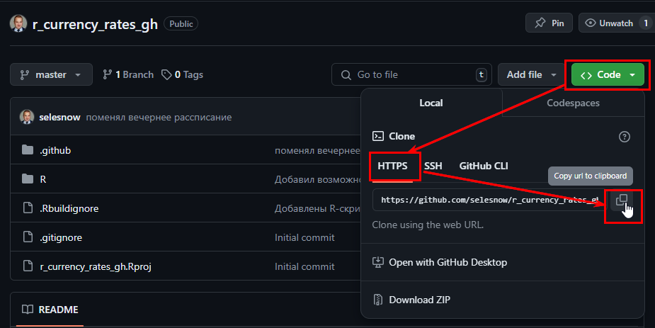
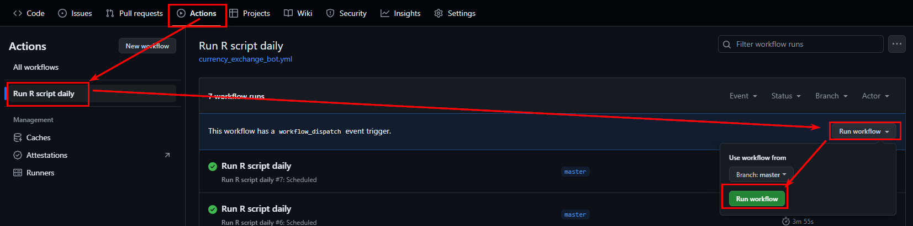

# Создаём бота, и отправляем с его помощью сообщения в telegram
В этой главе мы сделаем первые шаги в разработке telegram ботов. 

1. Научимся создавать ботов через BotFather;
2. Познакомимся с пакетов `telegram.bot`;
3. Научимся отправлять сообщения в Telegram.

В завершении главы мы научимся настраивать запуск написанных скриптов по рассписанию с помощью планировщика заданий Windows, или сервиса GitHub Actions.

Пока что это не полноценная разработка ботов, но прочитав эту главу вы научитесь писать скрипты, которые будут отправлять информацию вам в Telegram.

## Создание телеграм бота

### Видео урок о создании telegram бота через BotFather

<iframe width="560" height="315" src="https://www.youtube.com/embed/Tu9tHHhQU0g?enablejsapi=1" title="YouTube video player" frameborder="0" allow="accelerometer; autoplay; clipboard-write; encrypted-media; gyroscope; picture-in-picture" allowfullscreen></iframe>

### Конспект о создании telegram бота через BotFather

Для начала нам необходимо создать бота. Делается это с помощью специального бота **BotFather**, переходим по [ссылке](https://t.me/BotFather) и пишем боту `/start`.

После чего вы получите сообщение со списком команд:

```
I can help you create and manage Telegram bots. If you're new to the Bot API, please see the manual (https://core.telegram.org/bots).

You can control me by sending these commands:

/newbot - create a new bot
/mybots - edit your bots [beta]

Edit Bots
/setname - change a bot's name
/setdescription - change bot description
/setabouttext - change bot about info
/setuserpic - change bot profile photo
/setcommands - change the list of commands
/deletebot - delete a bot

Bot Settings
/token - generate authorization token
/revoke - revoke bot access token
/setinline - toggle inline mode (https://core.telegram.org/bots/inline)
/setinlinegeo - toggle inline location requests (https://core.telegram.org/bots/inline#location-based-results)
/setinlinefeedback - change inline feedback (https://core.telegram.org/bots/inline#collecting-feedback) settings
/setjoingroups - can your bot be added to groups?
/setprivacy - toggle privacy mode (https://core.telegram.org/bots#privacy-mode) in groups

Games
/mygames - edit your games (https://core.telegram.org/bots/games) [beta]
/newgame - create a new game (https://core.telegram.org/bots/games)
/listgames - get a list of your games
/editgame - edit a game
/deletegame - delete an existing game
```

Для создания нового бота отправляем команду `/newbot`.

BotFather попросит вас ввести имя и логин бота.

```
BotFather, [25.07.20 09:39]
Alright, a new bot. How are we going to call it? Please choose a name for your bot.

Alexey Seleznev, [25.07.20 09:40]
My Test Bot

BotFather, [25.07.20 09:40]
Good. Now let's choose a username for your bot. It must end in `bot`. Like this, for example: TetrisBot or tetris_bot.

Alexey Seleznev, [25.07.20 09:40]
@my_test_bot
```

Имя вы можете ввести произвольное, а логин должен заканчиваться на `bot`.

Если вы всё сделали правильно, то получите следующее сообщение:
```
Done! Congratulations on your new bot. You will find it at t.me/my_test_bot. You can now add a description, about section and profile picture for your bot, see /help for a list of commands. By the way, when you've finished creating your cool bot, ping our Bot Support if you want a better username for it. Just make sure the bot is fully operational before you do this.

Use this token to access the HTTP API:
123456789:abcdefghijklmnopqrstuvwxyz

For a description of the Bot API, see this page: https://core.telegram.org/bots/api
```

Далее вам понадобится полученный API токен, в моём примере это `123456789:abcdefghijklmnopqrstuvwxyz`.

Более подробно о возможностях **BotFather** можно узнать из [этой публикации](https://botcreators.ru/blog/botfather-instrukciya/). На этом шаге подготовительные работы по созданию бота завершены.

## Установка пакета для работы с телеграм ботом на R
Я предполагаю, что у вас уже установлен язык R, и среда разработки RStudio. Если это не так, то вы можете посмотреть данный [видео урок](https://youtu.be/wFUoaeGEMmY) о том, как их установить.

Для работы с Telegram Bot API мы будем использовать R пакет [telegram.bot](https://CRAN.R-project.org/package=telegram.bot).

Установка пакетов в R осуществляется функцией `install.packages()`, поэтому для установки нужного нам пакета используйте команду `install.packages("telegram.bot")`. 

Более подробно узнать об установке различных пакетов можно из [этого видео](https://youtu.be/1UvrWoZugic).

После установки пакета его необходимо подключить:
```{r eval=FALSE}
library(telegram.bot)
```

## Отправка сообщений из R в Telegram

Созданного вами бота можно найти в Telegram по заданному при создании логину, в моём случае это `@my_test_bot`.

Отправьте боту любое сообщение, например "Привет бот". На данный момент это нам надо для того, что бы получить id вашего с ботом чата.

Теперь в R пишем следующий код.

```{r eval=FALSE}
library(telegram.bot)

# создаём экземпляр бота
bot <- Bot(token = "123456789:abcdefghijklmnopqrstuvwxyz")

# Запрашиваем информацию о боте
print(bot$getMe())

# Получаем обновления бота, т.е. список отправленных ему сообщений
updates <- bot$getUpdates()

# Запрашиваем идентификатор чата
# Примечание: перед запросом обновлений вы должны отправить боту сообщение
chat_id <- updates[[1L]]$from_chat_id()
```

Изначально мы создаём экземпляр нашего бота функцией `Bot()`, в качестве аргумента в неё необходимо передать полученный ранее токен. 

Хранить токен в коде считается не лучшей практикой, поэтому вы можете хранить его в переменной среды, и считывать его из неё. По умолчанию в пакете `telegram.bot` реализована поддержка переменных среды следующего наименования: `R_TELEGRAM_BOT_ИМЯ_ВАШЕГО_БОТА`. Вместо `ИМЯ_ВАШЕГО_БОТА` подставьте имя которое вы задали при создании, в моём случае будет переменная  `R_TELEGRAM_BOT_My Test Bot`. 

Создать переменную среды можно несколькими способами, я расскажу о наиболее универсальном и кроссплатформенном. Создайте в вашей домашней директории (узнать её можно с помощью команды `path.expand("~")`) текстовый файл с названием *.Renviron*. Сделать это также можно с помощью команды `file.edit(path.expand(file.path("~", ".Renviron")))`. 

И добавьте в него следующую строку.

```
R_TELEGRAM_BOT_ИМЯ_ВАШЕГО_БОТА=123456789:abcdefghijklmnopqrstuvwxyz
```

Далее вы можете использовать сохранённый в переменной среды токен с помощью функции `bot_token()`, т.е. вот так: 

```{r eval=FALSE}
bot <- Bot(token = bot_token("My Test Bot"))
```

Метод `getUpdates()`позволяет нам получить обновления бота, т.е. сообщения которые были ему отправлены. Метод `from_chat_id()`, позволяет получить идентификатор чата, из которого было отправлено сообщение. Этот идентификатор нам нужен для отправки сообщений от бота. 

Помимо id чата из объекта полученного методом `getUpdates()` вы получаете и некоторую другую полезную информацию. Например, информацию о пользователе, отправившем сообщение.

```{r eval=FALSE}
updates[[1L]]$message$from
```
```
$id
[1] 000000000

$is_bot
[1] FALSE

$first_name
[1] "Alexey"

$last_name
[1] "Seleznev"

$username
[1] "AlexeySeleznev"

$language_code
[1] "ru"
```

Итак, на данном этапе у нас уже есть всё, что необходимо для отправки сообщения от бота в телеграм. Воспользуемся методом `sendMessage()`, в который необходимо передать идентификатор чата, текст сообщения, и тип разметки текста сообщения. Тип разметки может быть Markdown или HTML и устанавливается аргументом `parse_mode`.

```{r eval=FALSE}
# Отправка сообщения
bot$sendMessage(chat_id,
                text = "Привет, *жирный текст* _курсив_",
                parse_mode = "Markdown"
)
```
Если вам необходимо отправить сообщение от бота не в чат, а в публичный канал, то в `chat_id` указывайте адрс вашего канала, например `'@MyTGChannel'`.

При необходимости отправить сообщение в приватный канал, вам необходимо скопировать ссылку на любое сообщение данного канала, из ссылки получить его идентификатор, и к этому идентификатору добавить -100.


Пример ссылки приватного канала: https://t.me/c/012345678/11

Соответвенно, к id 012345678 вам необходимо добавить -100, в таком случае в `chat_id` надо указать -100012345678.

**Основы форматирования Markdown разметки:**

+ Жирный шрифт выделяется с помощью знака \*: 
    + пример: `*жирный шритф*` 
    + результат: **жирный шритф**
+ Курсив задаётся нижним подчёркиванием:
    + пример: `_курсив_` 
    + результат: *курсив*
+ Моноширинный шрифт, которым обычно выделяется программный код, задаётся с помощью апострофов:
    + пример: \`моноширинный шрифт\` 
    + результат: `моноширинный шрифт`

**Основы форматирования HTML разметки:**

В HTML вы заворачиваете часть текста, которую надо выделать, в теги, пример `<тег>текст</тег>`.

+ `<тег>` - открывающий тег
+ `</тег>` - закрывающий тег

**Теги HTML разметки**

+ `<b>` - жирный шрифт
    + пример: `<b>жирный шрифт</b>` 
    + результат **жирный шрифт**
+ `<i>` - курсив
    + пример: `<i>курсив</i>` 
    + результат: *курсив*
+ `<code>` - моноширинный шрифт
    + пример: `<code\>моноширинный шрифт</code\>`
    + результат: `моноширинный шрифт`

Помимо текста вы можете отправлять и другой контент используя специальные методы:
```{r eval=FALSE}
# Отправить изображение
bot$sendPhoto(chat_id,
  photo = "https://telegram.org/img/t_logo.png"
)

# Отправка голосового сообщения
bot$sendAudio(chat_id,
  audio = "http://www.largesound.com/ashborytour/sound/brobob.mp3"
)

# Отправить документ
bot$sendDocument(chat_id,
  document = "https://github.com/ebeneditos/telegram.bot/raw/gh-pages/docs/telegram.bot.pdf"
)

# Отправить стикер
bot$sendSticker(chat_id,
  sticker = "https://www.gstatic.com/webp/gallery/1.webp"
)

# Отправить видео
bot$sendVideo(chat_id,
  video = "http://techslides.com/demos/sample-videos/small.mp4"
)

# Отправить gif анимацию
bot$sendAnimation(chat_id,
  animation = "https://media.giphy.com/media/sIIhZliB2McAo/giphy.gif"
)

# Отправить локацию
bot$sendLocation(chat_id,
  latitude = 51.521727,
  longitude = -0.117255
)

# Имитация действия в чате
bot$sendChatAction(chat_id,
  action = "typing"
)
```

Т.е. например с помощью метода `sendPhoto()` вы можете отправить сохранённый в виде изображения график, который вы построили с помощью пакета `ggplot2`.

Помимо отправки данных бот имеет и ряд других методов:

* `deleteMessage()` - Удалить сообщение
* `editMessageText()` - Редактирвать текст сообщения
* `editMessageCaption()` - Редактировать описание изображения, файла и т.д.
* `forwardMessage()` - Переслать сообщение
* `getFile()` - Подготовка файла к скачиванию
* `getMe()` - Получить информацию о боте
* `getUpdates()` - Получить список обновлений бота
* `getUserProfilePhotos()` - Получить аватар пользователя
* `leaveChat()` - Выйти из группы
* `clean_updates()` - Очистить очередь обновлений

## Как отправить в telegram таблицу
К сожалению на момент написания книги telegram не поддерживает полноценные таблицы в HTML или Markdown, но вы можете иметировать подобие таблицы. Для этого воспользуйтесь кодом представленной ниже функции `to_tg_table()`:

```{r eval=FALSE}
library(purrr)
library(tidyr)
library(stringr)

# функция для перевода data.frame в telegram таблицу 
to_tg_table <- function( table, align = NULL, indents = 3, parse_mode = 'Markdown' ) {
  
  # если выравнивание не задано то выравниваем по левому краю
  if ( is.null(align) ) {
    
    col_num <- length(table)
    align   <- str_c( rep('l', col_num), collapse = '' )
  
  }
  
  # проверяем правильно ли заданно выравнивание
  if ( length(table) != nchar(align) ) {
    
    align <- NULL
    
  }
  
  # новое выравнивание столбцов 
  side <- sapply(1:nchar(align), 
         function(x) { 
           letter <- substr(align, x, x)
           switch (letter,
                   'l' = 'right',
                   'r' = 'left',
                   'c' = 'both',
                   'left'
           )
  })
  
  # сохраняем имена
  t_names      <- names(table)

  # вычисляем ширину столбцов
  names_length <- sapply(t_names, nchar) 
  value_length <- sapply(table, function(x) max(nchar(as.character(x))))
  max_length   <- ifelse(value_length > names_length, value_length, names_length)
  
  # подгоняем размер имён столбцов под их ширину + указанное в indents к-во пробелов 
  t_names <- mapply(str_pad, 
                    string = t_names, 
                    width  = max_length + indents, 
                    side   = side)
  
  # объединяем названия столбцов
  str_names <- str_c(t_names, collapse = '')
  
  # аргументы для фукнции str_pad
  rules <- list(string = table, width = max_length + indents, side = side)

  # поочереди переводим каждый столбец к нужному виду
  t_str <-   pmap_df( rules, str_pad )%>%
              unite("data", everything(), remove = TRUE, sep = '') %>%
              unlist(data) %>%
              str_c(collapse = '\n') 
  
  # если таблица занимает более 4096 символов обрезаем её
  if ( nchar(t_str) >= 4021 ) {
    
    warning('Таблица составляет более 4096 символов!')
    t_str <- substr(t_str, 1, 4021)
    
  }
  
  # символы выделения блока кода согласно выбранной разметке
  code_block <- switch(parse_mode, 
                       'Markdown' = c('```', '```'),
                       'HTML' = c('<code>', '</code>'))
           
  # переводим в code
  res <- str_c(code_block[1], str_names, t_str, code_block[2], sep = '\n')
  
  return(res)
}
```

С помощью этой функци вы можете преобразовать любой data.frame и отправить в telegram:

```{r eval=FALSE}
# преобразуем таблицу iris 
tg_table <- to_tg_table( head(iris, 15) )

# отправляем таблицу в telegram
bot$sendMessage(194336771, 
                tg_table,
                "Markdown")
```

В telegram это буедет выглядеть так:


У функции `to_tg_table()` есть несколько дополнительных аргументов:

* align - выравнивнивание столбцов, тектовая строка, каждая буква соответвует одному столбцу, пример `'llrrc'`:
    * l - выравнивание по левой стороне
    * r - выравнивание по правой стороне
    * c - выравнивание по центру
* indents - количество пробелов для разделения столбцов.
* parse_mode - разметка сообщения, Markdown или HTML.

Пример с выравниванием столбцов:

```{r eval=FALSE}
# преобразуем таблицу iris 
tg_table <- to_tg_table( head(iris, 15), 
                         align = 'llccr')

# отправляем таблицу в telegram
bot$sendMessage(194336771, 
                tg_table,
                "Markdown")
```


## Как добавить в сообщение Emoji
Требования к телеграм ботам могут быть разные, в том числе заказчик может попросить вас добавить в сообщения бота какие то Emoji. 

Получить полный список доступных смайлов можно по этой [ссылке](https://apps.timwhitlock.info/emoji/tables/unicode).


Из таблицы нас интересует поле **Unicode**. Скопиройте код нужного вам смайла, и замените `U+` на `\U000`. Т.е. если вам необходимо отправить смайл, код котого в [таблице](https://apps.timwhitlock.info/emoji/tables/unicode)  `U+1F601`, то в коде на R вам необходимо добавить его в текст сообщения вот так - `\U0001F601`.

Пример:
```{r eval=FALSE}
bot$sendMessage(chat_id, 
                'Сообщение со смайлом \U0001F601 код которого в таблице U+1F601')
```

Результат:


## Проверка планировщика задач Windows, и отправка уведомления о задачах, работа которых была завершена аварийно

### Видео урок о разработке бота для контроля планировщика заданий
<iframe width="560" height="315" src="https://www.youtube.com/embed/u8vpsyIUVCs?enablejsapi=1" title="YouTube video player" frameborder="0" allow="accelerometer; autoplay; clipboard-write; encrypted-media; gyroscope; picture-in-picture" allowfullscreen></iframe>

### Конспект о разработке бота для контроля планировщика заданий
Для работы с планировщиком заданий Windows вам необходимо установить пакет `taskscheduleR`, и для удобства работы с данными установим пакет `dplyr`.

```{r eval=FALSE}
# Установка пакетов
install.packages(c('taskscheduleR', 'dplyr'))
# Подключение пакетов
library(taskscheduleR)
library(dplyr)
```

Далее с помощью функции `taskscheduler_ls()` мы запрашиваем информацию о задачах из нашего планировщика. С помощью функции `filter()` из пакета `dplyr` мы убираем из списка задач те, которые были успешно выполненны и имеют статус последнего результата 0, и те, которые ещё ни разу не запускались и имеют статус 267011, выключенные задачи, и задачи которые выполняются в данный момент. 

```{r eval=FALSE}
# запрашиваем список задач
task <- task <- taskscheduler_ls() %>%
        filter(! `Last Result`  %in% c("0", "267011") & 
               `Scheduled Task State` == "Enabled" & 
               Status != "Running") %>%
        select(TaskName) %>%
        unique() %>%
        unlist() %>%
        paste0(., collapse = "\n")
```

В объекте `task` у нас теперь список задач, работа которых завершилась ошибкой, этот список нам надо отправить в Telegram.

Если рассмотреть каждую команду подробнее, то:

* `filter()` - фильтрует список задач, по описанным выше условиям
* `select()` - оставляет в таблице только одно поле с названием задач
* `unique()` - убирает дубли названий
* `unlist()` - переводит выбранный столбец таблицы в вектор
* `paste0()` - соединяет названия задач в одну строку, и ставит в качестве разделителя знак перевода строки, т.е. `\n`.

Всё что нам остаётся - отправить этот результат в телеграм.

```{r eval=FALSE}
bot$sendMessage(chat_id,
                text = task,
                parse_mode = "Markdown"
)
```

Итак, на данный момент код бота выглядит вот так:

```{r eval=FALSE}
# Подключение пакета
library(telegram.bot)
library(taskscheduleR)
library(dplyr)

# инициализируем бота
bot <- Bot(token = "123456789:abcdefghijklmnopqrstuvwxyz")

# идентификатор чата
chat_id <- 123456789

# запрашиваем список задач
task <- taskscheduler_ls() %>%
        filter(! `Last Result`  %in% c("0", "267011")  &
               `Scheduled Task State` == "Enabled" & 
               Status != "Running") %>%
        select(TaskName) %>%
        unique() %>%
        unlist() %>%
        paste0(., collapse = "\n")

# если есть проблемные задачи отправляем сообщение
if ( task != "" ) {

  bot$sendMessage(chat_id,
                  text = task,
                  parse_mode = "Markdown"
  )

}
```

*При использовании приведённого выше примера подставьте в код токен вашего бота и ваш идентификатор чата.*

Вы можете добавлять условия фильтрации задач, например проверяя только те задачи, которые были созданны вами, исключая системные. 

Так же вы можете вынести различные настройки в отдельный файл конфигурации, и хранить  в нём id чата и токен. Читать конфиг можно например с помощью пакета `configr`.

```
[telegram_bot]
;настройки телеграм бота и чата, в который будут приходить уведомления
chat_id=12345678
bot_token=123456789:abcdefghijklmnopqrstuvwxyz"
```

```{r eval=FALSE}
library(configr)

# чтение конфина
config <- read.config('C:/путь_к_конфигу/config.cfg', rcmd.parse = TRUE)

bot_token <- config$telegram_bot$bot_token
chat_id     <- config$telegram_bot$chat_id
```

## Настраиваем расписание запуска проверки задач
Наиболее подробно процесс настройки запуска скриптов по расписанию описан в этой [статье](https://netpeak.net/ru/blog/kak-nastroit-zapusk-r-skripta-po-raspisaniyu/). 

Тут я лишь опишу шаги, которые для этого необходимо выполнить. Если какой-то из шагов вам не понятен, то обратитесь к статье на которую я указал ссылку.

Предположим, что мы сохранили код нашего бота в файл `check_bot.R`. Для того, что бы запланировать регулярный запуск этого файла выполните следующие шаги:

1. Пропишите в системную переменную Path путь к папке в которой установлен R, в Windows путь будет примерно таким: `C:\Program Files\R\R-4.0.2\bin`.
2. Создайте исполняемый bat файл, в котором будет всего одна строка `R CMD BATCH C:\rscripts\check_bot\check_bot.R`. Замените `C:\rscripts\check_bot\check_bot.R` на полный путь к вашему R файлу.
3. Далее настройте с помощью планировщика задач Windows расписание запуска, например на каждые пол часа.

## Настраиваем запуск расписания отправки сообщения с помощью GitHub Actions
Прошлый пример запускал скрипт отправки сообщения с вашего ноутбука, ПК или сервера на Windows. Т.к. сам бот которого мы рассматривал мониторил планировщик заданий на том ПК на котором запускался, то это пожалуй был единственный способ настроить расписание его автоматического запуска. Но зачастую вам необходима будет отправка данных не вашего ПК, а полученных из каких то внешних источников, например API. А рассписание запуска настроенное на вашем ноутбуке будет отрабатывать только в том случае если сам ноутбук включён и имеет доступ к интернету, но нам хотелось бы иметь альтернативный способ запуска скриптов по рассписанию, и желательно бесплатный.

Давайте рассмотрим ещё один пример бота, данный бот будет запрашивать курсы валют и отправлять их в telegram чат. Но настраивать автоматизацию его запуска мы будем с помощью сервиса GitHub Actions.

>Для выполнения описанных в этом разделе действий вам необходимо предварительно установить Git на вашу операционную систему.

### Видео по настройке запуска скриптов с помощью GitHub Actions
<iframe width="560" height="315" src="https://www.youtube.com/embed/SR69O1bkzmI?si=sN1nS-3BZ-Z-clYI" title="YouTube video player" frameborder="0" allow="accelerometer; autoplay; clipboard-write; encrypted-media; gyroscope; picture-in-picture; web-share" referrerpolicy="strict-origin-when-cross-origin" allowfullscreen></iframe>

### Что такое CI/CD

**CI/CD** — это методология и набор практик для автоматизации процессов разработки, тестирования и развертывания программного обеспечения. CI/CD расшифровывается как Continuous Integration (непрерывная интеграция) и Continuous Deployment (непрерывное развертывание) или Continuous Delivery (непрерывная доставка).

**Непрерывная интеграция (CI)** — это практика частого слияния изменений в основной кодовой базе. Основные принципы CI:

* Разработчики регулярно интегрируют свои изменения в основной репозиторий.
* После каждого слияния запускаются автоматические тесты, чтобы убедиться, что изменения не ломают существующий код.
* Выявленные ошибки устраняются сразу.

**Continuous Deployment (непрерывное развертывание)** и **Continuous Delivery (непрерывная доставка)** — это методы автоматического развертывания и доставки изменений в продакшн.

* Continuous Delivery: Изменения автоматически тестируются и подготавливаются к развертыванию, но финальное развертывание может требовать ручного подтверждения.
* Continuous Deployment: Все изменения, прошедшие автоматическое тестирование, автоматически развертываются в производственной среде.

### Что такое GitHub Actions

**GitHub Actions** — это платформа для автоматизации процессов в рамках репозитория GitHub. Она позволяет создавать и запускать рабочие процессы (workflows), которые автоматически выполняются при наступлении определенных событий в репозитории.

Основные компоненты GitHub Actions:

* Workflow (рабочий процесс): YAML-файл, который описывает автоматизируемый процесс.
* Job (задача): Определенная часть рабочего процесса, которая выполняется на виртуальной машине.
* Step (шаг): Отдельные шаги внутри задачи, которые могут включать команды или действия (actions).
* Action (действие): Повторно используемый блок, который выполняет одну конкретную задачу, например, установка зависимостей, запуск тестов и т.д.

### Обзор рабочего процесса

Рабочий процесс выглядит следующим образом:

1. Создание репозитория на GitHub
2. Создание R-скрипта
3. Настройка GitHub Actions
4. Создание переменных среды в репозитории GitHub
5. Commit и Push изменений

### Создание репозитория

1. Создайте новый репозиторий на GitHub или используйте уже существующий.Добавьте ваш код на языке R в репозиторий.
2. Скопируйте URL для клонирования репозитория



3. Откройте RStudio: File -> New Project -> Version Control -> Git — > Вставить скопированный URL в поле Repository URL. Необходим установленный Git.

### Добавляем в проект R скрипт

Теперь создайте в проекте папку R, и в ней файл с будущим скриптом бота `currency_rate_sender.R`. Для удобства я использую функцию `usethis::use_r('currency_rate_sender')`, она создаст каталог R, и в нём файл скрипта.

Листинг нашего кода:

```{r eval=FALSE}
library(httr)
library(jsonlite)
library(telegram.bot)

# Функция для получения курса валют
get_exchange_rate <- function(api_key, currency) {
  url <- paste0("https://api.exchangerate-api.com/v4/latest/USD?apikey=", api_key)
  response <- GET(url)
  data <- fromJSON(content(response, "text"))
  return(data$rates[[currency]])
}

# Функция для отправки сообщения в Telegram
send_telegram_message <- function(bot_token, chat_id, message) {
  bot <- Bot(token = bot_token)
  bot$sendMessage(chat_id = chat_id, text = message)
}

# Получение переменных среды
api_key   <- Sys.getenv("EXCHANGE_RATE_API_KEY")
bot_token <- Sys.getenv("TELEGRAM_BOT_TOKEN")
chat_id   <- Sys.getenv("TELEGRAM_CHAT_ID")
currency  <- "EUR"

# Получение курса валют и отправка сообщения
exchange_rate <- get_exchange_rate(api_key, currency)
message <- paste("Курс", currency, "к USD:", exchange_rate)
send_telegram_message(bot_token, chat_id, message)
```


Данный код запрашивает по API курсы валют, после чего отправляет их в Telegram Чат. Для того что бы использовать этот же код вам необходимо получить к API ключ на сайте https://www.exchangerate-api.com/.

### Настройка GitHub Actions

Теперь необходимо создать конфигурацию для нашего рабочего процесса, это делается с помощью yaml файла.

Используйте функцию use_github_action('currency_rate_sender'). Работа функции закончится ошибкой, но она создаст необходимую нам структуру папок .github/workflows.

Далее создайте в проекте, в папке workflows текстовый файл `currency_rate_sender.yaml`. И добавьте в него следующие команды:

```
name: Run R script daily

on:
  schedule:
    - cron: '0 10 * * *'  # Ежедневно в 10:00 UTC
    - cron: '51 17 * * *'  # Ежедневно в 19:00 по Каирскому времени
  workflow_dispatch:

jobs:
  run-r-script:
    runs-on: ubuntu-latest

    steps:
    - name: Checkout repository
      uses: actions/checkout@v2
      
    - name: Set timezone to Cairo
      uses: szenius/set-timezone@v2.0
      with:
        timezoneLinux: "Africa/Cairo"
        
    - name: Log current time
      run: date

    - name: Set up R
      uses: r-lib/actions/setup-r@v2
      with:
        r-version: '4.0.3'
        
    - name: Install Linux package
      run: |
        sudo apt-get install libcurl4-openssl-dev

    - name: Install R packages
      run: |
        Rscript -e 'install.packages(c("curl", "httr", "jsonlite", "telegram.bot"), repos="https://cran.rstudio.com/")'

    - name: Run R script
      env:
        EXCHANGE_RATE_API_KEY: ${{ secrets.EXCHANGE_RATE_API_KEY }}
        TELEGRAM_BOT_TOKEN: ${{ secrets.TELEGRAM_BOT_TOKEN }}
        TELEGRAM_CHAT_ID: ${{ secrets.TELEGRAM_CHAT_ID }}
      run: |
        Rscript R/currency_rate_sender.R
```

Давайте рассмотрим все эти команды подробнее:

```
name: Run R script daily
```

Задаёт название рабочего процесса

```
on:
  schedule:
    - cron: '0 10 * * *'  # Ежедневно в 10:00 UTC
    - cron: '51 17 * * *'  # Ежедневно в 19:00 по Каирскому времени
  workflow_dispatch:
```

Блок on определяет, какие события в репозитории запускают workflow. В нем можно указать различные события, такие как push, pull_request, schedule и другие. Рассмотрим некоторые из них:

* События `push` и `pull_request` — Эти события запускают workflow при выполнении push или создании pull request соответственно.
* Событие `schedule` позволяет запускать workflow по расписанию, используя синтаксис cron. Cron выражения состоят из пяти полей, каждое из которых задает единицу времени:
    * Минуты (0-59)
    * Часы (0-23)
    * День месяца (1-31)
    * Месяц (1-12)
    * День недели (0-6, где 0 — воскресенье)
* Событие `workflow_dispatch` позволяет вручную запускать workflow через интерфейс GitHub.
* Событие `release` запускает workflow при создании релиза.
* Событие `issue_comment` запускает workflow при добавлении комментария к issue.

Когда используется запуск GitHub Action через schedule необходимо учитывать следующие нюансы. Описанные в справке GitHub:

* Событие schedule может быть отложено в периоды высокой нагрузки при выполнении рабочего процесса GitHub Actions. Время высокой загрузки включает начало каждого часа. Если нагрузка достаточно высока, некоторые задания в очереди могут быть удалены. Чтобы уменьшить вероятность задержки, запланируйте выполнение рабочего процесса в другое время часа.
* В общедоступном репозитории запланированные рабочие процессы автоматически отключаются, если в течение 60 дней не происходит никаких действий с репозиторием.

```
jobs:
  run-r-script:
    runs-on: ubuntu-latest
```

Создаёт виртуальную машину на ubuntu, можно создать и на Windows.

```
steps:
    - name: Checkout repository
      uses: actions/checkout@v2

```

Копирует в виртуальную машину всё содержимое репозитория.

```
- name: Set up R
      uses: r-lib/actions/setup-r@v2
      with:
        r-version: '4.0.3'
```

Устанавливает указанную версию R.

```
- name: Install Linux package
      run: |
        sudo apt-get install libcurl4-openssl-dev
```

Устанавливает на Linux специальный программный пакет, необходимый для установки R пакета httr и telegram.bot.

```
- name: Install R packages
      run: |
        Rscript -e 'install.packages(c("httr", "jsonlite", "telegram.bot"), repos="https://cran.rstudio.com/")'
```

Устанавливает на виртуальную машину необходимые пакеты.

```
- name: Run R script
      env:
        EXCHANGE_RATE_API_KEY: ${{ secrets.EXCHANGE_RATE_API_KEY }}
        TELEGRAM_BOT_TOKEN: ${{ secrets.TELEGRAM_BOT_TOKEN }}
        TELEGRAM_CHAT_ID: ${{ secrets.TELEGRAM_CHAT_ID }}
      run: |
        Rscript R/currency_rate_sender.R
```

Считывает переменные среды из репозитория, и запускает выполнение R скрипта.

### Создание переменныз среды в GitHub репозитоории

1. Перейдите в ваш репозиторий на GitHub.
2. Перейдите в раздел Settings.
3. В левом меню выберите Secrets and variables -> Actions.
4. Нажмите на кнопку New repository secret и создайте следующие переменные:
5. Создайте все необходимые вам переменные среды.

### Публикация на GitHub

Теперь отправьте всё, что мы сделали коммитом на GitHub.

1. В RStudio откройте вкладку Git
2. Выделите все файлы галочками
3. Нажмите кнопку Commit
4. Напишите комментарий
5. Нажмите кнопку Commit
6. Нажмите кнопку Push
7. Теперь вы опубликовали ваш проект на GitHub.

### Тестирование рабочего процесса на GitHub

Всё готово. Теперь вернитесь в свой репозиторий на GitHub, перейдите в Actions.



Если тест пройдёт успешно то в следующий раз скрипт запустится автоматически по указанному вами рассписанию.

## Заключение
В этой главе мы разобрались с тем, как создать бота, и отправлять с его помощью различные уведомления в telegram. 

Я описал задачу контроля планировщика заданий Windows, но вы можете использовать материал этой главы для отправки любых уведомлений, от прогноза погоды до котировок акций на фондовой бирже, т.к. 
R позволяет вам подключиться к огромному количеству источников данных.

В следующей главе мы с вами разберёмся с тем, как добавить боту команды и фильтры сообщений, для того, что он мог не только отправлять уведомления, но и выполнять более сложные действия.

## Тесты и задания

### Тесты

Для закрепления материла рекомендую вам пройти тест доступный по [ссылке](https://onlinetestpad.com/t/build-tg-bot-in-r-1).

### Задания

1. Создайте с помощью [BotFather](http://t.me/BotFather) бота.
2. Перейдите к диалогу с ботом, и узнайте идентификатор вашего с ботом чата.
3. Отправьте с помощью созданного бота в telegram первые 20 строк из встроенного в R набора данных `ToothGrowth`.

Если вы всё сделали правильно то результат будет следующим:


