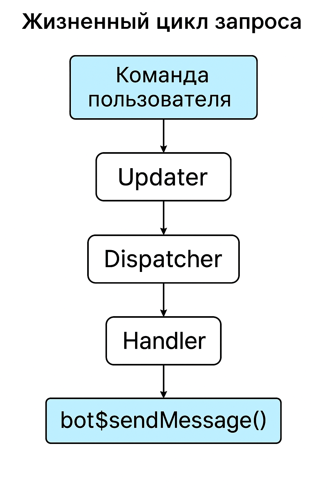
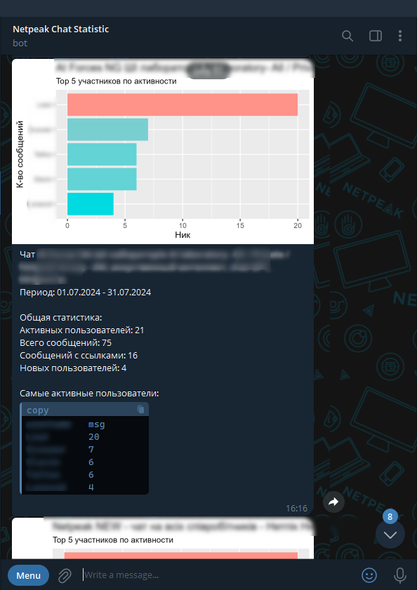

# Добавляем боту поддержку команд и фильтры сообщений, класс Updater
Во второй главе нашего руководства мы продолжим развитие вашего Telegram-бота, сосредоточив внимание на добавлении команд и фильтров сообщений. Вы узнаете, как реализовать команды, которые пользователи могут отправлять боту, и как обрабатывать их с помощью пакета telegram.bot.

Мы рассмотрим, как настроить обработку команд для выполнения различных действий и внедрить фильтры для управления типами сообщений. Эти инструменты позволят вашему боту стать более интерактивным и удобным для пользователей.

В этой главе научим бота понимать команды и реагировать на них — приветствовать, фильтровать сообщения и быть чуть полезнее.

## Видео по добавлению боту поддержки команд
<iframe width="560" height="315" src="https://www.youtube.com/embed/nT5_WYwGfG8?enablejsapi=1" title="YouTube video player" frameborder="0" allow="accelerometer; autoplay; clipboard-write; encrypted-media; gyroscope; picture-in-picture" allowfullscreen></iframe>

## Класс Updater
`Updater` - это класс, который упрощает вам разработку телеграм бота, и использует под капотом класс `Dispetcher`. Назначение класса `Updater` заключается в том, что бы получить обновления от бота (в предыдущей главе мы использовали для этой цели метод `getUpdates()`), и передать их далее в `Dispetcher`.

В свою очередь `Dispetcher` содержит в себе созданные вами обработчики, т.е. объекты класса `Handler`.

## Handlers - обработчики
С помощью обработчиков вы добавляете в `Dispetcher` реакции бота на различные события. На момент написания книги в `telegram.bot` добавлены следующие типы обработчиков:

* MessageHandler - Обработчик сообщений
* CommandHandler - Обработчик команд
* CallbackQueryHandler - Обработчик данных отправляемых из Inline клавиатур
* ErrorHandler - Обработчик ошибок при запросе обновлений от бота

## Добавляем первую команду боту, обработчик команд
Если вы никогда ранее не использовали ботов, и не в курсе, что такое команда, то команды боту необходимо отправлять с помощью прямого слеша `/` в качестве префикса.

Начнём мы с простых команд, т.е. научим нашего бота здороваться по команде `/hi`.

```{r eval=FALSE}
library(telegram.bot)

# создаём экземпляр класса Updater
updater <- Updater('ТОКЕН ВАШЕГО БОТА')

# Пишем метод для приветствия
say_hello <- function(bot, update) {

  # Имя пользователя с которым надо поздороваться
  user_name <- update$effective_user()$first_name

  # Отправка приветственного сообщения
  bot$sendMessage(update$from_chat_id(),
                  text = paste0("Моё почтение, ", user_name, "!"),
                  parse_mode = "Markdown")

}

# создаём обработчик
hi_hendler <- CommandHandler('hi', say_hello)

# добавляем обработчик в диспетчер
updater <- updater + hi_hendler

# запускаем бота
updater$start_polling()
```

> Запустите приведённый выше пример кода, предварительно заменив 'ТОКЕН ВАШЕГО БОТА' на реальный токен, который вы получили при создании бота через *BotFather*.

Метод `start_polling()` класса `Updater`, который используется в конце кода, запускает бесконечный цикл запроса и обработки обновлений от бота.

Мы написали боту метод `say_hello()`. Методами бота являются функции с двумя обязательными аргументами:

* bot - объект бота, с помощью которого вы можете выполнять любые, доступные боту операции: отправлять сообщения, удалять сообщения, и так далее.
* update - полученное от пользоватя сообщение (обновление бота).

Внутри кода метода вы можете обращаться и к боту, и к обновлению. С методами бота мы познакомились в первой главе, теперь давайте я вкратце опишу методы, доступные в приходящих обновлениях:

* `from_chat_id()` - получить идентификатор чата, из которого боту было отправлено сообщение
* `from_user_id()` - получить идентификатор пользователя, который отправил боту сообщение
* `effective_chat()` - получить подробную информацию о чате, из которого бот получил сообщение
* `effective_message()` - получить подробную информацию о сообщение, включая текст, вложения и т.д.
* `effective_user()` - получить подробную информацию о пользователе, который отправил сообщение

Теперь откроем телеграм, и напишем нашему боту первую команду `/hi`.


Теперь наш бот понимает команду `/hi`, и умеет с нами здороваться.

Схематически процесс построения такого простейшего бота можно изобразить следующим образом.


1. Создаём экземпляр класса `Updater`;
2. Создаём методы, т.е. функции которые будет выполнять наш бот. В примере кода это функция `say_hello()`. Функции, которые вами будут использоваться как методы бота должны иметь два обязательных аргумента - *bot* и *update*, и один необязательный - *args*. Аргумент *bot*, это и есть ваш бот, с его помощью вы можете отвечать на сообщения, отправлять сообщения, или использовать любые другие доступные боту методы. Аргумент *update* это то, что бот получил от пользователя, по сути, то что в первой главе мы получали методом `getUpdates()`. Аргумент *args* позволяет вам обрабатывать дополнительные данные отправленные пользователем вместе с командой, к этой теме мы ещё вернёмся немного позже;
3. Создаём обработчики, т.е. связываем какие-то действия пользователя с созданными на прошлом шаге методами. По сути обработчик это триггер, событие которое вызывает какую-то функцию бота. В нашем примере таким триггером является отправка команды `/hi`, и реализуется командой `hi_hendler <- CommandHandler('hi', say_hello)`. Первый аргумент функции `CommandHandler()` позволяет вам задать команду, в нашем случае `hi`, на которую будет реагировать бот. Второй аргумент позволяет указать метод бота, мы будем вызывать метод `say_hello`, который будет выполняться если пользователь вызвал указанную в первом аргументе команду;
4. Далее добавляем созданный обработчик в диспетчер нашего экземпляра класса `Updater`. Добавлять обработчики можно несколькими способами, в примере выше я использовал простейший, с помощью знака `+`, т.е. `updater <- updater + hi_hendler`. То же самое можно сделать с помощью метода `add_handler()`, который относится к классу `Dispatcher`, найти этот метод можно так: `updater$dispatcher$add_handler()`;
5. Запускаем бота с помощью команды `start_polling()`.

При взаимодействии пользователя с ботом:

1. Пользователь отправляет боту сообщение;
2. Его сообщение попадает в Updater;
3. Далее в Dispatcher, где с помощью фильтров начинается поиск нужного обработчика;
4. Если обработчик нашёл нужную функцию, то она вызывается.

## Обработчик текстовых сообщений и фильтры
Как отправлять боту команды мы разобрались, но иногда нам требуется, что бы бот реагировал не только на команды, но и на какие-то обычные, текстовые сообщения. Для этого необходимо использовать обработчики сообщений - **MessageHandler**.

Обычный **MessageHandler** будет реагировать на абсолютно все входящие сообщения. Поэтому зачастую обработчики сообщений используются вместе с фильтрами. Давайте научим бота здороваться не только по команде `/hi`, но и всегда, когда в сообщении отправленном боту  встречается одно из следующих слов: привет, здравствуй, салют, хай, бонжур.

Пока мы не будем писать какие-то новые методы, т.к. у нас уже есть метод с помощью которого бот с нами здоровается. От нас требуется только создать нужный фильтр и обработчик сообщений.

```{r eval=FALSE}
library(telegram.bot)

# создаём экземпляр класса Updater
updater <- Updater('ТОКЕН ВАШЕГО БОТА')

# Пишем метод для приветствия
## команда приветвия
say_hello <- function(bot, update) {

  # Имя пользователя с которым надо поздороваться
  user_name <- update$effective_user()$first_name

  # Отправляем приветсвенное сообщение
  bot$sendMessage(update$from_chat_id(),
                  text = paste0("Моё почтение, ", user_name, "!"),
                  parse_mode = "Markdown",
                  reply_to_message_id = update$message$message_id)

}

# создаём фильтры
MessageFilters$hi <- BaseFilter(function(message) {

  # проверяем, встречается ли в тексте сообщения слова: привет, здравствуй, салют, хай, бонжур
  grepl(x           = message$text,
        pattern     = 'привет|здравствуй|салют|хай|бонжур',
        ignore.case = TRUE)
  }
)

# создаём обработчик
hi_hendler <- CommandHandler('hi', say_hello) # обработчик команды hi
hi_txt_hnd <- MessageHandler(say_hello, filters = MessageFilters$hi)

# добавляем обработчики в диспетчер
updater <- updater +
             hi_hendler +
             hi_txt_hnd

# запускаем бота
updater$start_polling()
```

> Запустите приведённый выше пример кода, предварительно заменив 'ТОКЕН ВАШЕГО БОТА' на реальный токен, который вы получили при создании бота через *BotFather*.

Теперь попробуем отправить боту несколько сообщений, в которых будут встречаться перечисленные ранее слова приветствия:


Итак, в первую очередь мы научили бота не просто здороваться, а отвечать на приветствие. Сделали мы это с помощью аргумента *reply_to_message_id*, который доступен в методе `sendMessage()`, в который необходимо передать id сообщения на которое требуется ответить. Получить id сообщения можно вот так: `update$message$message_id`.

Но главное, что мы сделали - добавили боту фильтр с помощью функции `BaseFilter()`:

```{r eval=FALSE}
# создаём фильтры
MessageFilters$hi <- BaseFilter(

  # анонимная фильтрующая функция
  function(message) {

    # проверяем, встречается ли в тексте сообщения слова приветствия
    grepl(x           = message$text,
          pattern     = 'привет|здравствуй|салют|хай|бонжур',
          ignore.case = TRUE)
  }

)
```

Как вы могли заметить, фильтры необходимо добавлять в объект **MessageFilters**, в котором изначально уже есть небольшой набор готовых фильтров. В нашем примере в объект **MessageFilters** мы добавили элемент *hi*, это новый фильтр.

В функцию `BaseFilter()` вам необходимо передать фильтрующую функцию. По сути, фильтр - это просто функция, которая получает экземпляр сообщения и возвращает *TRUE* или *FALSE*. В нашем примере, мы написали простейшую функцию, которая с помощью базовой функции `grepl()` проверяет текст сообщения, и если он соответствует регулярному выражению `привет|здравствуй|салют|хай|бонжур` возвращает *TRUE*.

Далее мы создаём обработчик сообщений `hi_txt_hnd <- MessageHandler(say_hello, filters = MessageFilters$hi)`. Первый аргумент функции `MessageHandler()` - метод, который будет вызывать обработчик, а второй аргумент - это фильтр по которому он будет вызываться. В нашем случае это созданный нами фильтр `MessageFilters$hi`.

Ну и в итоге, мы добавляем в диспетчер созданный только, что обработчик *hi_txt_hnd*.

```{r eval=FALSE}
updater <- updater +
             hi_hendler +
             hi_txt_hnd
```

Как я уже писал выше, в пакете `telegram.bot` и объекте **MessageFilters** уже есть набор встроенных фильтров, которые вы можете использовать:

* all - Все сообщения
* text - Текстовые сообщения
* command - Команды, т.е. сообщения которые начинаются на `/`
* reply - Сообщения, которые являются ответом на другое сообщение
* audio - Сообщения в которых содержится аудио файл
* document - Сообщения с отправленным документом
* photo - Сообщения с отправленными изображениями
* sticker - Сообщения с отправленным стикером
* video - Сообщения с видео
* voice - Голосовые сообщения
* contact - Сообщения в которых содержится контант телеграм пользователя
* location - Сообщения с геолокацией
* venue - Пересылаемые сообщения
* game - Игры

Если вы хотите совместить некоторые фильтры в одном обработчике просто используйте знак `|` - в качестве логического **ИЛИ**, и знак `&` в качестве логического **И**. Например, если вы хотите что бы бот вызывал один и тот же метод когда он получает видео, изображение или документ используйте следующий пример создания обработчика сообщений:

```{r eval=FALSE}
handler <- MessageHandler(callback,
  MessageFilters$video | MessageFilters$photo | MessageFilters$document
)
```

## Добавление команд с параметрами
Мы уже знаем, что такое команды, как их создавать и как заставить бота выполнить нужную команду. Но в некоторых случаях помимо названия команды, нам необходимо передать некоторые данные для её выполнения.

Ниже пример бота, который по заданной дате и стране возвращает вам тип дня из производственного календаря.

Приведённый ниже бот использует API производственного календаря [isdayoff.ru](https://isdayoff.ru/).

<spoiler title="Код 3: Бот, который сообщает по дате и стране ">
```{r eval=FALSE}
library(telegram.bot)

# создаём экземпляр класса Updater
updater <- Updater('ТОКЕН ВАШЕГО БОТА')

# Пишем метод для приветствия
## команда приветвия
check_date <- function(bot, update, args) {

  # входящие данные
  day     <- args[1]  # дата
  country <- args[2]  # страна

  # проверка введённых параметров
  if ( !grepl('\\d{4}-\\d{2}-\\d{2}', day) ) {

    # Send Custom Keyboard
    bot$sendMessage(update$from_chat_id(),
                    text = paste0(day, " - некорреткная дата, введите дату в формате ГГГГ-ММ-ДД"),
                    parse_mode = "Markdown")

  } else {
    day <- as.Date(day)
    # переводим в формат POSIXtl
    y <- format(day, "%Y")
    m <- format(day, "%m")
    d <- format(day, "%d")

  }

  # страна для проверки
  ## проверяем задана ли страна
  ## если не задана устанавливаем ru
  if ( ! country %in% c('ru', 'ua', 'by', 'kz', 'us') ) {

    # Send Custom Keyboard
    bot$sendMessage(update$from_chat_id(),
                    text = paste0(country, " - некорретктный код страны, возможнные значения: ru, by, kz, ua, us. Запрошены данные по России."),
                    parse_mode = "Markdown")

    country <- 'ru'

  }

  # запрос данных из API
  # компоновка HTTP запроса
  url <- paste0("https://isdayoff.ru/api/getdata?",
                "year=",  y, "&",
                "month=", m, "&",
                "day=",   d, "&",
                "cc=",    country, "&",
                "pre=1&",
                "covid=1")

  # получаем ответ
  res <- readLines(url)

  # интрепретация ответа
  out <- switch(res,
                "0"   = "Рабочий день",
                "1"   = "Нерабочий день",
                "2"   = "Сокращённый рабочий день",
                "4"   = "covid-19",
                "100" = "Ошибка в дате",
                "101" = "Данные не найдены",
                "199" = "Ошибка сервиса")

  # отправляем сообщение
  bot$sendMessage(update$from_chat_id(),
                  text = paste0(day, " - ", out),
                  parse_mode = "Markdown")

}

# создаём обработчик
date_hendler <- CommandHandler('check_date', check_date, pass_args = TRUE)

# добавляем обработчик в диспетчер
updater <- updater + date_hendler

# запускаем бота
updater$start_polling()
```
</spoiler>

> Запустите приведённый выше пример кода, предварительно заменив 'ТОКЕН ВАШЕГО БОТА' на реальный токен, который вы получили при создании бота через *BotFather*.

Мы создали бота, который в арсенале имеет всего один метод `check_date `, данный метод вызывается одноимённой командой.

Но, помимо имени команды, данный метод ждёт от вас введения двух параметров, код страны и дату. Далее бот проверяется, является ли заданный день в указанной стране выходным, сокращённым или рабочим согласно официального производственного календаря.

Что бы создаваемый нами метод принимал дополнительные параметры вместе с командой, используйте аргумент `pass_args = TRUE` в функции `CommandHandler()`, и при создании метода, помимо обязательных аргументов *bot*, *update* создайте опциональный - *args*. Созданный таким образом метод будет принимать параметры, которые вы передаёте боту после названия команды. Параметры необходимо между собой разделять пробелом, в метод они поступят в виде текстового вектора.

Давайте запустим, и протестируем нашего бота.


## Запускаем бота в фоновом режиме
Последний шаг который нам осталось выполнить - запустить бота в фоновом режиме.

Есть несколько вариантов запуска:

1. Запуск отдельно процесса церез планировщик заданий
2. Запуск как отдельную службу Windows

### Запускаем бота через планировщик заданий Windows
Для этого следуйте по описанному ниже алгоритму:

1. Сохраните код бота в файл с расширением R. При работе в RStudio это делается через меню *File*, командой *Save As...*.
2. Добавьте путь к папке bin, которая в свою очередь находится в папке в которую вы установили язык R в переменную Path, инструкция [тут](https://www.java.com/ru/download/help/path.xml).
3. Откройте планировщик задач Windows и создайте новую задачу.
4. На вкладке "Общие" задайте имя задаче, и поставьте галочку "Выполнять для всех пользователей"
5. На вкладке "Триггеры" создайте новый триггер, в поле "Начать задачу" выберите "При запуске"
6. На вкладке "Действие" нажмите создать, далее:
  1. Программа или сценарий: R
  2. Добавить аргументы: CMD BATCH bot.R
  3. Рабочая папка: Укажите путь к папаке в которой лежит файл с кодом бота (bot.R)
7. Жмём ОК, при необходимости вводим пароль от вашей учётной записи операционной системы.
8. Находим в планировщике созданную задачу, выделяем и в нижнем правом углу жмём кнопку "Выполнить".

Наш бот запущен в фоновом режиме, и будет работать до тех пор, пока вы не остановите задачу, или не выключите ваш ПК или сервер на котором его запустили.

### Запуск бота как отдельной службы

Более предпочтительным способом запуска бота является запуск в виде отдельной службы Windows, это даёт ряд преимуществ:

1. Постоянная работа без таймеров, служба стартует вместе с системой и работает постоянно, без необходимости циклического перезапуска или ручной настройки расписания.
2. Автоматический перезапуск при сбоях, если бот "упал" по ошибке, служба Windows сама его перезапустит, если настроено Recovery (восстановление после сбоя).
3. Более чистое управление, легко стартовать, останавливать и перезапускать через стандартные средства (services.msc, sc, PowerShell), а не искать задачу в планировщике.
4. Логирование прямо в системные логи, ошибки и статусы работы можно писать в Windows Event Log, всё централизованно.
5. Более быстрая реакция на события системы, служба может реагировать на события старта/остановки системы, например, если сервер ребутнулся — бот стартанёт без задержек.
6. Нет лишних окон и процессов, Task Scheduler часто запускает процессы в фоновом режиме через cmd или powershell, а служба работает как чистый системный процесс без привязки к сессии пользователя.
7. Уведомления об ошибках через стандартные средства Windows, при желании можно добавить отправку уведомлений прямо из событий службы.

Для запуска бота в виде отдельной службы Windows проще всего использовать специальную утилиту nssm.

1. Скачайте NSSM

- Перейдите на [https://nssm.cc/download](https://nssm.cc/download)
- Скачайте архив и распакуйте его, например, в `C:\nssm\`

2. Запустите `nssm.exe` от имени администратора

- Откройте `cmd` или `PowerShell` от имени администратора
- Перейдите в папку `nssm`, например:

```
cd C:\nssm\win64
```

- Запустите:

```
nssm install
```

3. Заполните поля в окне установки службы

- **Application → Path:**
  - Укажите путь к Rscript.exe или Python.exe

```
C:\Program Files\R\R-4.3.2\bin\x64\Rscript.exe
```

- **Arguments:**
  - Укажите путь к скрипту с ботом

```
C:\path\to\your\bot_script.R
```

- **Startup directory:**
  - Укажите папку со скриптом

```
C:\path\to\your\
```

4. Дополнительная настройка службы

- **Details:**
  - Задайте имя службы, например:

```
TelegramBotService
```

- **Log on:**
  - Укажите пользователя, от имени которого будет запущен бот

- **Shutdown:**
  - Включите корректное завершение процесса

5. Сохраните и запустите службу

- Нажмите **Install service**
- Запустите службу через `services.msc`

В этом разделе мы рассмотрели варианты локального запуска бота, к теме деплоя telegram мы вернёмся в главе [Разворачиваем бота в облачных сервисах].

## Обработка голосовых сообщений. Переводим голосовое сообщение в текст

давайте разберём ещё один довольно полезный пример, напишем бота, который будет принимать голосовые сообщение, при чём эти голосовые сообщения можно пересылать из любого другого чата, а на выходе давать вам его текстовую расшифровку.

### Функция для преобразования голоса в текст

Для начала нам необходимо разработать основу, т.е. функцию, которая на вход получит аудио файл, и преобразует его в текст. Для этого можно использовать Google Speech-to-Text API. Это условно бесплатный сервис, бесплатно вы можете в месяц конвертировать до 60 минут аудиоо в текст. Этот лимит в будущем возможно будет изменён.

Прежде всего, нам нужно настроить проект в Google Cloud:

1. Зайдите на [console.cloud.google.com](https://console.cloud.google.com/) и создайте новый проект.
2. Включите API Speech-to-Text в разделе "APIs & Services".
3. Создайте учетные данные (Service Account Key) для доступа к API:
    3.1. Перейдите в "APIs & Services" > "Credentials"
    3.2. Нажмите "Create Credentials" > "Service Account Key"
    3.3. Выберите роль "Project" > "Owner"
    3.4. Скачайте JSON файл с ключом

Теперь установим пакеты, которые нам понадобятся:

```{r eval=FALSE}
install.packages(c("tuneR", "seewave", "googledrive", "googleAuthR", "googleLanguageR", "av"))
```

Теперь рассмотрим сам код функции, которая ляжет в основу нашего будущего бота:

```{r eval=FALSE}
library(tuneR)
library(seewave)
library(googledrive)
library(googleAuthR)
library(googleLanguageR)
library(av)

speech_to_text_from_audio <- function(audio_file_path) {
  # Определяем расширение файла
  file_ext <- tolower(tools::file_ext(audio_file_path))
  
  # Создаем временный WAV файл
  temp_wav_file <- tempfile(fileext = ".wav")
  
  # Обработка в зависимости от типа файла
  if (file_ext == "mp3") {
    audio <- readMP3(audio_file_path)
  } else if (file_ext == "wav") {
    audio <- readWave(audio_file_path)
  } else if (file_ext == "ogg") {
    # Конвертируем OGG в WAV
    av_audio_convert(audio_file_path, temp_wav_file)
    audio <- readWave(temp_wav_file)
  } else {
    stop("Неподдерживаемый формат файла. Поддерживаются только MP3, WAV и OGG.")
  }
  
  # Если аудио стерео, конвертируем в моно
  if (audio@stereo) {
    audio <- mono(audio, "both")
  }
  
  # Изменяем частоту дискретизации на 16000 Гц, только если текущая частота отличается
  if (audio@samp.rate != 16000) {
    audio_resampled <- resamp(audio, g = 16000, output = "Wave")
  } else {
    audio_resampled <- audio
  }
  
  # Записываем обработанное аудио во временный WAV файл
  writeWave(audio_resampled, temp_wav_file)
  
  # Выполняем распознавание речи
  result <- tryCatch({
    gl_speech(temp_wav_file, 
              languageCode = "ru-RU",
              sampleRateHertz = 16000)$transcript
  }, error = function(e) {
    return(paste("Ошибка при распознавании речи:", e$message))
  })
  
  # Удаляем временный WAV файл
  file.remove(temp_wav_file)
  
  # Возвращаем результат
  return(result$transcript)
}
```

Голосовые сообщения в telegram хранятся в ogg формате, который данная функция успешно преобразовывает в текст. Для теста можете скачать [voice.ogg](/files/voice.ogg) файл и протестировать работу описанной выше функции.

Перед запуском не забудьте заменить "path/to/your/google_cloud_credentials.json" на путь к скачанному вами из Google Cloud ключу сервисного аккаунта.

```{r eval=FALSE}
# Пример использования:
# Не забудьте аутентифицироваться перед использованием функции
gl_auth("path/to/your/google_cloud_credentials.json")

# Теперь вы можете использовать функцию так:
ogg_file <- "path/to/your/voice.ogg"

transcript_ogg <- speech_to_text_from_audio(ogg_file)
```


На выходе получите следующий текст:

```
небольшая начитка для тестирования преобразования голоса в текст с помощью языка R
```

### Код бота преобразуещего голосовое сообщение в текст

Теперь давайте напишем бота, в основе которого будет лежать данная функция, он будет получать любое голосовое сообщение, переводить его в текстовый формат и отправлять в виде текстового сообщения.

Примечание! Для того, что бы приведённый ниже код работал вам необходимо заранее сохранить токен бота в переменную среды, и заменить "my_bot" на указанное в названии переменной среды имя вашего бота. Так же необходимо заменить "path/to/your/google_cloud_credentials.json" на путь к скачанному вами из Google Cloud ключу сервисного аккаунта.

```{r eval=FALSE}
library(telegram.bot)
library(tuneR)
library(seewave)
library(googledrive)
library(googleAuthR)
library(googleLanguageR)
library(av)

# Функция для преобразования аудио в текст (используем ранее созданную функцию)
speech_to_text_from_audio <- function(audio_file_path) {
  # Определяем расширение файла
  file_ext <- tolower(tools::file_ext(audio_file_path))
  
  # Создаем временный WAV файл
  temp_wav_file <- tempfile(fileext = ".wav")
  
  # Обработка в зависимости от типа файла
  if (file_ext == "mp3") {
    audio <- readMP3(audio_file_path)
  } else if (file_ext == "wav") {
    audio <- readWave(audio_file_path)
  } else if (file_ext == "ogg") {
    # Конвертируем OGG в WAV
    av_audio_convert(audio_file_path, temp_wav_file)
    audio <- readWave(temp_wav_file)
  } else {
    stop("Неподдерживаемый формат файла. Поддерживаются только MP3, WAV и OGG.")
  }
  
  # Если аудио стерео, конвертируем в моно
  if (audio@stereo) {
    audio <- mono(audio, "both")
  }
  
  # Изменяем частоту дискретизации на 16000 Гц, только если текущая частота отличается
  if (audio@samp.rate != 16000) {
    audio_resampled <- resamp(audio, g = 16000, output = "Wave")
  } else {
    audio_resampled <- audio
  }
  
  # Записываем обработанное аудио во временный WAV файл
  writeWave(audio_resampled, temp_wav_file)
  
  # Выполняем распознавание речи
  result <- tryCatch({
    gl_speech(temp_wav_file, 
              languageCode = "ru-RU",
              sampleRateHertz = 16000)$transcript
  }, error = function(e) {
    return(paste("Ошибка при распознавании речи:", e$message))
  })
  
  # Удаляем временный WAV файл
  file.remove(temp_wav_file)
  
  # Возвращаем результат
  return(result$transcript)
}

# Аутентификация в Google Cloud (делаем это перед запуском бота)
# Не забудьте аутентифицироваться в Google Cloud перед запуском бота
gl_auth("path/to/your/google_cloud_credentials.json")

# Функция для обработки голосовых сообщений
handle_voice <- function(bot, update) {
  # Получаем информацию о голосовом сообщении
  voice <- update$message$voice
  
  # Получаем файл
  file <- bot$getFile(voice$file_id)
  
  # Создаем временный файл для сохранения голосового сообщения
  temp_file <- tempfile(fileext = ".ogg")
  
  # Получаем полный URL для скачивания файла
  file_url  <- paste0("https://api.telegram.org/file/bot", bot_token('my_bot'), "/", file$file_path)
  
  # Скачиваем файл
  download.file(file_url, temp_file, mode = "wb")
  
  # Преобразуем голосовое сообщение в текст
  text <- speech_to_text_from_audio(temp_file)
  
  # Отправляем текст обратно пользователю
  bot$sendMessage(chat_id = update$message$chat_id,
                  text = paste("Расшифровка вашего голосового сообщения:\n\n", text))
  
  # Удаляем временный файл
  file.remove(temp_file)
}

# Функция для обработки текстовых сообщений
handle_text <- function(bot, update) {
  bot$sendMessage(chat_id = update$message$chat_id,
                  text = "Пожалуйста, отправьте голосовое сообщение для расшифровки.")
}

# Создание и настройка updater
updater <- Updater(bot_token('my_bot'))

# Добавляем обработчики с правильными фильтрами
updater <- updater + CommandHandler("start", handle_text)
updater <- updater + MessageHandler(handle_voice, MessageFilters$voice)
updater <- updater + MessageHandler(handle_text, MessageFilters$text)

# Запуск бота
updater$start_polling()
```

Пример работы этого бота:


## Бот для сбора статистики из Telegram чатов
Боты довольно функциональны, в том числе они могут быть модераторами чатов, или просто собирать статистику по активности в группах. В этом разделе я приведу пример бота, который собирает во внутреннюю базу данных статистику о сообщениях и новых учатсниках чатов, в которые он добавлен в роли администратора. Так же мы добавим боту команду, которая будет выводить статистику за любой указанный период.

>Что бы бот мог собирать статистику из чата, или быть его модератором, у него обязательно должны быть в этом чате админские права.

### Как добавить бота в группу
Для того, что бы использовать бота в публичных или закрытых группах, изначально проверьте соответвующую настройку в [BotFather](http://t.me/BotFather). По умолчанию эта настройка должна быть включена. Находится она тут: `/mybots` -> `@bot_username` -> Bot Settings -> Allow Groups?. Если настройка включена то вы увидите следующее сообщение:


Далее добааляете бота в нужные группы и используете его через команды. Если вам необходимо сделать так, что бы бот прослушивал не только команды, но и все сообщения в группе, то вам необходимо назначить его администратором, посе чего вы увидите что бот имеет доступ ко всем сообщениям.


### Подготовка базы данных для хранения статистики
Ранее в этой книге мы рассматривали ботов, которые получают с данными полученными на лету, т.е. данные которые в моменте запрашиваются, используются и далее они нам не нужны. В данном случае задача в том, что бы собирать статистику из чатов, и потом при необходимости её запрашивать, поэтому для начала нам надо развернуть базу данных. 

В нашем случае в базе будет всего 2 таблицы, в одну мы будем собирать данные о сообщениях, а в другую о добавленных пользователях. использовать мы будет встраивамаю в нашего бота SQLite базу. 

Таблица для хранения данных о сообщениях:
```{sql eval = FALSE}
-- message definition

CREATE TABLE `message` (
  `chat_id` REAL,
  `chat_title` TEXT,
  `msg_id` INTEGER,
  `timestamp` TEXT,
  `date` TEXT,
  `user_id` INTEGER,
  `user_first_name` TEXT,
  `user_last_name` TEXT,
  `tg_username` TEXT,
  `text` TEXT,
  `is_link` INTEGER,
  `links` INTEGER
);
```

Таблица для хранения данных о новых участниках:
```{sql eval = FALSE}
-- new_users definition

CREATE TABLE `new_users` (
  `chat_id` REAL,
  `chat_title` TEXT,
  `msg_id` INTEGER,
  `timestamp` TEXT,
  `date` TEXT,
  `users_add_id` REAL,
  `users_add_first_name` TEXT,
  `users_add_last_name` TEXT,
  `users_add_tg_username` TEXT,
  `new_user_id` REAL,
  `new_user_first_name` TEXT,
  `new_user_last_name` TEXT,
  `new_user_tg_username` TEXT
);
```

### Методы бота
Для того, что бы код нашего бота был более читаем, код каждого из его методов я разделю на отдельные файлы, зачастую такой способ хранения функций используется при разработке пакетов. В нашем случае у бота будет всего 3 функции, давайте с помощью пакета `usethis` создадим файлы для этих функций.

```{r eval=FALSE}
usethis::use_r('get_message')  # функция для сбора данных о сообщениях
usethis::use_r('get_new_user') # функция для сбора данных о новых участниках
usethis::use_r('chat_stat')    # функция запроса статистики по чатам
usethis::use_r('to_tg_table')  # Вспомогательная функция приволящая data.frame в формат таблицы для отправки в telegram
```

Функцию `to_tg_table()` мы с вами рассматривали в первой главе, остальные 3 функции разработаны специально для этого бота. Функция `usethis::use_r()` создаёт в вашем проекте каталог R, и в нём файлы с заданными в единственном её аргументе названием.

теперь приведу пример кода для каждого метода:

```{r eval=FALSE}
get_message <- function(bot, update) {
  
  msg <- update$effective_message()
  
  # анализ ссылок в сообщении
  if (map_lgl(msg$entities, ~ .x$type == "url") %>% sum(na.rm = T) %>% .[1] > 0) {
    is_link <- TRUE
    link    <- map_chr(
      msg$entities,
      ~ str_sub(msg$text, .x$offset, .x$offset + .x$length)
    ) %>% 
      str_remove_all('\\n') %>% 
      str_c(collapse = ', ')
      
      str_sub(string = msg$text, msg$entities[[1]]$offset, msg$entities[[1]]$offset + msg$entities[[1]]$length)
  } else {
    is_link <- FALSE
    link    <- NA
  }
  
  msg_info <- tibble(
    chat_id         = msg$chat$id,
    chat_title      = msg$chat$title,
    msg_id          = msg$message_id,
    timestamp       = as.character(as.POSIXct(msg$date,  origin = "1970-01-01")),
    date            = as.character(as.Date(as.POSIXlt(msg$date,  origin = "1970-01-01"))),
    user_id         = msg$from$id,
    user_first_name = ifelse(length(gsub("[^\x01-\x7F]", "", msg$from$first_name)) == 0, NA_character_, gsub("[^\x01-\x7F]", "", msg$from$first_name)),
    user_last_name  = ifelse(length(gsub("[^\x01-\x7F]", "", msg$from$last_name)) == 0, NA_character_, gsub("[^\x01-\x7F]", "", msg$from$last_name)),
    tg_username     = msg$from$username,
    text            = msg$text,
    is_link         = is_link,
    links           = link
  )
  
  con <- dbConnect(SQLite(), here(db_name))
  dbWriteTable(conn = con, name = msg_tbl, value = msg_info, append = TRUE, overwrite = FALSE)
  dbDisconnect(con)
  
}
```

Данная функция перехватает каждое текстовое сообщение в чате, далее проверяет его на наличие ссылок, и собирает информацию об этом сообщении:

* Идентификатор чата в котором было перехвачено это сообщение
* Название чата
* Идентификатор сообщения
* Дата и время когда было отправлено сообщение
* Дата когда было отправлено сообщение
* ID пользователя в telegram, который отправил сообщение
* Имя пользователя (если указано в telegram)
* Фамилия пользователя (если указано в telegram)
* Username в telegram
* текст сообщения
* есть ли в сообщении хотя бы одна ссылка
* Представленные в сообщение ссылки через запятую

Далее функция записывает собранную информацию в таблицу message нашей базы данных.

```{r eval=FALSE}
get_new_user <- function(bot, update) {
  
  msg <- update$effective_message()
  
  msg_info <- tibble(
    chat_id               = msg$chat$id,
    chat_title            = msg$chat$title,
    msg_id                = msg$message_id,
    timestamp             = as.character(as.POSIXct(msg$date,  origin = "1970-01-01")),
    date                  = as.character(as.Date(as.POSIXlt(msg$date,  origin = "1970-01-01"))),
    users_add_id          = msg$from$id,
    users_add_first_name  = ifelse(length(gsub("[^\x01-\x7F]", "", msg$from$first_name)) == 0, NA_character_, gsub("[^\x01-\x7F]", "", msg$from$first_name)),
    users_add_last_name   = ifelse(length(gsub("[^\x01-\x7F]", "", msg$from$last_name)) == 0, NA_character_, gsub("[^\x01-\x7F]", "", msg$from$last_name)),
    users_add_tg_username = msg$from$username,
    new_user_id           = msg$new_chat_member$id,
    new_user_first_name   = ifelse(length(gsub("[^\x01-\x7F]", "", msg$new_chat_member$first_name)) == 0, NA_character_, gsub("[^\x01-\x7F]", "", msg$new_chat_member$first_name)),
    new_user_last_name    = ifelse(length(gsub("[^\x01-\x7F]", "", msg$new_chat_member$last_name)) == 0, NA_character_, gsub("[^\x01-\x7F]", "", msg$new_chat_member$last_name)),
    new_user_tg_username  = msg$new_chat_member$username
  )
  
  con <- dbConnect(SQLite(), here(db_name))
  dbWriteTable(conn = con, name = new_user_tbl, value = msg_info, append = TRUE, overwrite = FALSE)
  dbDisconnect(con)
  
}
```

Данная функция схожа с предыдущей, но она собирает информацию о добавленном участнике чата. 

* Идентификатор чата в котором было перехвачено это сообщение
* Название чата
* Идентификатор сообщения
* дата и время когда был добавлен пользователь
* Дата когда был добавлен пользователь
* Идентификатор пользователя, который добавил новго участника в чат
* Имя пользователя, который добавил новго участника в чат (если указано в telegram)
* Фамилия пользователя, который добавил новго участника в чат (если указано в telegram)
* Username в telegram, который добавил новго участника в чат
* Идентификатор добавленого участника
* Имя пользователя, добавленого участника (если указано в telegram)
* Фамилия пользователя, добавленого участника (если указано в telegram)
* Username в telegram, добавленого участника

Собранную информацию данный метод дописывает в таблицу new_users.

```{r eval=FALSE}
chat_stat <- function(bot, update, args) {
  
  function_list <- ls("package:timeperiodsR") %>% .[grepl(pattern = '^previous|^this', x = .)]
  func_names <- str_c(ls("package:timeperiodsR") %>% .[grepl(pattern = "^previous|^this", x = .)], collapse = ", ")
  
  if (is.null(args)) {
    
    bot$sendMessage(
      update$from_chat_id(),
      text       = str_glue('Вы не указали период за который необходимо получить статистику, доступные периоды: {func_names}. \n По умолчанию устанавливаю период this_month.'),
      parse_mode = 'html'
    )
    
    args <- 'this_month'
  }
  
  if (!args[1] %in% function_list) {
    
    bot$sendMessage(
      update$from_chat_id(),
      text       = str_glue('Вы указали некорректный период ({args}), доступные периоды: {func_names}. \n По умолчанию устанавливаю период this_month.'),
      parse_mode = 'html'
    )
    args <- 'this_month'
  }
  
  bot$sendChatAction(
    update$from_chat_id(),
    action = "typing"
  )
  
  period <- do.call(args[1], list(x = Sys.Date()))
  
  con <- dbConnect(SQLite(), here(db_name))
  
  messages <- dbGetQuery(
    conn = con, 
    statement = str_glue(
      'SELECT * 
      FROM message
      WHERE date(date) BETWEEN "{period$start}" AND "{period$end}" '
    ))
  
  new_users <- dbGetQuery(
    conn = con, 
    statement = str_glue(
      'SELECT * 
      FROM new_users
      WHERE date(date) BETWEEN "{period$start}" AND "{period$end}" '
    ))
  
  dbDisconnect(con)
  
  chats <- unique(messages$chat_title)
  
  for (chat in chats) {
    
    chat_msg_data  <- filter(messages, chat_title == chat)
    chat_new_users <- filter(new_users, chat_title == chat)
    
    active_users <- n_distinct(chat_msg_data$user_id)
    total_msg    <- n_distinct(chat_msg_data$msg_id)
    events_links <- filter(chat_msg_data, str_detect(links, 'calendar.google.com')) %>% nrow()
    total_links  <- sum(chat_msg_data$is_link)
    new_users_n  <- nrow(chat_new_users)
    
    top_active_users <- chat_msg_data %>% 
      count(tg_username, user_first_name, user_last_name, sort = T) %>% 
      mutate(user_last_name = replace_na(user_last_name, '')) %>% 
      mutate(tg_username = if_else(is.na(tg_username), str_glue('{user_first_name} {user_last_name}'), tg_username)) %>% 
      select(tg_username, n) %>% 
      slice_head(n = 5) %>% 
      mutate(tg_username = str_to_lower(tg_username)) %>% 
      select('contacts_telegram', 'n') %>% 
      rename( msg = n ) 
    
    ggplot(top_active_users, aes(y = forcats::fct_reorder(contacts_telegram, msg, median), x = msg)) +
      geom_col(aes(fill = msg)) +
      theme(axis.text.y = element_text(size = 8), 
            plot.subtitle = element_text(size = 10)) +
      scale_fill_gradient(high=hcl(15,100,75), low=hcl(195,100,75)) +
      xlab("Ник") +
      ylab('К-во сообщений') +
      guides(fill=FALSE) +
      ggtitle(label = chat, subtitle = 'Top 5 участников по активности')
    
    ggsave('top5.png', device = 'png', units = 'cm', width = 13, height = 8)
    
    top_active_users <- to_tg_table(top_active_users)
    
    tg_msg <- str_glue(
      'Чат *{chat}*',
      'Период: {format(period$start, "%d.%m.%Y")} - {format(period$end, "%d.%m.%Y")}',
      '',
      'Общая статистика:',
      'Активных пользователей: {active_users}',
      'Всего сообщений: {total_msg}',
      'Сообщений с ссылками: {total_links}',
      'Новых пользователей: {new_users_n}',
      '',
      'Самые активные пользователи:',
      top_active_users,
      .sep = '\n'
    )
    
    bot$sendPhoto(
      update$from_chat_id(),
      photo      = 'top5.png',
      caption    = tg_msg,
      parse_mode = 'Markdown'
    )
    
    Sys.sleep(1)
    
  }
  
}
```

Данная функция запрашивает из базы данных собранную статистику за указанный период, формирует график и таблицу и отправляет вам в telegram.

Этот метод позволяет передать аргумент, в качестве аргумента вы моете указать произвольный период, за который зотите получить статистику. В качестве преиода необходимо указать одну из функций пакета `timeperiodsR` с префиксом `previous` млм `this`, например `this_month`, `previous_quarter` и т.д.

Далее запрашивает за указанный период статистику из таблиц message и new_users, на основе статистики строит таблицу и график по 5 наиболее активным пользователям за указанный период. Формирует и отправляет сообщение со статистикой, выглядит в итоге оно примерно так:



```{r eval=FALSE}
# функция для перевода data.frame в telegram таблицу 
to_tg_table <- function( table, align = NULL, indents = 3, parse_mode = 'Markdown' ) {
  
  # если выравнивание не задано то выравниваем по левому краю
  if ( is.null(align) ) {
    
    col_num <- length(table)
    align   <- str_c( rep('l', col_num), collapse = '' )
    
  }
  
  # проверяем правильно ли заданно выравнивание
  if ( length(table) != nchar(align) ) {
    
    align <- NULL
    
  }
  
  # новое выравнивание столбцов 
  side <- sapply(1:nchar(align), 
                 function(x) { 
                   letter <- substr(align, x, x)
                   switch (letter,
                           'l' = 'right',
                           'r' = 'left',
                           'c' = 'both',
                           'left'
                   )
                 })
  
  # сохраняем имена
  t_names      <- names(table)
  
  # вычисляем ширину столбцов
  names_length <- sapply(t_names, nchar) 
  value_length <- sapply(table, function(x) max(nchar(as.character(x))))
  max_length   <- ifelse(value_length > names_length, value_length, names_length)
  
  # подгоняем размер имён столбцов под их ширину + указанное в indents к-во пробелов 
  t_names <- mapply(str_pad, 
                    string = t_names, 
                    width  = max_length + indents, 
                    side   = side)
  
  # объединяем названия столбцов
  str_names <- str_c(t_names, collapse = '')
  
  # аргументы для фукнции str_pad
  rules <- list(string = table, width = max_length + indents, side = side)
  
  # поочереди переводим каждый столбец к нужному виду
  t_str <-   pmap_df( rules, str_pad )%>%
    unite("data", everything(), remove = TRUE, sep = '') %>%
    unlist(data) %>%
    str_c(collapse = '\n') 
  
  # если таблица занимает более 4096 символов обрезаем её
  if ( nchar(t_str) >= 4021 ) {
    
    warning('Таблица составляет более 4096 символов!')
    t_str <- substr(t_str, 1, 4021)
    
  }
  
  # символы выделения блока кода согласно выбранной разметке
  code_block <- switch(parse_mode, 
                       'Markdown' = c('```', '```'),
                       'HTML' = c('<code>', '</code>'))
  
  # переводим в code
  res <- str_c(code_block[1], str_names, t_str, code_block[2], sep = '\n')
  
  return(res)
}
```

Эту функцию мы уже разбирали в первой главе книги.

### Код бота сбора статистики
С методами бота мы разобрались, ниже привожу пример кода самого бота. Не забудьте подставить имя своего бота в функцию `bot_token()`, или замените её на токен вашего бота.

```{r eval=FALSE}
Sys.setlocale(locale = 'russian')

library(telegram.bot)
library(RSQLite)
library(purrr)
library(stringr)
library(dplyr)
library(here)
library(tidyr)
library(timeperiodsR)
library(ggplot2)

# Переменные
db_name        <- 'chatstat.db'
msg_tbl        <- 'message'
new_user_tbl   <- 'new_users'
bot_start_time <- Sys.time()

# Чтение методов бота из каталога R
funcs <- dir(here('R'))
walk(here("R", funcs), source)

# Инициализация бота
updater <- Updater(bot_token("Chat stat bot"))
updater$bot$clean_updates()

# фильтры
# фильтр для обработки сообщений msg
MessageFilters$save_msg <- BaseFilter(function(message) {
  
  if ( !is.null(message$text) ) {
    TRUE
  } else {
    FALSE
  }
}

)

# фильтр для обработки добавленных в чат участников
MessageFilters$new_users <- BaseFilter(function(message) {
  
  if ( !is.null(message$new_chat_member) ) {
    TRUE
  } else {
    FALSE
  }
}

)

# обработчики
h_save_msg <- MessageHandler(get_message, MessageFilters$save_msg & ! MessageFilters$command)
h_new_user <- MessageHandler(get_new_user, MessageFilters$new_users & ! MessageFilters$command)
h_stat     <- CommandHandler('chat_stat', chat_stat, pass_args = T)

# диспетчер
updater <-
  updater +
  h_save_msg +
  h_new_user +
  h_stat

# запуск  бота
updater$start_polling()
```

Далее добавляете созданного вами бота в ваши чаты, даёте ему права администратора, и он в фоновом режиме собирает статистику в свою внутреннюю базу. При необходимости можно использовать вместо SQLite какую то клиент серверную или облачную базу, в таком случае на основе собранной статистику без проблем вы сможете строить дашборды в различных BI системах.

Боты могут не только собирать статистику по активности в чатах, но так же модерировать их, считать карму её участников, отвечать на какие либо вопросы участников чата.

## Как добавить описание команд в интерфейс бота
Теперь вы умеете создавать полноценных ботов, которых помимо вас могут использовать другие пользователи. Но, для того, что бы облегчить поиск нужных команд вы можете добавить их в интефейс бота.

Выглядеть это будет вот так:


Делается это через [BotFather](@@BotFather) -> `@bot_username` -> Edit Bot -> Edit Commands. Далее просто передаёте название команды и через тире их описание:

```
command1 - Description
command2 - Another description
```

## Заключение
Отличная работа! Вы освоили настройку команд и фильтров для вашего бота. Это основа для создания более сложных взаимодействий и функций. В следующей главе мы будем работать с клавиатурами — как reply, так и inline, чтобы улучшить пользовательский интерфейс и взаимодействие с вашим ботом. Будьте готовы к тому, чтобы сделать ваш бот более интерактивным и удобным для пользователей.

## Тесты и задания

### Тесты

Для закрепления материла рекомендую вам пройти тест доступный по [ссылке](https://onlinetestpad.com/t/build-tg-bot-in-r-2).

### Задания

1. Создайте бота, который будет по команде `/sum` и переданное в качестве дополнительных параметров произвольное количество перечисленных через пробел чисел, возвращать их сумму.

Если вы всё сделали правильно результат должен быть таким:

