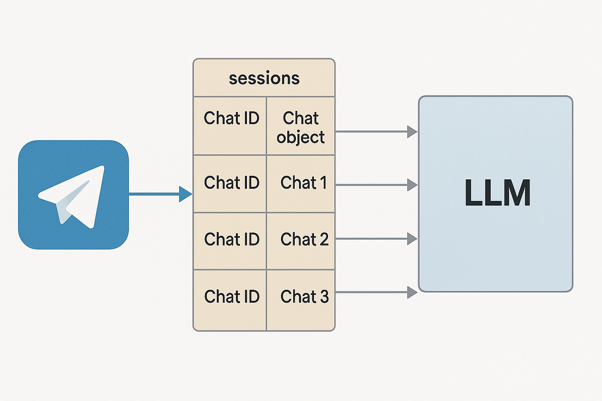

# Интегрируем в бота искусственный интеллект
Когда мы строим диалоговую логику на основе заранее заданных правил и сценариев — это даёт нам полный контроль, но ограничивает гибкость. Пользователи всё чаще ожидают от ботов способности понимать свободный текст и адаптироваться к ходу беседы.

Чтобы наш бот стал «умнее», мы можем интегрировать в него LLM — большие языковые модели, такие как GPT. Это позволяет ботам не просто отвечать на вопросы, а по-настоящему понимать контекст, уточнять детали, объяснять, переспрашивать и даже вести небольшие консультации.

В этой главе мы разберём, как с помощью языка R подключить ИИ к нашему боту: от генерации ответов до работы с памятью и контекстом.

## Как мы используем LLM в рабочих процессах
Львиная часть нашей работы заключается в разработке скриптов, которые получают данные из различных источников, обрабатывают их, и далее либо куда-то записывают, либо формируют из них сообщения или письма и рассылают. Все скрипты крутятся на сервере под Windows, и запускаются через планировщик задач. На данный момент в планировщике заданий настроено более 350 задач, запускающих разные скрипты.

Для мониторинга планировщика заданий был написан бот, о котором я рассказал в первой главе книги. Он запускается каждые 10 минут, проверяет статус последнего выполнения всех настроенных в планировщике задач, и отправляет уведомления в Telegram, со списком задачь, работа которых была завершена ошибкой.

Недавно мы пошли дальше, и развернули на сервере Shiny приложение, которое запрашивает все данные по задачам из планировщика заданий Windows, и позволяет:

* Просматривать и фильтровать список настроенных задач
* Просматривать логи, т.е. Rout файлы запускаемых задачей скриптов
* Отправлять .Rout файл на анализ в LLM, и получать объяснение о возникновении ошибки при выполнении скрипта, и пошаговый план по устранению ошибки
* Просматривать листинг скрипта запускаемого задачей
* Отправить код на анализ в Gemini и получить объяснение того, что этот код делает
* Запускать задачу

Так же в приложении есть и много другого функционала, среди которых есть чат основанный на LLM, который помогает генерировать код, и исправлять ошибки.

У нас достаточно много внутренних источников данных:

* Внутренняя самописная ERP/CRM система
* Внутренняя самописная HRM система
* Менеджер задач
* Система финансового учёта
* И ряд других внутренних источников данных.

Под работу с каждым из этих источников данных у нас написаны пакеты, которые по сути являются обёрткми в которые вшиты либо SQL запросы либо вызовы API. Так вот, чат помогающий нам писать код, анализирующий Rout файл и листинг кода, о котором я писал выше, дообучен документацией по работе к нашим пакетам, и он генерирует и анализирует код и логи с использованием подробной документации к нашим внутренним пакетам, чего не может делать ни один внешний LLM чат, ни ChatGPT, ни Claude, ни Gemini.

Всё это работает на базе Shiny, ellmer, shinychat и Gemini, абсолютно бесплатно. Большую часть этого функционала можно интегрировать и в Telegram бота.

## Генерация API ключа
Для работы с API любой LLM модели вам надо сгенерировать API ключ. Практически все провайдеры сейчас убрали из планов бесплатный доступ к API, единственный провайдер, у которого я нашел бесплатный тарифы это Gemini.

Для генерации ключа просто зайдите в [Google AI Studio](https://aistudio.google.com/), и нажмите кнопку Get API Key. В бесплатном тарифе вам доступно [несколько моделей](https://ai.google.dev/gemini-api/docs/pricing), среди которых очень неплохо себя показала `Gemini 2.5 Flash`.

Для удобства дальнейшей работы создайте переменную среды `GOOGLE_API_KEY` с полученным ключём.

## Работа с LLM в R
Для работы с большими языковыми моделями в R команда Хедли Викхема написала отличный пакет - `ellmer`. Который упрощает использование больших языковых моделей (LLM) из языка R. Он поддерживает широкий спектр провайдеров LLM и реализует множество функций, включая потоковую передачу ответов, вызов инструментов/функций, извлечение структурированных данных и многое другое.

На данный момент в `ellmer` уже интегрированы множество моделей, для начала работы с любым из них необходимо использовать функцию-конструктор объекта `chat`:

* Anthropic’s Claude: `chat_claude()`.
* AWS Bedrock: `chat_bedrock()`.
* Azure OpenAI: `chat_azure()`.
* Databricks: `chat_databricks()`.
* DeepSeek: `chat_deepseek()`.
* GitHub model marketplace: `chat_github()`.
* Google Gemini: `chat_gemini()`.
* Groq: `chat_groq()`.
* Ollama: `chat_ollama()`.
* OpenAI: `chat_openai()`.
* OpenRouter: `chat_openrouter()`.
* perplexity.ai: `chat_perplexity()`
* Snowflake Cortex: `chat_snowflake()` и `chat_cortex_analyst()`.
* VLLM: `chat_vllm()`.

### Создание чата и отправка запроса
Установим пакет `ellmer`, и создадим объект `chat` и отправим свой первый запрос:

```{r eval=FALSE}
pak::pak('ellmer')
library(ellmer)

# API ключ
Sys.setenv(GOOGLE_API_KEY = 'ВАШ API ТОКЕН')

chat <- chat_gemini(
  system_prompt = 
    'Ты специалист по анализу данных, и разработчик на языке R. 
     В этом чате ты помогаешь генерировать код на языке R.'
  )

out <- chat$chat(
  'Напиши мне функцию, которая по заданному 
   городу запрашивает текущу погоду из бесплатного API', 
  echo = 'none'
  )
```

Вы получите в объекте `out` примерно такой ответ:

```
Конечно! Вот функция на R, которая запрашивает текущую погоду для заданного города, используя бесплатный API OpenWeatherMap. 
Чтобы использовать эту функцию, вам понадобится зарегистрироваться на OpenWeatherMap (https://openweathermap.org/) и получить свой API ключ.

# Установите пакеты, если они еще не установлены
# install.packages(c("httr", "jsonlite"))

library(httr)
library(jsonlite)

get_weather <- function(city, api_key) {
  # Формируем URL для запроса к API
  base_url <- "http://api.openweathermap.org/data/2.5/weather"
  query_params <- list(q = city, appid = api_key, units = "metric") # units=metric для градусов Цельсия

  # Выполняем GET запрос
  response <- GET(base_url, query = query_params)

  # Проверяем статус ответа
  if (http_status(response)$category != "Success") {
    stop(paste("Ошибка при запросе к API. Статус код:", http_status(response)$message))
  }

  # Преобразуем JSON ответ в R объект
  data <- fromJSON(content(response, "text", encoding = "UTF-8"))

  # Извлекаем нужную информацию
  temperature <- data$main$temp
  humidity <- data$main$humidity
  description <- data$weather$description[1]
  wind_speed <- data$wind$speed

  # Формируем сообщение с информацией о погоде
  weather_message <- paste0(
    "Погода в городе ", city, ":\n",
    "Температура: ", temperature, " °C\n",
    "Влажность: ", humidity, "%\n",
    "Описание: ", description, "\n",
    "Скорость ветра: ", wind_speed, " м/с"
  )

  return(weather_message)
}

# Пример использования функции
# Замените "YOUR_API_KEY" на ваш реальный API ключ
api_key <- "YOUR_API_KEY"
city_name <- "Moscow"

tryCatch({
  weather_info <- get_weather(city_name, api_key)
  cat(weather_info)
}, error = function(e) {
  cat("Произошла ошибка: ", e$message, "\n")
})

### Как использовать эту функцию:

1.  **Установите необходимые пакеты:** Если у вас еще не установлены пакеты `httr` и `jsonlite`, раскомментируйте и выполните первую часть кода (`install.packages(...)`).
2.  **Получите API ключ:** Зарегистрируйтесь на OpenWeatherMap и получите свой API ключ.
3.  **Замените `YOUR_API_KEY`:** В коде, замените `"YOUR_API_KEY"` на ваш полученный API ключ.
4.  **Укажите город:** Измените переменную `city_name` на нужный вам город.
5.  **Запустите код:** Выполните код R. Результат будет выведен в консоль.

### Что делает этот код:

*   Использует пакет `httr` для выполнения HTTP запросов к API OpenWeatherMap.
*   Использует пакет `jsonlite` для разбора JSON ответа от API.
*   Формирует URL запроса с указанием города и API ключа.
*   Обрабатывает возможные ошибки при запросе к API.
*   Извлекает информацию о температуре, влажности, описании погоды и скорости ветра из JSON ответа.
*   Форматирует и возвращает текстовое сообщение с информацией о погоде.

Этот пример предоставляет базовую функциональность. Вы можете расширить его, чтобы включать другие данные о погоде, такие как давление, восход и закат солнца, и т.д.
```

Все функции-конструкторы чатов имеют общий набор основных аргументов:

* `model` - Имя модели, которую вы хотите использовать. Каждый провайдер предлагает различные модели, и вы можете выбрать ту, которая лучше всего подходит для вашего случая использования. Например, у OpenAI есть модели GPT-4o, gpt-4o-mini и др.
* `system_prompt` - Строка, описывающая роль или поведение чата. Это начальная подсказка, которая задает тон и стиль взаимодействия, например: «Ты специалист по анализу данных, и разработчик на языке R. В этом чате ты помогаешь генерировать код на языке R.»
* `api_args` - Список дополнительных аргументов, которые могут быть переданы API. Это может включать настройки специфичные для конкретного провайдера, например, температуру для генерации текста.
* `echo` - Управление выводом результата, принимает одно из значений: none, text, all.

Объект `chat` построен на базе `R6` классов, которые являются реализацией классического ООП в R, chat имеет следующие методы:

* `chat()` - Этот метод используется для отправки запроса к LLM и получения ответа в виде строки.
* `stream()` - Позволяет обрабатывать потоковые данные в реальном времени. Этот метод возвращает генератор coro, который позволяет обрабатывать ответ по мере его поступления. Это удобно для различных случаев использования, таких как запись данных в файл или отправка ответа в интерфейс Shiny.
* `chat_async()` - Асинхронная версия метода chat(). Возвращает promise, который разрешает результаты, когда ответ получен. Полезен для одновременного запуска нескольких сеансов общения или в контексте Shiny, чтобы не блокировать интерфейс.
* `stream_async()` - Асинхронная версия метода stream(). Она возвращает async generator, который позволяет обрабатывать асинхронные результаты с течением времени.
* `extract_data()` - Используется для извлечения структурированных данных из текста или изображений. Принимает схему, определяющую, как должны быть структурированы данные. Возвращает данные в R-представлении, например в виде списка или таблицы данных.
* `register_tool()` - Регистрирует внешние функции или "инструменты", которые чат-бот может вызывать. Позволяет настроить чат для выполнения дополнительных действий в зависимости от контекста, таких как выполнение API-запросов или манипуляции с данными.
* `token_usage()` - Возвращает информацию об использовании токенов в текущей сессии. Это полезно для оптимизации затрат на использование модели, так как позволяет следить за количеством использованных и оставшихся токенов.

### Извлечение структурированных данных из текста
Большинство LLM моделей обладают функцией извлечения структурированных данных их текста. С помощью чего вы можете:

* Быстро обрабатывать полнотекстовые анкеты извлекая из них нужные данные
* Определить настроение комментариев
* Классифицировать статьи по тематикам

Да и в целом можно найти огромное количество вариантов применения этой функции. Реализуется она с помощью метода `extract_data()`, в который вам необходимо передать текст, из которого планируете извлечь структурированные данные, и описание структуры, которую вы хотите извлечь из текста.

```{r eval=FALSE}
## описание структуры
personal_data_str <- type_object(
  age  = type_integer('Возраст в годах, целое число'),
  name = type_string('Имя'),
  job  = type_string('Занимаемая на работе должность')
)

## извлекаем информацию
text <- "
Привет, меня зовут Алексей, мне 40 лет, с 2016 года занимаю должность 
руководителя отдела аналитики.
"
personal_data <- chat$extract_data(text, type = personal_data_str)
```

Т.е. изначально вам необходимо создать объект описания структуры с помощью функции type_object(), внутри которого вы описываете каждый отдельный извлекаемый элемент структуры с помощью других функций семейства type_*(), все типы данных можно условно поделить на 3 категории:

* Скаляры представляют собой отдельные значения, которые бывают пяти типов: `type_boolean()`, `type_integer()`, `type_number()`, `type_string()` и `type_enum()`, представляющие собой отдельные логические, целочисленные, двойные, строковые и факторные значения соответственно. По смыслу они похожи на векторы единичной длинны.
* Массивы представляют любое количество значений одного типа и создаются с помощью `type_array()`. Вы всегда должны указывать `item` аргумент, который определяет тип каждого отдельного элемента. Массивы скаляров очень похожи на атомарные векторы R.
* Объекты представляют собой набор именованных значений и создаются с помощью `type_object()`. Объекты могут содержать любое количество скаляров, массивов и других объектов. Они похожи на именованные списки в R.

У функции извлечения структурированных данных есть и более продвинутые варианты применения. Например, мы можем дать эмоциональную оценку отзывов клиентов о товаре и продавце, распределив в процентах насколько комментарий является положительным, нейтральным и отрицательным:

```{r eval=FALSE}
# классификация настроения комментария
text <- "
Купленный товар работает отлично, к нему никаких притензий нет, 
но обслуживание клиентов было ужасным. 
Я, вероятно, больше не буду у них покупать.
"
type_sentiment <- type_object(
  "Извлеки оценки настроений заданного текста. Сумма оценок настроений должна быть равна 1.",
  positive_score = type_number("Положительная оценка, число от 0.0 до 1.0."),
  negative_score = type_number("Отрицаетльная оценка, число от 0.0 до 1.0."),
  neutral_score = type_number("Нейтральная оценка, число от 0.0 до 1.0.")
)

str(chat$extract_data(text, type = type_sentiment))
```

В результате мы получим примерно такой ответ:

```
List of 3
 $ positive_score: num 0.1
 $ negative_score: num 0.8
 $ neutral_score : num 0.1
```

Хотя с просьбой "Сумма оценок настроений должна быть равна 1." модель не всегда справляется успешно.

Этот же подход можно использовать и для других форм классификации текста, например по тексту статьи определить её тематику, к тому же извлекать данные можно не только из текста но даже из изображений:

```{r eval=FALSE}
type_asset <- type_object(
  assert_name = type_string(),       # Название актива
  owner = type_string(),             # Владелец
  location = type_string(),          # Местоположение
  asset_value_low = type_integer(),  # Минимальная оценка стоимости актива
  asset_value_high = type_integer(), # Максимальная оценка стоимости актива
  income_type = type_string(),       # Тип дохода
  income_low = type_integer(),       # Минимальный доход
  income_high = type_integer(),      # Максимальный доход
  tx_gt_1000 = type_boolean()        # Были ли транзакции на сумму более $1000 (TRUE/FALSE)
)

type_assets <- type_array(items = type_asset)

chat <- chat_openai()
#> Используется модель = "gpt-4o".

image <- content_image_file("congressional-assets.png")
data <- chat$extract_data(image, type = type_assets)
```


Ответ:
```
                                assert_name owner
1  11 Zinfandel Lane - Home & Vineyard [RP]    JT
2 25 Point Lobos - Commercial Property [RP]    SP
                            location asset_value_low asset_value_high
1             St. Helena/Napa, CA, US         5000001         25000000
2 San Francisco/San Francisco, CA, US         5000001         25000000
  income_type income_low income_high tx_gt_1000
1 Grape Sales     100001     1000000       TRUE
2        Rent     100001     1000000      FALSE
```

### Добавление в чат инструментов
Одна из ключевых особенностей современных чат-моделей — способность вызывать внешние инструменты.

Модель может в ответ на запрос использовать один или несколько таких инструментов — то есть, запросить выполнение нужной функции с заданными параметрами. После выполнения функция возвращает результат, и модель использует его, чтобы продолжить ответ или сделать новый вызов. Именно так работают AI ассистенты.

Метод `register_tool()` позволяет вам встраивать в ваш чат дополнительные инструменты, например интеграцию с любыми другими API, или в целом описать любой другой инструментарий посредствам создания обычных R функций, которые вы добавите в чат. Например, ниодна LLM модель не может получить данные в реальном времени, она не знает даже текущего времени, не может дать вам информацию о текущей погоде в каком либо городе. 

```{r eval=FALSE}
chat <- chat_gemini()

chat$chat('Какое текущее время сейчас по Киеву?')
```

Вы получите примерно такой ответ - "Я не знаю текущее время в Киеве. Я могу получить доступ только к информации о реальном времени, о которой мне явно предоставили.". Но мы можем написать функцию запрашивающую текущее время, и добавить её в качестве инструмента в наш чат:

```{r eval=FALSE}
#' Получает текущее время в указанном часовом поясе.
#'
#' @param tz Часовой пояс, в котором нужно получить текущее время.
#' @return Текущее время в указанном часовом поясе.
get_current_time <- function(tz = "UTC") {
  format(Sys.time(), tz = tz, usetz = TRUE)
}

chat$register_tool(tool(
  get_current_time,
  "Получить текущее время в указанном часовом поясе.",
  tz = type_string(
    "Часовой пояс. По умолчанию `\"UTC\"`.",
    required = FALSE
  )
))

chat$chat('Какое текущее время сейчас по Киеву?')

```

Теперь модель может получить текущеее время, и ответит вам примерно так: "Сейчас 19:25:29 по киевскому времени.".

В этом примере мы написали функцию `get_current_time()`, которая получает текущее время по указанному часовому поясу. Далее мы добавили эту функцию в чат с помощью метода `register_tool()`, и функции `tool()`, которая позволяет вам дать описание того, что передаваемая в чат функция делает, и описать каждый её аргумент. Таким образом модель из контекста общения с пользователем понимает какой дополнительный функционал в неё интегрирован, и когда этот функционал необходимо использовать. 

## Интеграция LLM модели в бот
Теперь давайте разберёмся с тем, как добавить весь описанный выше функционал в Telegram бота. Основная сложность с которой вы можете столкнуться это то, как хранить одновременно отдельные объекты chat для кадого отдельного чата в Telegram. Т.к. если вы просто создадите один объект чата, и в него будут прилетать сообщения из разных telegram чатов, и разных пользователей, то контекст чата будет запутан, и соответвенно модель в чате не сможет осмысленно связать все входящие сообщения, и качество ответов будет желать лучшего. Поэтому одним из вариантов хранения информация о разных чатах является создание списока, в котором в виде отдельных элементов будут хранится разные объекты чата для разных telegram чатов, название каждого элемента списка будет соответвовать идентификатору чата в telegram.



Простейший пример кода, для интеграции LLM модели в telegram бот выглядит так:
```{r eval=FALSE}
library(telegram.bot)
library(ellmer)

# Создаём глобальную переменную для хранения сессий
# в которую будут добавляться новые чаты
sessions <- list()

# Handler для команды /start
start_handler <- function(bot, update) {
  
  chat_id <- update$message$chat$id
  
  # Создаём новый чат-объект для пользователя с уникальным чатом
  chat <- chat_gemini(
    system_prompt = "
        Ты специалист по разработке кода и анализу данных на языке на языке R, 
        в этом чате помогаешь с разработкой кода на R. Твои ответы должны занимать не более 3000 символов.
    "
  )
  
  # Сохраняем чат-объект в глобальной переменной sessions
  sessions[[as.character(chat_id)]] <<- chat
  
  bot$sendMessage(chat_id = chat_id, text = "Здравствуйте, чем могу вам помочь?")
  
}

# Handler для текстовых сообщений
message_handler <- function(bot, update) {
  
  chat_id <- update$message$chat$id
  
  # Получаем чат-объект для пользователя
  chat <- sessions[[as.character(chat_id)]]

  # Если чат не найден то просим выполнить команду start для его запуска
  if (is.null(chat)) {
    bot$sendMessage(chat_id = chat_id, text = "Используйте /start для начала AI чата.")
    return(NULL)
  }
  
  # текст запроса
  user_message <- update$message$text
  
  # отправляем запрос пользователя в LLM
  response <- chat$chat(user_message, echo = FALSE)
  
  # отправляем в чат полученный от LLM ответ
  bot$sendMessage(
    chat_id = chat_id, 
    text = response,
    parse_mode = 'markdown'
  )

}

# Инициализируем бот и добавляем обработчики
updater <- Updater(bot_token('TEST'))

# Обработчики
h_start <- CommandHandler("start", start_handler)
h_msgs  <- MessageHandler(message_handler, MessageFilters$text)

updater <- updater + h_start + h_msgs

# Запускаем бота
updater$start_polling()
```

Что делает этот код и как он устроен:
В этом примере мы создаём Telegram-бота, который использует LLM-модель через пакет ellmer и умеет вести отдельные диалоги с каждым пользователем, сохраняя контекст общения.

1. Инициализация переменной sessions:
В начале мы создаём глобальный список sessions, куда будут добавляться объекты чата chat_gemini для каждого Telegram-пользователя. Ключом в этом списке будет ID Telegram-чата (chat_id). Это позволяет хранить независимый LLM-контекст для каждого пользователя.

2. Обработчик команды /start:
Когда пользователь впервые запускает бота командой /start, срабатывает start_handler.
В нём:

* Получается `chat_id` пользователя.
* Создаётся новый объект `chat_gemini` с заданным `system_prompt.` В prompt задаётся роль модели: помощник по разработке на языке R.
* Этот объект сохраняется в список sessions, где ключом служит chat_id.
* Пользователю отправляется приветственное сообщение.

3. Обработчик текстовых сообщений:
Этот обработчик вызывается каждый раз, когда пользователь пишет что-то в чат. Внутри:

* Получаем `chat_id` и по нему — соответствующий объект из `sessions.`
* Если объект чата не найден (например, пользователь не вызвал `/start`), то бот просит сначала это сделать.
* Если всё ок — берём текст сообщения пользователя и отправляем его в LLM через `chat$chat()`.
* Полученный ответ от модели возвращается пользователю в Telegram.

4. Запуск бота:
Далее создаётся объект `Updater` с токеном бота, к нему добавляются два обработчика: для команды `/start` и для всех обычных сообщений.
Затем вызывается `start_polling()`, чтобы бот начал слушать входящие сообщения.

В чём суть логики?
Главное в этом подходе — поддержка сессий для каждого пользователя. Благодаря списку `sessions` мы можем вести независимые диалоги с разными пользователями одновременно. Каждый `chat_gemini` живёт в своей "ячейке" и помнит контекст диалога. Это особенно важно для того, чтобы LLM не путала запросы между разными пользователями, и могла давать максимально точные и уместные ответы.

Обратите внимание, что в системном промпте я отдельно указал "Твои ответы должны занимать не более 3000 символов.", это сделано для того, что полученный от модели ответ помещался в одно сообщение telegram, которое на данный момент имеет лимит в 4096 символов.

Приведённый выше бот будет хранить все чаты в рамках одной своей сессии, после перезапуска все чаты будут удалены из его памяти. Если вам нужен бот, который будет хранить информацию о всех чатах между сессиями то объекты чата надо хранить в виде локальных rds файлов. Для реализации надо:

1. Написать функции для сохраннеия и записи обхектов чатов в RDS файлы
2. Доработать функции start_handler() и message_handler() так, что бы они читали и сохраняли объекты чата в отдельные RDS файлы.

Сохраним код функций для работы с RDS файлами в отдельный `session_func.R` файл.

```{r eval=FALSE}
save_chat <- function(chat_id, chat_object) {
  file_path <- file.path("chat_sessions", paste0(chat_id, ".rds"))
  saveRDS(chat_object, file_path)
}

load_chat <- function(chat_id) {
  file_path <- file.path("chat_sessions", paste0(chat_id, ".rds"))
  if (file.exists(file_path)) {
    return(readRDS(file_path))
  } else {
    return(NULL)
  }
}
```

И доработаем код бота:

```{r eval=FALSE}
library(telegram.bot)
library(ellmer)

# Загрузка функций чтения объектов чата
source('session_func.R')

# Handler для команды /start
start_handler <- function(bot, update) {
  
  chat_id <- update$message$chat$id
  
  # Проверяйм был ли ранее создан чат
  chat <- load_chat(chat_id)
  # Создаём новый чат-объект для пользователя с уникальным чатом
  if (is.null(chat)) {
    chat <- chat_gemini(
      system_prompt = paste(readLines(here::here('system_prompt.md')), collapse = "\n")
    )
    
    # сохраняем объект чата
    save_chat(chat_id, chat)
    
  }
  
  bot$sendMessage(chat_id = chat_id, text = "Здравствуйте, чем могу вам помочь?")
  
}

# Handler для текстовых сообщений
message_handler <- function(bot, update) {
  
  chat_id <- update$message$chat$id
  
  # Получаем чат-объект для пользователя
  chat <- load_chat(chat_id)
  
  # Если чат не найден то просим выполнить команду start для его запуска
  if (is.null(chat)) {
    bot$sendMessage(chat_id = chat_id, text = "Используйте /start для начала AI чата.")
    return(NULL)
  }
  
  # текст запроса
  user_message <- update$message$text
  
  # отправляем запрос пользователя в LLM
  response <- chat$chat(user_message, echo = FALSE)
  
  # сохраняем объект чата
  save_chat(chat_id, chat)
  
  # отправляем в чат полученный от LLM ответ
  bot$sendMessage(
    chat_id = chat_id, 
    text = response,
    parse_mode = 'markdown'
  )
  
}

# Инициализируем бот и добавляем обработчики
updater <- Updater(bot_token('TEST'))

# Обработчики
h_start <- CommandHandler("start", start_handler)
h_msgs  <- MessageHandler(message_handler, MessageFilters$text)

updater <- updater + h_start + h_msgs

# Запускаем бота
updater$start_polling()
```

Как изменилась логика работы бота
В этой версии бота добавлена долговременная память — теперь каждый чат сохраняется в отдельный .rds-файл, а значит, бот не забывает переписку после перезапуска.

Основные изменения:

1. Загрузка и сохранение сессий:
Вместо хранения объектов `chat_gemini` в оперативной памяти (в списке sessions) теперь используется файловая система. Добавлены функции `load_chat()` и `save_chat()`, которые читают и записывают объекты чата в .rds-файлы (по одному на каждый chat_id). Эти функции подключаются из внешнего файла `session_func.R`.

2. Обновлён `start_handler()`:
Теперь при вызове `/start` бот сначала проверяет, есть ли сохранённый .rds-файл сессии для данного пользователя. Если есть — загружает его. Если нет — создаёт новый чат-объект и сохраняет его.

3. Обновлён `message_handler()`:
Здесь всё то же, что и раньше, но теперь после каждого запроса дополнительно сохраняется обновлённый объект чата обратно в `.rds`. Это важно, чтобы вся история общения сохранялась между сессиями.

Таким образом, теперь бот умеет "помнить", о чём вы говорили с ним ранее, даже если он был выключен или перезапущен — очень полезно для долгосрочного взаимодействия с пользователями.

### Дообучение бота на своих данных
Основным аргументом позволяющим вам дообучать модель собственными данными, например документацией к вашим пакетам, или просто описанием каких либо ваших рабочих процессов источников данных, или чего угодно, является `system_prompt`. 

`system_prompt` — это стартовая инструкция для модели, которая задаёт тон и правила поведения. 

Прямо как в обычном чате с GPT:
Если вы пишете в первый ввод:

>Ты — мой личный помощник по R. Отвечай кратко, в стиле Hadley Wickham.

…модель будет учитывать это в течение сессии. Но как только ты начнёшь новый чат — всё забудется. Это называется контекстный промпт.

А `system_prompt` в `chat_gemini()` — это способ задать этот промпт жёстко и навсегда на всю сессию, как если бы ты каждый раз начинал чат с этой инструкции — только скрыто, под капотом.

#### Как модель его воспринимает
Когда начинается чат, за кулисами делается следующее:

```{r eval=FALSE}
chat <- chat_gemini(system_prompt = "Ты — эксперт по R...")
chat$chat("Подскажи как пользоваться пакетом dplyr")
```

Модель на самом деле получает примерно такое:

```
system: Ты — эксперт по R...
user: Подскажи как пользоваться пакетом dplyr
```

`system_prompt` — это то, что модель видит всегда первым. Он как брифинг или техническое задание. Модель будет отталкиваться от него при любом ответе.

В первом примере кода, мы задачи системный промпт просто небольшой строкой "Ты специалист по разработке кода и анализу данных на языке на языке R, в этом чате помогаешь с разработкой кода на R. Твои ответы должны занимать не более 1500 символов.", что даёт общую зарактеристику чату, но в этом случае мы никак не дообучиваем модель своими данными.

Во втором примере в аргумент `system_prompt` я загрузил файл `system_prompt = paste(readLines(here::here('system_prompt.md')), collapse = "\n")`, в котором вы можете описать любую информцию, и бот будет вести диалог используя все описанные вами инструкции. В своём рабочем боте я дал базовое описание:

* какие внутренние источники данных у нас есть
* определение того какой пакет предназначен для работы с каким источником
* описание всех функций, всех аргументов, и всех возвращаемых каждой функцией пакета полей

Т.е. мой md файл выглядит примерно так:

```
В этом чате ты выполняешь несколько фукнций:

1. Анализируешь логи выполнения скриптом читая Rout файлы, даёшь объяснения ошибки и пошаговый план её исправления
2. Помогаешь генерировать код на основе внутренних корпоративных пакетов

# Внутренние источники данных
Тут базово описаны внутренние истоники данных

# Соответвие пакета и источника данных
Прописываем какой пакет предназначен для работы с каждым из источников данных

# Документация к пакетам
Ниже приведена подробная документация к корпоративным пакетам, используй эту документацию для генерации кода и анализа Rout файлов.

## Название пакета
Работает с источником 1

## Функции пакета

* название фукнции 1 - описание
  * аргументы
    * аргумент 1 - описание
    * аргумент 2 - описание
  * поля которые возвращает функция
    * поле 1 - описание
    * поле 2 - описание
* название фукнции 2 - описание
  * аргументы
    * аргумент 1 - описание
    * аргумент 2 - описание
  * поля которые возвращает функция
    * поле 1 - описание
    * поле 2 - описание
```

Но в зависимости от выполняемых в чате задач, наполнение файла, который вы будете загружать в качестве системного промпта может меняться. Ниже пример системного промпта для SQL помощника:

```
Ты выступаешь как эксперт по аналитике данных и SQL-запросам. Помогаешь сотрудникам отдела BI писать, оптимизировать и проверять SQL-запросы.

# Стандарты компании
* Используем только `standard SQL`
* Основная СУБД — Google BigQuery
* Все таблицы именуются в формате `project.dataset.table`
* Все временные метки храним в UTC

# Часто используемые таблицы
* `analytics.sessions` — содержит сессии пользователей
* `analytics.events` — события, собранные с сайта

# Частые ошибки
* Использование `JOIN` без `ON`
* Ошибки в `PARTITION BY` при использовании оконных функций

# Подсказки
1. Если запрос слишком медленный — предложи варианты оптимизации
2. Всегда объясняй, что делает запрос
```

## Заключение
Теперь наш бот умеет обращаться к языковым моделям и выдавать осмысленные ответы на свободный текст. Это мощный инструмент, но с ним приходит и новая ответственность: что, если кто-то начнёт злоупотреблять этой возможностью?

Не все пользователи должны иметь равные права доступа ко всем функциям бота. Например, ты можешь захотеть, чтобы только определённые пользователи могли инициировать диалог с ИИ, просматривать конфиденциальные данные или выполнять административные команды.

В следующей главе мы разберём, как настроить систему прав доступа и разграничения функциональности в Telegram-боте на языке R.
