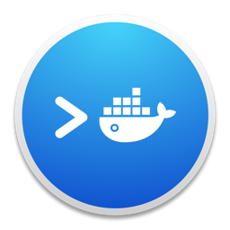

# Упаковываем бота в Docker контейнер

## Что такое докер
Docker — программное обеспечение для автоматизации развёртывания и управления приложениями в средах с поддержкой контейнеризации, контейнеризатор приложений. Позволяет «упаковать» приложение со всем его окружением и зависимостями в контейнер. 

Docker предназначен для заключения сред внутри образа/контейнера. Это позволяет, например, иметь компьютер с Linux на Windows или компьютер с R 3.3, когда на вашем основном компьютере установлен R 3.5. Кроме того, это означает, что вы можете использовать более старые версии пакета для конкретной задачи, сохраняя при этом пакет на вашем компьютере в актуальном состоянии.

Т.е. вы можете запустить бота в абсолютно изолированной среде, на которой будет предустановлены всё необходимое ПО, настроены переменные окружения, и она никак не будет зависить от внешних настроек вашей операционной системы. Соответвенно, при запуске контейнера по созданному образу на любой другой машине, вам не придётся её каким либо образом предварительно настраивать, прописывать переменные среды, устанавливать нужные пакеты, устанавливать сам язык R и т.д.

В этом учебнике мы не будем подробно изучать сам Docker, т.к. это отдельная большая тема, а учебник у нас по разработке telegram ботов, а не работе с Docker. Но в интернете вы без проблем найдёте огромное количество статей и видео уроков, которые помогут вам глуюже погрузиться в изучение возможностей Docker. Данная глава лишь описывает рабочий процесс упаковки и запуска бота написанного на языке R. 

## Установка Docker
Для начала вам необходимо скачать и установить Docker и Docker Compose на свой ПК. Перейдите по [ссылке](https://github.com/docker-archive/toolbox/releases), скачайте инсталятор для своей операционной системы и запустите процесс установки.

У меня никаких дополнительных манипуляций процесс установки не потребовал, но в случае сложностей, я рекомендую найти на YouTube урок по установке Docker на вашу операционную систему.

По завершию установки запустите Docker Quickstart Terminal, ярлык вы найдёте на рабочем столе.



## Создаём проект в RStudio
Для удобства работы я рекомндую создать проект.

Открываем RStudio и создаём новый проект. Перейтиде в меню file -> New Project....


Далее выбираем "New project" и указываем имя проекта.


## Код бота
В данном случае нам не особо важен функционал нашего бота, поэтому мы просто возьмём код асинхронного бота из 7ой главы этого учебника:

Меню file -> New file -> R script (или сочетание клавиш Ctrl+Shift+N). Далее скопируйте приведённый ниже код бота, и сохраните его с именем `bot.R`.
```{r eval=FALSE}
library(telegram.bot)
library(stringr)

# Включаем параллельный план вычислений
future::plan('multisession', workers = 4)

# Инициализируем бота
updater <-  Updater(bot_token('botname'))
# Очищаем очередь бота от старых сообщений
updater$bot$clean_updates()

# Функция с длительным временем вычислений
slow_fun <- function(bot, update) {
  
  # Запускаем выполнение кода в параллельной сессии
  promises::future_promise(
    {
      # Сообщение о том, что начата работа длительного вычисления
      bot$sendMessage(update$message$chat_id,
        text = str_glue("Медленная функция, начало работы!\nID процесса: {Sys.getpid()}"),
        parse_mode = "Markdown")
      
      # Добавляем паузу, для того, что бы исскусственно сделать функцию длительной
      Sys.sleep(10)
      
      # Сообщаем о том, что все вычисления выполнены
      bot$sendMessage(update$message$chat_id,
        text = str_glue("Медленная функция выполнена!\nID процесса: {Sys.getpid()}"),
        parse_mode = "Markdown")
    }
  )
  
}

# Функция с коротким временем вычислений
fast_fun <- function(bot, update) {
  
  
  # Просто отправляем сообщение
  bot$sendMessage(update$message$chat_id,
    text = str_glue("Быстрая функция, выполняется последовательный режим!\nID процесса: {Sys.getpid()}"),
    parse_mode = "Markdown")
  
}


# Остановка пулинга
stop <- function(bot, update) {
  
  lg$info('Bot stop')
  bot$sendMessage(update$message$chat_id,
    text = str_glue("Останавливаю работу бота!\nID процесса: {Sys.getpid()}"),
    parse_mode = "Markdown")
  # Просто отправляем сообщение
  updater$stop_polling()
  
}

# Функция с ошибкой, имитирующая падение бота
crush <- function(bot, update) {
  
  lg$info('Crush command')
  bot$sendMessage(update$message$chat_id,
    text = str_glue("Функция с ошибкой, сбой в работе бота!\nID процесса: {Sys.getpid()}"),
    parse_mode = "Markdown")
  
  stop("Ошибка, сбой бота!")
  
}

# создаём обработчик
lg$info('Make handlers')
slow_hendler <- CommandHandler('slow', slow_fun)
fast_hendler <- CommandHandler('fast', fast_fun)
stop_hendler <- CommandHandler('stop', stop)
crush_hendler <- CommandHandler('crush', crush)

# добаляем добавляем в диспетчер
lg$info('Add handlers to dispatcher')
updater <- updater + slow_hendler + fast_hendler+ stop_hendler + crush_hendler

# запускаем бота
lg$info('Run polling')
updater$start_polling()
```


**Обратите внимание, я явно указал количество потоков `future::plan('multisession', workers = 4)`, т.к. в контейнере по умолчанию функция `plan()` определит всего 1 ядро, и соответвенно бот будет запущен в последовательном режиме работы.**

Также мы добавили команду очистки очереди бота от старых сообщений, после его инициализации.

Помимо прочего мы добавили боту две новые команды:

* `stop` - Команда остановки бота.
* `crush` - Команда с ошибкой, имитирующая падение бота.

## Образы и контейнеры
В основе работы Docker лежат образы и созданные из них контейнеры. Образы — это описание среды и её настроек, необходимых для работы вашего бота (R, пакеты, переменные среды), а контейнеры — это фактически запущенные экземпляры образов. Образ создаётся один раз, а контейнеры будут запускаться всякий раз, когда вам необходимо запустить бота. И, конечно же, одновременно можно запускать несколько контейнеров с одними и теми же образами.

Применительно к R, это тот же принцип, что установка и загрузка пакета: для начала вам необходимо один раз установить пакет командой `install.packages()`, а потом подключать его командой `library()` каждый раз, когда вам требуется его функционал. И пакет можно легко запустить в нескольких сеансах R одновременно.

Продолжая аналогию с пакетами, создание образа по смыслу схоже на команду `install.packages()`, а запуск контейнера на основе образа по смыслу близко к команде `library()`.

## Создание Dockerfile
Docker образ создаётся из `Dockerfile`. По сути это обычный текстовый файл, без расширения, в котором вы прописываете команды для развёртования нужной для запуска вашего бота среды. 

Теперь необходимо создать в рабочей директории проекта обычный текстовый файл, и дать ему имя `Dockerfile`.


Докер файл будет содержать следующие команды:
```
FROM rocker/r-ver:4.2.1

RUN mkdir /home/bot

ENV R_TELEGRAM_BOT_botname ТОКЕН_ВАШЕГО_БОТА

COPY bot.R /home/bot/bot.R

RUN R -e "install.packages(c('telegram.bot', 'stringr', 'future', 'promises','fastmap'))"

CMD R -e "source('/home/analysis/bot.R')"
```

Тут давайте остановимя и разберём отдельно каждую команду:

1. `FROM rocker/r-ver:4.2.1`, создаёт среду с установленным R 4.2.1, вы можете указать любую, нужную вам версию R.
2. `RUN mkdir /home/bot` создаёт в контейнере папку bot.
3. `ENV R_TELEGRAM_BOT_botname ТОКЕН_ВАШЕГО_БОТА` эта команда создаёт переменную среды `R_TELEGRAM_BOT_botname` внутри контейнера. В данную переменную передайте токен вашего бота.
4. `COPY bot.R /home/bot/bot.R` копирует скрипт с кодом нашего бота в контейнер.
5. `RUN R -e "install.packages(c('telegram.bot', 'stringr', 'future', 'promises','fastmap'))"`, конструкция `RUN R -e "код на R"` позволяет запускать внутри контейнера R команды. В данном случае мы устанавливаем все, нужные нам пакеты.
6. `CMD R -e "source('/home/analysis/bot.R')"`, аналогично предыдущему пункту, мы запускаем самого бота. Команда `CMD` запускается каждый раз, при запуске контейнера.

Если вам необхоимы определённые версии используемых пакетов то вы можете заменить команду из 5 пункта на:

```
RUN R -e "install.packages('remotes'); \
  remotes::install_version('package_name', '0.1.2')"
```

Или установить пакет из снимка MRAN на определённую дату:
```
RUN R -e "options(repos = \
  list(CRAN = 'http://mran.revolutionanalytics.com/snapshot/2022-08-01/')); \
  install.packages('package_name')"
```

## Создание образа
Теперь нам необходимо перейти в терминал, и запустить команду создания образа `docker build`. Данная команда требует от вас передачи нескольких параметров:

1. `-t` - позволяет задать тег вашего образа;
2. вторым параметром являеться путь к папке с `Dockerfile`, если вы создали `Dockerfile` в текущем рабочем каталоге проекта, то просто в качестве этого параметра передайте точку.

Т.е. для создания образа перейдите в терминал (найти терминал можно на соседней вкладке с консолью в RStudio)  и запустите в терминале (не в консоле RStudio, а именно а теринале!) следующую команду:
```
docker build -t rbot .
```


## Запуск контейнера
Итак, теперь у нас уже есть собранный Docker образ с нашим ботом, и нам остаётся запустить его командой `docker run`. В данной команде мы будет использовать следующие параметры:

1. `--name` позволяет задать название контейнера
2. `-d` флаг, который запускает контейнер в фоновом режиме, не блокируя терминал
3. последним параметром мы задаём имя образа, на основе которого будет запущен контейнер.
```
docker run --name my_bot -d rbot
```


Дополнительно мы могли укзаать флаг `--rm`, который автоматически удалит контейнер после его остановки.
```
docker run --name my_bot -d --rm rbot
```

## Прокидываем токен бота в контейнер при его запуске
В примере выше мы указывали токен нашего бота непосредственно в `Dockerfile` с помощью команды `ENV R_TELEGRAM_BOT_botname ТОКЕН_ВАШЕГО_БОТА`. Это не всегда удобно, например вам зотелось бы иметь возможность указывать токен бота непосредтвенно при запуске контейнера, как вариант, вы можете запускать разных ботов, и вам не хочется постоянно редактировать `Dockerfile`. В таком случае вы можете прокидывать переменные среды при запуске используя флаг `-e`. 

Вы можете удалит из `Dockerfile` команду `ENV R_TELEGRAM_BOT_botname ТОКЕН_ВАШЕГО_БОТА`, и прокнуть эту же переменную непосредвенно при запуске контейнера.

```
docker run --name my_bot -d --rm -e R_TELEGRAM_BOT_botname="ТОКЕН_ВАШЕГО_БОТА" rbot
```

## Политики перезапуска бота
В главе "[Повышаем стабильность работы бота]" мы разобрались, как написать бота, который автоматически перезапускается в случае падения. 

При запуске бота через docker контейнер, у вас есть отдельная опция `--restart`, которая позволяет более гибко управлять перезапуском вашего бота. Данная опция принимает одно из следующих значений:

* `no` - Не перезапускать контейнер после завершения. Это значение по умолчанию.
* `on-failure[:max-retries]` - Перезапускает контейнер если он завершился с не нулевым статусом (т.е. завершился с ошибкой). Опционально можно указать количество попыток перезапуска. Это наиболее подходящая опция для работы бота, т.к. вы можете добавить боту метод остановки пуллинга, и он при запуске команды оставки успешно выклчиться, а в случае аварийной остановки - будет перезапущен.
* `always` - 	Всегда перезапускает контейнер в не зависимости от статуса завершения. Когда вы выбираете данный вариант, Docker демон будет пытаться перезапустить контейнер бесконечное число раз. Также контейнер будет всегда запускаться при запуске демона, не зависимо от текущего состояния контейнера. В данном случае у вас не будет возможности остановить бота.
* `unless-stopped` - Всегда перезапускает контейнер не зависимо от статуса завершения, но контейнер не будет запускаться при запуске демона, если контейнер до этого был остановлен вручную.

Т.е. следущая команда позволяет запустить бота, который автоматически будет перезапуска в случае ошибки, но при этом, вы в любой момент сможете остановить его любой командой.

```
docker run --name my_bot -d --rm -e --restart=on-failure rbot
```

Давайте протестируем команду `/crush` и `/stop`, как я уже писал ранее, первая имитирует ошибку в работе бота, вторая же корректно оставливает его работу.


Из скрина видно, что даже при выполнение команды `/crush` вызывающую критическую ошибку и падение бота, сам бот автоматически перезапускается, очищает очередь команд, и продолжает работу.

Команда `/stop` при этом корректно останавливает работу бота.

## Просмотр списка запущенных контейнеров
Команда `docker ps` позволяет посмотреть список запущенных в данный момент контейнеров.
```
docker ps
```


## Остановка контейнера
Для остановки контейнера используте команду `docker stop`, передав в качестве единственного аргумента либо id либо название контейнера, который необходимо остановить, в моём случае равнозначными будет две слудующие команды:
```
docker stop my_bot
```
```
docker stop d06f8cebe987
```


## Удаление контейнера
После остановки контейнера с ботом вы можете его удалить командой `docker rm` передав ей имя контенейра.
```
docker rm my_bot
```


## Запуск контейнера из планировщика заданий Windows
Вы можете запускать контейнеры из планировщика заданий Windows. Для этого на вкладке "Действия" в поле "Программа или сценайрий" укажите путь к файлу запуска Docker, обычный путь "C:\\Program Files\\Docker Toolbox\\docker.exe". А в поле "Добавить аргументы" укажите параметры запуска контейнера, в нашем случае `run --name my_bot -d --rm rbot`.


## Публикация образа в Docker hub
На данном этапе мы уже разобрались с тем, как устроен Docker, и узнали его основные команды. Но пока мы работали с образами, и запускали контейнеры локально, на ПК на котором мы эти образы собирали. Вся мощь Docker заключается в том, что собранные образы очень легко можно переносить на любой другой ПК, единственное требование - наличие на нём установленного Docker. 

Для такого переноса удобно использовать [docker-hub](https://hub.docker.com/), для начала перейдите по ссылке и зарегестрируйтесь там. 

Далее возвращаемся в терминал RStudio, логинимся в Docker-hub.

```
docker login
```

Далее введите свой логин и пароль, или ключ API вместо пароля. Теперь нам необходимо добавить нужный тег нашему образу для его публикации. Команда `tag` принимает два аргумента, имя образа, которому надо присвоить тег, и сам тег. Присваиваемый тег должен иметь следующий вид `username/repository`, т.е. имя пользователя на Docker-hub и название репозитория, куда вы хотите опубликовать образ.

```
docker rbot username/rbot
```

Следующая команда позволяет опубликовать образ на Docker-hub:
```
docker push username/rbot
```

Теперь вы можете загрузить опубликованный ранее образ на любой ПК, независимо от того, какая на неё установлена операционная система, главное предварительно устновите на него сам Docker. Используйте следующую команду, что бы забрать образ из Docker-hub:
```
docker pull username/rbot
```

После чего образ будет загружен в ваш локальный реестр образов, убедиться в этом можно с помощью команды `docker images`. Процесс запуска контейнера из загруженного образа ничем не отличается от описанного выше в этой главе.
