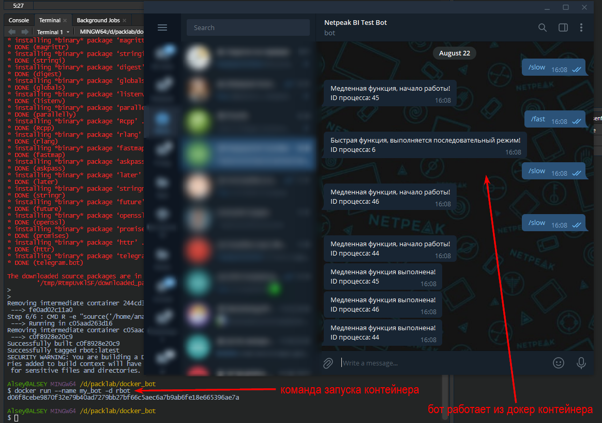

# Упаковываем бота в Docker контейнер
В восьмой главе нашего руководства мы сосредоточимся на упаковке вашего Telegram-бота в Docker-контейнер. Вы узнаете, как создать и настроить Docker-образ для вашего бота, что позволит вам легко развертывать его в различных средах и на разных платформах.

Мы подробно рассмотрим процесс создания контейнера, включая написание Dockerfile, сборку образа и настройку контейнера. Вы увидите, как Docker упрощает управление зависимостями и окружением, обеспечивая согласованность и переносимость вашего проекта.

Эта глава даст вам все необходимые инструменты для эффективного использования Docker, улучшая гибкость и удобство развертывания вашего бота. Надеюсь, что полученные знания помогут вам оптимизировать процесс разработки и управления проектом.

## Что такое докер
Docker — программное обеспечение для автоматизации развёртывания и управления приложениями в средах с поддержкой контейнеризации, контейнеризатор приложений. Позволяет «упаковать» приложение со всем его окружением и зависимостями в контейнер. 

Docker предназначен для заключения сред внутри образа/контейнера. Это позволяет, например, иметь компьютер с Linux на Windows или компьютер с R 3.3, когда на вашем основном компьютере установлен R 3.5. Кроме того, это означает, что вы можете использовать более старые версии пакета для конкретной задачи, сохраняя при этом пакет на вашем компьютере в актуальном состоянии.

Т.е. вы можете запустить бота в абсолютно изолированной среде, на которой будет предустановлены всё необходимое ПО, настроены переменные окружения, и она никак не будет зависеть от внешних настроек вашей операционной системы. Соответственно, при запуске контейнера по созданному образу на любой другой машине, вам не придётся её каким либо образом предварительно настраивать, прописывать переменные среды, устанавливать нужные пакеты, устанавливать сам язык R и т.д.

В этом учебнике мы не будем подробно изучать сам Docker, т.к. это отдельная большая тема, а учебник у нас по разработке telegram ботов, а не работе с Docker. Но в интернете вы без проблем найдёте огромное количество статей и видео уроков, которые помогут вам глубже погрузиться в изучение возможностей Docker, несколько полезных ссылок я приведу в завершении данной главы. Здесь же мы лишь рассмотрим рабочий процесс упаковки и запуска бота написанного на языке R. В нашем случае мы рассмотрим рабочий процесс упаковки на примере ОС Windows 10 Home, но на других ОС процесс будет отличаться не значительно.

> Описанные в этой главе приёмы универсальны, по такому же принципу можно упаковать в Docker и запустить любой R скрипт.

## Установка Docker
Для начала вам необходимо скачать и установить Docker на свой ПК. Тут есть некоторый нюанс, дело в том, что для Windows есть два варианта Docker:

1. Docker for Windows
2. Docker Toolbox on Windows

Какую версию выбрать вам:

* Если у вас Windows 10 x64 Pro, Enterprise или Education то включаем службу Hyper-V и ставим Docker for Windows.
* Если же у вас другая версия Windows(7 Pro, 8, 8.1, 10 Home) то ставим Virtual Box и Docker Toolbox on Windows.

У меня Windows 10 Home, если у вас тоже то перейдите по [ссылке](https://github.com/docker-archive/toolbox/releases), скачайте инсталлятор для своей операционной системы и запустите процесс установки.

У меня никаких дополнительных манипуляций процесс установки не потребовал, но в случае возникновения каких либо сложностей, я рекомендую найти на YouTube урок по установке Docker на вашу операционную систему. Например, в [этом видео](https://www.youtube.com/watch?v=a5mxBTGfC5k) рассматривается процесс установки как Docker for Windows, так и Docker Toolbox on Windows.

Все приведённые ниже примеры использовались с Docker Toolbox on Windows.

По завершению установки запустите `Docker Quickstart Terminal`, ярлык вы найдёте на рабочем столе.


## Создаём проект в RStudio
Для удобства работы я рекомендую создать проект.

Открываем RStudio и создаём новый проект. Перейдите в меню `file -> New Project...`.


Далее выбираем "New project" и указываем имя проекта.


## Код бота
В данном случае нам не особо важен функционал нашего бота, поэтому мы просто возьмём код асинхронного бота из 7ой главы этого учебника, но предварительно немного его доработали:

1. Мы добавили команду очистки очереди бота от старых сообщений, сразу после его инициализации.
2. Добавили боту две новые команды:
    1.  `/stop` - Команда остановки бота.
    2.  `/crush` - Команда с ошибкой, имитирующая падение бота.
3. Добавили боту процесс логирования его работы в обычный текстовый файл `bot.log`.

Все эти доработки нам потребовались для демонстрации некоторых дополнительных возможностей, которые даёт Docker.

Меню file -> New file -> R script (или сочетание клавиш Ctrl+Shift+N). Далее скопируйте приведённый ниже код бота, и сохраните его с именем `bot.R`.
```{r eval=FALSE}
library(telegram.bot)
library(stringr)
library(lgr)

# Включаем логгер
lg <- get_logger()
lg$set_appenders(AppenderFile$new(file = 'log/bot.log'))
lg$info('Bot start')

# Включаем параллельный план вычислений
lg$info('Run multisession mode')
future::plan('multisession', workers = 4)

# Инициализируем бота
lg$info('Make updater')
updater <-  Updater(bot_token('botname'))
# Очищаем очередь бота от старых сообщений
lg$info('Clean update queue')
updater$bot$clean_updates()

# Функция с длительным временем вычислений
slow_fun <- function(bot, update) {
  
  lg$info('Run slow command')
  # Запускаем выполнение кода в параллельной сессии
  promises::future_promise(
    {
      # Сообщение о том, что начата работа длительного вычисления
      bot$sendMessage(update$message$chat_id,
        text = str_glue("Медленная функция, начало работы!\nID процесса: {Sys.getpid()}"),
        parse_mode = "Markdown")
      
      # Добавляем паузу, для того, что бы искусственно сделать функцию длительной
      Sys.sleep(10)
      
      # Сообщаем о том, что все вычисления выполнены
      bot$sendMessage(update$message$chat_id,
        text = str_glue("Медленная функция выполнена!\nID процесса: {Sys.getpid()}"),
        parse_mode = "Markdown")
    }
  )
  
}

# Функция с коротким временем вычислений
fast_fun <- function(bot, update) {
  
  lg$info('Run fast command')
  # Просто отправляем сообщение
  bot$sendMessage(update$message$chat_id,
    text = str_glue("Быстрая функция, выполняется последовательный режим!\nID процесса: {Sys.getpid()}"),
    parse_mode = "Markdown")
  
}

# Остановка пуллинга
stop <- function(bot, update) {
  
  lg$info('Bot stop')
  bot$sendMessage(update$message$chat_id,
    text = str_glue("Останавливаю работу бота!\nID процесса: {Sys.getpid()}"),
    parse_mode = "Markdown")
  # Просто отправляем сообщение
  updater$stop_polling()
  
}

# Функция с ошибкой, имитирующая падение бота
crush <- function(bot, update) {
  
  lg$info('Crush command')
  bot$sendMessage(update$message$chat_id,
    text = str_glue("Функция с ошибкой, сбой в работе бота!\nID процесса: {Sys.getpid()}"),
    parse_mode = "Markdown")
  
  stop("Ошибка, сбой бота!")
  
}

# создаём обработчик
lg$info('Make handlers')
slow_hendler <- CommandHandler('slow', slow_fun)
fast_hendler <- CommandHandler('fast', fast_fun)
stop_hendler <- CommandHandler('stop', stop)
crush_hendler <- CommandHandler('crush', crush)

# добавляем в диспетчер
lg$info('Add handlers to dispatcher')
updater <- updater + slow_hendler + fast_hendler + stop_hendler + crush_hendler

# запускаем бота
lg$info('Run polling')
updater$start_polling()
```


>Обратите внимание, я явно указал количество потоков `future::plan('multisession', workers = 4)`, т.к. в контейнере по умолчанию функция `plan()` определит всего 1 ядро, и соответственно бот будет запущен в последовательном режиме работы.

## Образы и контейнеры
В основе работы Docker лежат образы и созданные из них контейнеры. Образы — это описание среды и её настроек, необходимых для работы вашего бота (R, пакеты, переменные среды), а контейнеры — это фактически запущенные экземпляры образов. Образ создаётся один раз, а контейнеры будут запускаться всякий раз, когда вам необходимо запустить бота. И, конечно же, одновременно можно запускать несколько контейнеров с одними и теми же образами.

Применительно к R, это тот же принцип, что установка и загрузка пакета. Для начала вам необходимо один раз установить пакет командой `install.packages()`, а потом подключать его командой `library()` каждый раз, когда вам требуется его функционал. И пакет можно легко запустить в нескольких сеансах R одновременно.

Продолжая аналогию с пакетами, создание образа по смыслу схоже на команду `install.packages()`, а запуск контейнера на основе образа по смыслу близко к команде `library()`.

## Создание Dockerfile
Docker образ создаётся из `Dockerfile`. По сути это обычный текстовый файл, без расширения, в котором вы прописываете команды для развёртывания нужной для запуска вашего бота среды. 

Теперь необходимо создать в рабочей директории проекта обычный текстовый файл, и дать ему имя `Dockerfile`.


Докер файл будет содержать следующие команды:
```{Dockerfile eval=FALSE}
FROM rocker/r-ver:4.2.1

RUN mkdir /home/bot
RUN mkdir /home/bot/log

ENV R_TELEGRAM_BOT_botname ТОКЕН_ВАШЕГО_БОТА

COPY bot.R /home/bot/bot.R

RUN R -e "install.packages(c('telegram.bot', 'stringr', 'future', 'promises','fastmap', 'lgr'))"

CMD cd /home/bot \
  &&  R -e "source('/home/bot/bot.R')"
```

Тут давайте остановимся и разберём отдельно каждую команду:

1. `FROM rocker/r-ver:4.2.1`, создаёт среду с установленным R 4.2.1, вы можете указать любую, нужную вам версию R.
2. `RUN mkdir /home/bot` и `RUN mkdir /home/bot/log` создаёт в контейнере папку `bot`, и папку `log` внутри неё.
3. `ENV R_TELEGRAM_BOT_botname ТОКЕН_ВАШЕГО_БОТА` эта команда создаёт переменную среды `R_TELEGRAM_BOT_botname` внутри контейнера. В данную переменную передайте токен вашего бота.
4. `COPY bot.R /home/bot/bot.R` копирует скрипт с кодом нашего бота в контейнер.
5. `RUN R -e "install.packages(c('telegram.bot', 'stringr', 'future', 'promises','fastmap', 'lgr'))"`, конструкция `RUN R -e "код на R"` позволяет запускать внутри контейнера R команды. В данном случае мы устанавливаем все, нужные нам пакеты.
6. `CMD cd /home/bot`, команда, которая переключает рабочую директорию на /home/bot. Команда `CMD` запускается каждый раз, при запуске контейнера.
7. `&& R -e "source('/home/analysis/bot.R')"`, объединяется с предыдущей командой, и запускает скрипт бота. 

Если вам необходимы определённые версии используемых пакетов то вы можете заменить команду из 5 пункта на:

```{Dockerfile eval=FALSE}
RUN R -e "install.packages('remotes'); \
  remotes::install_version('package_name', '0.1.2')"
```

Или установить пакет из снимка MRAN на определённую дату:
```{Dockerfile eval=FALSE}
RUN R -e "options(repos = \
  list(CRAN = 'http://mran.revolutionanalytics.com/snapshot/2022-08-01/')); \
  install.packages('package_name')"
```

## Создание образа
Теперь нам необходимо перейти в терминал, и запустить команду создания образа `docker build`. Данная команда требует от вас передачи нескольких параметров:

1. `-t` - позволяет задать тег вашего образа;
2. вторым параметром является путь к папке с `Dockerfile`, если вы создали `Dockerfile` в текущем рабочем каталоге проекта, то просто в качестве этого параметра передайте точку.

Т.е. для создания образа перейдите в терминал (найти терминал можно на соседней вкладке с консолью в RStudio)  и запустите в терминале (не в консоли RStudio, а именно в терминале!) следующую команду:
```
docker build -t rbot .
```


## Запуск контейнера
Итак, теперь у нас уже есть собранный Docker образ с нашим ботом, и нам остаётся запустить его командой `docker run`. При запуске контейнера вам необходимо указать следующие параметры:

1. `--name` позволяет задать название контейнера
2. `-d` флаг, который запускает контейнер в фоновом режиме, не блокируя терминал
3. последним параметром мы задаём имя образа, на основе которого будет запущен контейнер.
```
docker run --name my_bot -d rbot
```



Дополнительно мы могли указать флаг `--rm`, который автоматически удалит контейнер после его остановки.
```
docker run --name my_bot -d --rm rbot
```

## Прокидываем токен бота в контейнер при его запуске
В примере выше мы указывали токен нашего бота непосредственно в `Dockerfile` с помощью команды `ENV R_TELEGRAM_BOT_botname ТОКЕН_ВАШЕГО_БОТА`. Это не всегда удобно, например, вам может понадобиться возможность указывать токен бота непосредственно при запуске контейнера и вам не хочется постоянно редактировать `Dockerfile`. В таком случае вы можете прокидывать переменные среды при запуске контейнера используя флаг `-e`. 

Вы можете удалить из `Dockerfile` команду `ENV R_TELEGRAM_BOT_botname ТОКЕН_ВАШЕГО_БОТА`, и прокинуть эту же переменную непосредственно при запуске контейнера.

```
docker run --name my_bot -d --rm -e R_TELEGRAM_BOT_botname="ТОКЕН_ВАШЕГО_БОТА" rbot
```

## Политика перезапуска бота
В главе "[Повышаем стабильность работы бота]" мы разобрались, как написать бота, который автоматически перезапускается в случае падения. 

При запуске бота через docker контейнер, у вас есть отдельная опция `--restart`, которая позволяет более гибко управлять перезапуском вашего бота. Данная опция принимает одно из следующих значений:

* `no` - Не перезапускать контейнер после завершения. Это значение по умолчанию.
* `on-failure[:max-retries]` - Перезапускает контейнер если он завершился с не нулевым статусом (т.е. завершился с ошибкой). Опционально можно указать количество попыток перезапуска. Это наиболее подходящая опция для работы бота, т.к. вы можете добавить боту метод остановки пуллинга, и он при запуске команды остановки успешно выключиться, а в случае аварийной остановки - будет перезапущен.
* `always` - 	Всегда перезапускает контейнер в не зависимости от статуса завершения. Когда вы выбираете данный вариант, Docker демон будет пытаться перезапустить контейнер бесконечное число раз. Также контейнер будет всегда запускаться при запуске демона, не зависимо от текущего состояния контейнера. В данном случае у вас не будет возможности остановить бота.
* `unless-stopped` - Всегда перезапускает контейнер не зависимо от статуса завершения, но контейнер не будет запускаться при запуске демона, если контейнер до этого был остановлен вручную.

Т.е. следующая команда позволяет запустить бота, который автоматически будет перезапуска в случае ошибки, но при этом, вы в любой момент сможете остановить его любой командой.

```
docker run --name my_bot -d --rm -e --restart=on-failure rbot
```

Давайте протестируем команду `/crush` и `/stop`, как я уже писал ранее, первая имитирует ошибку в работе бота, вторая же корректно останавливает его работу.


Из скрина видно, что даже при выполнении команды `/crush` вызывающую критическую ошибку и падение бота, сам бот автоматически перезапускается, очищает очередь команд, и продолжает работу.

Команда `/stop` при этом корректно останавливает работу бота.

## Просмотр списка запущенных контейнеров
Команда `docker ps` позволяет посмотреть список запущенных в данный момент контейнеров.
```
docker ps
```


## Остановка контейнера
Для остановки контейнера используйте команду `docker stop`, передав в качестве единственного аргумента либо id, либо название контейнера, который необходимо остановить, в моём случае равнозначными будет две следующее команды:
```
docker stop my_bot
```
```
docker stop d06f8cebe987
```


## Удаление контейнера
После остановки контейнера с ботом вы можете его удалить командой `docker rm` передав ей имя контейнера.
```
docker rm my_bot
```


## Публикация образа в Docker hub
На данном этапе мы уже разобрались с тем, как устроен Docker, и узнали его основные команды. Но пока мы работали с образами, и запускали контейнеры локально, на ПК на котором мы эти образы собирали. Вся мощь Docker заключается в том, что собранные образы очень легко можно переносить на любой другой ПК, единственное требование - наличие на нём установленного Docker. 

Для такого переноса удобно использовать [docker-hub](https://hub.docker.com/), для начала перейдите по ссылке и зарегистрируйтесь там. 

Далее возвращаемся в терминал RStudio, логинимся в Docker-hub.

```
docker login
```

Далее введите свой логин и пароль, или ключ API вместо пароля. Теперь нам необходимо добавить нужный тег нашему образу для его публикации. Команда `tag` принимает два аргумента, имя образа, которому надо присвоить тег, и сам тег. Присваиваемый тег должен иметь следующий вид `username/repository`, т.е. имя пользователя на Docker-hub и название репозитория, куда вы хотите опубликовать образ.

```
docker tag rbot username/rbot
```

Следующая команда позволяет опубликовать образ на Docker-hub:
```
docker push username/rbot
```

Теперь вы можете загрузить опубликованный ранее образ на любой ПК, независимо от того, какая на нём установлена операционная система, главное предварительно установите на него сам Docker. Используйте следующую команду, что бы забрать образ из Docker-hub:
```
docker pull username/rbot
```

После чего образ будет загружен в ваш локальный реестр образов, убедиться в этом можно с помощью команды `docker images`. Процесс запуска контейнера из загруженного образа ничем не отличается от [описанного выше][Запуск контейнера] в этой главе.

> Обратите внимание, если вы планируете опубликовать образ с публичным доступом, то не включайте в `Dockerfile` секретные данные, такие как токен бота или пароли. Рекомендованным способом передачи секретных данных в контейнер является прокинуть необходимые переменные с этими данными непосредственно при запуске контейнера как описано в разделе [Прокидываем токен бота в контейнер при его запуске].

## Как создать общую папку для хранения файлов
По умолчанию контейнер является полностью изолированным, т.е. все файлы, которые создаются внутри контейнера, удаляются после его запуска, и все данные которые были в эти файлы записаны, также удаляются. 

В ходе работы нашего бота пишется лог, сам файл лога `bot.log` создаётся внутри контейнера в папке `log`, и за пределами самого контейнера он не доступен. В коде нашего бота за создание лога отвечает следующие команды:

```{r eval=FALSE}
library(lgr)

# Включаем логгер
lg <- get_logger()
lg$set_appenders(AppenderFile$new(file = 'log/bot.log'))
lg$info('Bot start')
```

> Если вы до этого момента не знакомы с процессом логирования, то рекомендую либо ознакомиться со статьёй "[Логирование выполнения скриптов на языке R, пакет lgr](https://habr.com/ru/post/529118/)", либо видео уроком "[Логирование процесса выполнения скриптов на языке R (пакеты lgr / lgrExtra)](https://www.youtube.com/watch?v=xA8YGxQH1Ws)".

В данном случае лог пишется в обычный текстовый файл. Но функционал может быть гораздо шире, чем в рассматриваемом нами примере, бот может работать с базой данных, может принимать какие-то файлы. И нам может потребоваться получить доступ к этим данным. 

Для того, что бы организовать на вашем ПК общую с каким либо контейнером папку в Docker есть понятие томов - volume. Но при работе на Windows требуется некоторая предварительная подготовка. 

1. Вместе с `Docker toolbox` вы установили несколько программ, включая Oracle VM Virtual Box. Запустите её, если у вас возникает ошибка при запуске VirtualBox, то скорее всего вам необходимо перейти по [ссылке](https://www.virtualbox.org/wiki/Downloads), и скачать наиболее актуальную версию.
2. В Virtual Box выберите дефолтную машину и нажмите "Настроить":


3. Перейдите в меню "Общие папки" и создайте новую общую папку прописав ей путь и дав имя. В моём случае сама папка находится по пути `D:\packlab\docker_bot\log`, и имя для неё я задал `d/packlab/docker_bot/log`:


4. Теперь вернитесь в терминал RStudio и перезапустите виртуальную машину командой `docker-machine restart`. 

5. После перезагрузки, при запуске контейнера используйте флаг `-v` и укажите через двоеточие соответствие папки на локальном компьютере с папкой в контейнере. В нашем случае папка на локальном компьютере `d/packlab/docker_bot/log` должна быть связана с папкой `/home/bot/log` в контейнере. Команда будет выглядеть следующим образом:

```
docker run --rm --name my_bot -v //d/packlab/docker_bot/log:/home/bot/log rbot
```

Обратите внимание, я указал двойной слеш `//` перед именем папки на локальном компьютере, без этого иногда при запуске контейнера возникает ошибка `invalid value "C:\\..." for flag -v: ...:... is not an absolute path`.

Сразу после запуска у меня в локальной папке `"D:\packlab\docker_bot\log"` создаётся файл `bot.log`, в котором в реальном времени пишется лог работы бота, давайте в этом убедимся:


Содержание локального файла `bot.log`:


Отставание на 4 часа между временем в telegram, и файлом лога объясняется тем, что в контейнере по умолчанию установлен другой часовой пояс - UTC. 

## Полезные ссылки
Как я уже писал в начале главы, в интернете полно информации по работе с Docker, тем не менее тут я приведу небольшую подборку ссылок, которые помогут вам получше с ним разобраться:

* [Основы Docker. Большой практический выпуск](https://youtu.be/QF4ZF857m44)
* [An Introduction to Docker for R Users](https://colinfay.me/docker-r-reproducibility/) (англ.)
* [Docker под Windows для разработки, разбор подводных камней](https://habr.com/ru/post/358774/)

## Заключение
Теперь мы умеем упаковывать telegram ботов в контейнер, что даёт несколько следующих преимуществ:

* Вы легко можете перенести вашего бота с ноутбука на сервер, или переносить его между серверами, весь процесс займёт пару минут. Никакой предварительной настройки среды для запуска бота теперь не потребуется.
* У вас появляется более гибкая возможность управления политикой перезапуска бота.

Основные команды docker и их параметры, которые вам понадобятся в ходе упаковки, запуска, публикации и загрузки бота:

* `docker build` - создать образ:
    * `-t` - тег образа;
    * второй аргумент - путь к папке с `Dockerfile`.
* `docker run` - запуск контейнера:
    * `--name` - имя контейнера;
    * `-d` - запускает контейнер в фоновом режиме;
    * `--rm` - автоматически удаляет контейнер после его остановки;
    * `-e` - создаёт переменную окружения при запуске контейнера;
    * `--restart` - управление политикой перезапуска контейнера;
    * `-v` позволяет прикрепить к контейнеру физическую папку на вашем локальном ПК;
    * последний аргумент - имя образа на основе которого будет запущен контейнер.
* `docker ps` - просмотр списка запущенных контейнеров:
    * `-a` выводит список всех контейнеров, включая остановленные.
* `docker stop` - остановка контейнера:
    * в качестве параметра необходимо передать имя или id контейнера.
* `docker rm` - удаление контейнера:
    * в качестве параметра необходимо передать имя или id контейнера.
* `docker login` - авторизация в Docker-hub.
* `docker tag` - добавить тег образу:
    * локальное название образа, которому надо присвоить тег;
    * название образа в docker-hub по шаблону username/repository.
* `docker push` - опубликовать образ в docker-hub:
    * название образа в docker-hub по шаблону username/repository.
* `docker pull` - забрать образ из docker-hub:
    * название образа в docker-hub по шаблону username/repository.

Отличная работа по упаковке бота в Docker-контейнер! Вы научились использовать Docker для удобного управления и развертывания вашего бота. В последней главе мы развернем бота на Google Cloud Run, чтобы обеспечить его масштабируемость и доступность. Это финальный шаг в нашем путешествии, и вы скоро увидите, как все ваши знания и навыки воплотятся в рабочем облачном решении.
