# Разворачиваем бота в облачных сервисах
Поздравляю с завершением предыдущих этапов! Мы подходим к финальной части нашего путешествия, и в этой главе мы сосредоточимся на важном шаге — развертывании вашего бота на Google Cloud Run. Это позволит вашему боту работать в облаке, обеспечивая масштабируемость и надежность.

Важной частью этого процесса является настройка технологии Webhook, которая позволяет вашему боту получать обновления в реальном времени. Мы подробно рассмотрим, как настроить Webhook для вашего бота, чтобы он мог эффективно обрабатывать входящие сообщения и команды от пользователей. Эта технология обеспечивает мгновенную доставку данных и позволяет вашему боту реагировать на события практически моментально.

Мы также изучим, как использовать Google Cloud Run для размещения вашего бота, рассмотрим его настройку и управление окружением. Это обеспечит надежную работу вашего бота и упростит его масштабирование при необходимости.

В завершение главы вы будете готовы запустить своего бота в облаке, и все ваши знания и навыки будут полностью реализованы в рабочем решении.

>Для того что бы повторить действия описанные в этой главе вам понадобится установить следующее ПО:
>
>* [Docker Desktop](https://www.docker.com/products/docker-desktop/)
>* [Git](https://git-scm.com/downloads)
>* [Google Cloud SDK Shell](https://cloud.google.com/sdk/docs/install-sdk)
>* [Heroku CLI](https://devcenter.heroku.com/articles/heroku-cli#install-the-heroku-cli)

После установки Docker Desktop перезагрузите ПК,и запуститье эту программу.

## Google Cloud Run
### Условные обозначения
В этой главе мы много будем работать с командной сторокой, и облачными сервисами. В примерах команд, которые мы будем использовать вы увидите специальные обозначения =, они будут выделены квадратными скобками, и написаны большими буквами. Эти значения необходимо заменить на ваши:

* `[PROJECT ID]` - Id проекта в Google Cloud
* `[IMAGE NAME]` - Название Docker образа
* `[CONTAINER NAME]` - Название Docker контейнера
* `[JOB NAME]` - Название задания в Google Cloud Run
* `[SCHEDULER JOB NAME]` - Название триггера в Google Cloud Run Job
* `[SERVICE NAME]` - Название сервиса в Google Cloud Run

Т.е. если вы решили назвать Docker образ "my-bot", а идентификатор вашего проекта в Google Cloud "tg-bot-091276". То следующую команду:

```
docker push gcr.io/[PROJECT ID]/[IMAGE NAME]
```

Необходимо заменить на:

```
docker push gcr.io/tg-bot-091276/my-bot
```

### Введение в Google Cloude Run
Google Cloud Run — это полностью управляемый сервис от Google Cloud, который позволяет развёртывать и масштабировать контейнерные приложения. Он предназначен для запуска HTTP-приложений и других серверных функций без необходимости управления серверной инфраструктурой. Основные преимущества Cloud Run включают автоматическое масштабирование, оплату только за фактическое использование и интеграцию с другими сервисами Google Cloud.

#### Services и Jobs в Google Cloud Run
Google Cloud Run позволяет вам создать 2 типа заданий:

**Jobs (Задачи):**
Cloud Run Jobs предназначены для выполнения одноразовых или периодических задач, которые не требуют HTTP-запросов. Это может быть полезно для различных сценариев, таких как обработка данных, резервное копирование, пакетная обработка и т. д. Ключевые характеристики задач:

* Ограниченное выполнение: Задачи запускаются по требованию и выполняются один раз.
* Асинхронные операции: Задачи могут выполняться в фоновом режиме, не требуя взаимодействия с пользователем.
* Параллельные задания: Возможность запуска множества экземпляров задачи для параллельной обработки данных.

Пример использования:

* Ежедневное резервное копирование базы данных.
* Обработка очередей задач из очереди сообщений.
* Конвертация и обработка изображений по расписанию.

**Services (Сервисы)**
Cloud Run Services предназначены для обслуживания HTTP-запросов. Это означает, что они используются для развёртывания веб-приложений, API и других HTTP-сервисов. Вот некоторые ключевые характеристики сервисов:

HTTP-триггеры: Сервисы обрабатывают HTTP-запросы и возвращают HTTP-ответы.
Автоматическое масштабирование: Сервисы автоматически масштабируются в зависимости от нагрузки — от нуля до бесконечности контейнеров.
Статическое и динамическое содержание: Могут обрабатывать как статические файлы, так и динамически генерируемые данные.
Настройка URL и доменов: Возможность привязки пользовательских доменов и маршрутизации трафика.

Пример использования:

* Telegram боты.
* RESTful API для мобильного приложения.
* Прокси-сервис для обработки и маршрутизации HTTP-запросов

То есть, с помощью Job мы можем настроить запуск скрипта по расписанию, например, уже знакомого нам по первой главе скрипта, который запрашивает курсы валют и отправляет их в Telegram. С помощью Service мы можем развернуть полноценного бота с поддержкой команд и клавиатур, который будет обрабатывать запросы пользователей. Далее разберёмся с обеими функциями Google Cloud Run.

### Как настроить запуск скрипта по рассписанию с помощью Google Cloude Run Job
#### Видео
<iframe width="560" height="315" src="https://www.youtube.com/embed/zdqRR-3ZFkM?enablejsapi=1" title="YouTube video player" frameborder="0" allow="accelerometer; autoplay; clipboard-write; encrypted-media; gyroscope; picture-in-picture; web-share" referrerpolicy="strict-origin-when-cross-origin" allowfullscreen></iframe>

#### Обзор рабочего процесса
Весь рабочий процесс по настройке запуска R-скрипта по расписанию выглядит следующим образом:

1. Создайте и настройте проект в Google Cloud.
2. Напишите R-скрипт, который планируете запускать по расписанию.
3. Создайте Dockerfile для создания образа, на основе которого будет создаваться контейнер.
4. Проведите тестовую сборку образа и запуск контейнера.
5. С помощью Google Cloud SDK инициализируйте командную строку с вашим проектом в Google Cloud.
6. Тегируйте и загрузите Docker-образ в Google Container Registry.
7. Настройте Job в Google Cloud Run.
8. Создайте триггер для запуска созданной Job.

Теперь давайте рассмотрим каждый из этих шагов подробнее.

#### Настройка проекта в Google Cloud

1. Переходим в [Google Cloud Console](https://console.cloud.google.com/welcome)
2. С помощью выпадающего меню в верхнем левом углу экрана создаём новый проект
3. Переходим в созданный проект
4. Включаем в проекте необходимые API сервисы, в левом меню:
    1. Cloud Run Admin API
    2. Google Schedule API
    3. Artifact Registry API

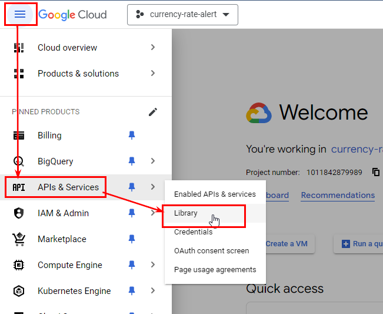

При желании активировать необходимые API вы сможете позже через Google Cloud SDK.

#### Скрипт который будем разворачивать в Google Cloud Run
Ниже приведен листинг скрипта, который мы будем запускать по расписанию:

```{r, eval=FALSE}
library(httr)
library(jsonlite)
library(telegram.bot)
library(stringr)

get_exchange_rate <- function(api_key) {
  url <- paste0("https://api.exchangerate-api.com/v4/latest/USD?apikey=", api_key)
  response <- GET(url)
  data <- fromJSON(content(response, "text"))
  return(data)
}

send_telegram_message <- function(bot_token, chat_id, message) {
  bot <- Bot(token = bot_token)
  bot$sendMessage(chat_id = chat_id, text = message)
}

# Функция для выполнения основного логики
execute_script <- function() {
  api_key   <- Sys.getenv("EXCHANGE_RATE_API_KEY")
  bot_token <- Sys.getenv("TELEGRAM_BOT_TOKEN")
  chat_id   <- Sys.getenv("TELEGRAM_CHAT_ID")
  
  exchange_rate <- get_exchange_rate(api_key)
  message <- str_glue(
    "Курс валют на {Sys.Date()}",
    '-----------------------------',
    "Курс EUR к USD: {exchange_rate$rates$EUR}", 
    "Курс GBP к USD: {exchange_rate$rates$GBP}",
    "Курс UAH к USD: {exchange_rate$rates$UAH}",
    "Курс EGP к USD: {exchange_rate$rates$EGP}", 
    .sep = '\n'
    )
  
  send_telegram_message(bot_token, chat_id, message)
}

# Выполнение скрипта
execute_script()
```

Чтобы использовать этот же код, вам необходимо получить API-ключ на сайте exchangerate-api.com. Файл с R-кодом в данном случае называется currency_rates_alert.R, и это имя файла будет использоваться на следующем шаге.

#### Создаём Dockerfile
С Dockerfile и функционалом Docker вы познакомились в предыдущей главе [Упаковываем бота в Docker контейнер]. Для нашего скрипта нужен следующий Dockerfile:

```{Dockerfile eval=FALSE}
FROM rocker/r-base:latest

SHELL ["/bin/bash", "-o", "pipefail", "-e", "-u", "-x", "-c"]
USER 0
RUN apt-get update && apt-get install -y r-base r-base-core r-base-dev \
    libcurl4-openssl-dev libssl-dev && \
    rm -r /var/lib/apt/lists/*

# Установка необходимых пакетов
RUN R -e "install.packages(c('httr', 'jsonlite', 'telegram.bot', 'stringr'), repos = 'http://cran.us.r-project.org')"

# Копирование R-скрипта в контейнер
COPY currency_rates_alert.R /app/currency_rates_alert.R

# Установка переменных окружения (замените на свои значения)
ENV EXCHANGE_RATE_API_KEY=ВАШ_API_КЛЮЧ_К_EXCHANGERATE_API
ENV TELEGRAM_BOT_TOKEN=ТОКЕН_ВАШЕГО_БОТА
ENV TELEGRAM_CHAT_ID=ID_ЧАТА_КУДА_НАДО_ПРИСЛАТЬ_СООБЩЕНИЕ

# Запуск R-скрипта
CMD ["Rscript", "/app/currency_rates_alert.R"]
```

В Dockerfile замените `ВАШ_API_КЛЮЧ_К_EXCHANGERATE_API`, `ТОКЕН_ВАШЕГО_БОТА` и `ID_ЧАТА_КУДА_НАДО_ПРИСЛАТЬ_СООБЩЕНИЕ` на ваши значения. Так же если файл с вашим R скриптом имеет другое название, то и в Dockerfile его необходимо изменить с `currency_rates_alert.R`.

#### Тестовая сборка образа и запуск контейнера
Когда ваш скрипт готов и вы убедились, что он работает, запустив его предварительно в интерактивном режиме RStudio, протестируйте сборку образа и запуск контейнера локально.

давайте перейдём в директорию с нашим проектом, т.е. в папку, в которой у вас хранится R скрипт и Dockerfile:

```
cd C:\Users\SAMSUNG\Documents\currency_rates_alert
```

Замените путь на ваш.

Далее выполним сборку образа и запуск контейнера, для этого следующие команды:

```
docker build -t [IMAGE NAME] .
docker run --name [CONTAINER NAME] --rm [IMAGE NAME]
```

Если контейнер был успешно собран и ваш скрипт выполнился, можно переходить к следующему шагу.

>Подробности работы с Docker смотрите в главе [Упаковываем бота в Docker контейнер].

#### Инициализация Google Cloud SDK
Если у вас еще не установлен Google Cloud SDK, следуйте [этой инструкции](https://cloud.google.com/sdk/docs/install-sdk) для его установки. После установки запустите Google Cloud SDK и выполните инициализацию:

```
gcloud init
```

Эта команда откроет веб-браузер, чтобы вы могли войти в Google Cloud и выбрать проект, который будете использовать. После завершения инициализации сохраните конфигурацию.

Далее вам необходимо настроить Docker для работы с Google Container Registry:, воспользуйтесь для этого следующей командой:

```
gcloud auth configure-docker
```

Если при создании проекта вы не активировали нужные API, то на этом шаге вы можете сделать это из командной строки:

```
gcloud services enable run.googleapis.com
gcloud services enable cloudscheduler.googleapis.com
gcloud services enable artifactregistry.googleapis.com
```

Проверить список активированных в проекте API можно следующей командой:

```
gcloud services list --enabled
```

#### Тегирование и загрузка Docker-образа в Google Container Registry
После успешного локального тестирования можно приступать к отравке образа и разворачиванию контейнера в Google Cloud. Но до этого образ необходимо тегорировать. Тегирование Docker-образа необходимо для его идентификации и управления версиями. В контексте работы с Google Container Registry (GCR) тегирование помогает определить, какой именно образ вы хотите загрузить, развернуть или использовать в дальнейшем.

```
docker tag [IMAGE NAME] gcr.io/[PROJECT ID]/[IMAGE NAME]
docker push gcr.io/[PROJECT ID]/[IMAGE NAME]
```

>Замените [PROJECT ID] на идентификатор вашего проекта в Google Cloud.

#### Настраиваем Job в Google Cloud Run
Для удобства дальнейшей работы перейдите в веб интерфейс сервиса [Google Cloud Run](https://console.cloud.google.com/run/jobs) на вкладку Jobs и нажмите кнопку "Create Job".

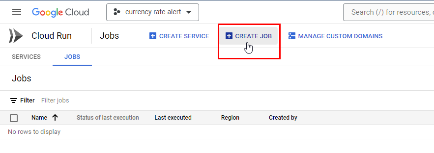

В поле "" нажмите кнопку "Select" и укажиет загруженный на прошлом шаге образ.

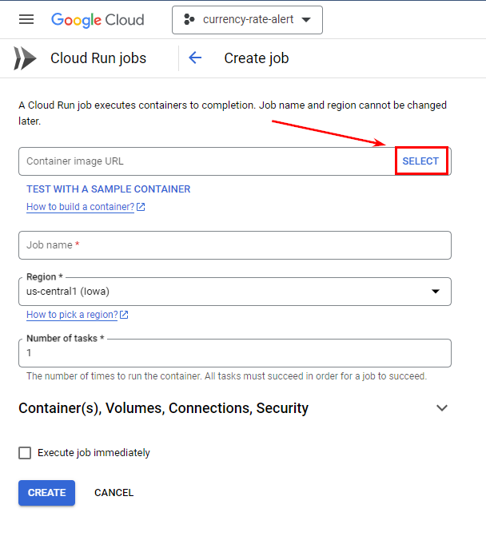
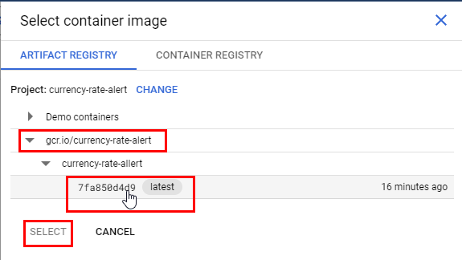

После чего можете задать произвольное имя для джобы, и нажать "Create".

#### Тестирование созданной Job в Google Cloud Run
Для тестирования просто откройте нужную Job и нажмите "Execute". Если задание успешно выполнися то можно переходить на вкладку TRIGGERS и создать расписание запуска.

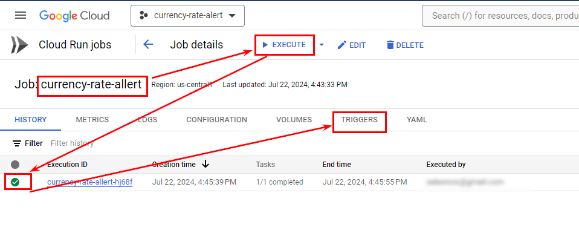

#### Создаём тригер для запуска созданной Job
Мы на финальном шаге, всё, что нам остаётся это создать триггер для запуска созданного задания. На вкладке "TRIGGERS" жмём кнопку "ADD SCHEDULER TRRIGER".

В открывшемся диалоговом окне,в поле "Frequency" вам необходимо написать CRON выражение, для создания расписания запуска задания. В первой главе мы уже сталкивались с CRON выражении в разделе [Настраиваем запуск расписания отправки сообщения с помощью GitHub Actions]. Но я продублирую тут эту информацию. 

CRON выражение состоит из 5 значений, любое из которых можно пропустить поставив `*`:

* Минуты (0-59)
* Часы (0-23)
* День месяца (1-31)
* Месяц (1-12)
* День недели (0-6, где 0 — воскресенье)

Т.е. если мы хотим настроить запуск нашего задание в 10:15 утра каждый понедельник то CRON выражение будет `15 10 * * 1`, т.е.:

* 15 - это 15 минут
* 10 - это 10 часов
* Далее две звезды значит что мы пропускаем месяца и день месяца, они не будут учитываться в расписании.
* 1 - понедельник. 

Но я сейчас создам триггер для запуска скрипта в 10:15 на ежедневной основе, т.е. `15 10 * * *`.

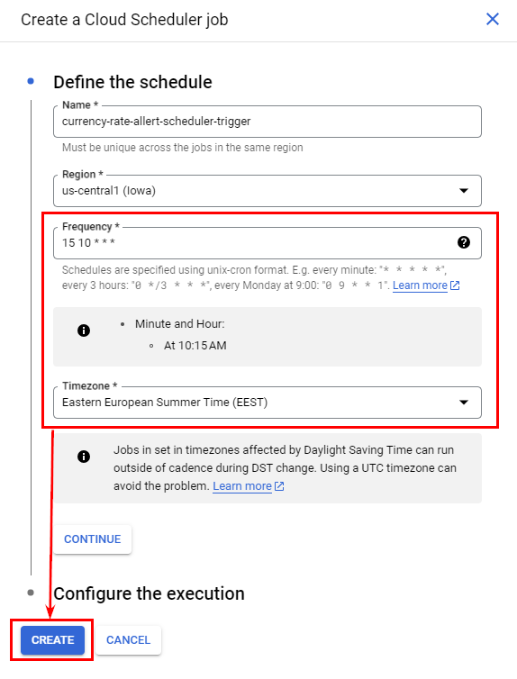

Так же вы можете нажать "Continue" вы можете настроить запуск задания от имени созданного вами сервисного аккаунта, но учтите что в таком случае вам необходимо для этого сервисного аккаунта в разделе IM выдать следующие разрешения:

1. Откройте Google Cloud Console
2. Перейдите в раздел "IAM & Admin" > "IAM"
3. Найдите ваш сервисный аккаунт (service-account-name@ptoj_id.iam.gserviceaccount.com)
4. Нажмите на карандаш рядом с ним для редактирования разрешений
5. Добавьте следующие роли:

* Cloud Run Invoker (roles/run.invoker): Эта роль позволяет сервисному аккаунту запускать Job.
* Cloud Run Developer (roles/run.developer): Эта роль дает возможность создавать, обновлять и удалять Job, а также просматривать их логи.
* Service Account User (roles/iam.serviceAccountUser): Эта роль нужна, если ваш Job выполняется от имени другого сервисного аккаунта.

Но, на самом деле создать Job и добавить в неё триггер можно непосредственно из самой консоли:

Создание Job:

```
gcloud run jobs create [JOB NAME] --image gcr.io/[PROJECT ID]/[IMAGE NAME] --platform managed
```

Добавление триггера:
```
gcloud scheduler jobs create http [SCHEDULER JOB NAME] \
    --schedule "30 10 * * *" \
    --http-method POST \
    --uri https://YOUR_REGION-run.googleapis.com/v2/projects/YOUR_PROJECT_ID/locations/YOUR_REGION/jobs/YOUR_JOB_NAME:run \
    --oauth-service-account-email YOUR_SERVICE_ACCOUNT_EMAIL \
    --region YOUR_REGION
```

Но, как по мне проще создавать Job и добавить ей триггеры через Веб интерфейс.

### Разворачиваем Telegram бота в Google Cloud Run Service
Как я уже писал в начале этой главе в сервисе Google Cloud Run есть 2 типа заданий, разовое - Job, и постоянное фоновое - Service. Для того, что бы запустить бота, который будет крутится в фоновом режиме и обрабатывать входящие запросы нам необходимо использовать именно Service. 

#### Видео
<iframe width="560" height="315" src="https://www.youtube.com/embed/YCXTjodFmqo?enablejsapi=1" title="YouTube video player" frameborder="0" allow="accelerometer; autoplay; clipboard-write; encrypted-media; gyroscope; picture-in-picture; web-share" referrerpolicy="strict-origin-when-cross-origin" allowfullscreen></iframe>

#### Рабочий процесс
При развёртывании бота в Google Cloud Run Service алгоритм ваших действий будет следующим:

1. Напишите скрипт бота, которого планируете развернуть.
2. Создайте Dockerfile для создания образа, на основе которого будет создаваться контейнер.
3. Проведите тестовую сборку образа и запуск контейнера.
4. Создайте и настройте проект в Google Cloud.
5. С помощью Google Cloud SDK инициализируйте командную строку с вашим проектом в Google Cloud.
6. Тегируйте и загрузите Docker-образ в Google Artifact Registry.
7. Запустите бота в Google Cloud Run для того что бы получить Webhook URL.
8. Исправьте в переменных среды Webhook URL, выполните повторную сборку, отправку и развёртку вашего бота в Google Cloud Run.


#### Webhook вместо polling
Прилшло время более подробно разобраться с тем, как устроен механизм получения ботом обновлений, и совсем немного окунутся в историю развития клиент серверных технологий.

##### Разница между механизмами polling и webhook
В ранние годы веб-технологий, когда серверные технологии и базы данных только начинали развиваться, коммуникация между клиентом (в нашем случае машиной на которой работает скрипт вашего бота) и сервером (в нашем случае сервер Telegram API) была довольно простой. Клиенты периодически отправляли запросы к серверу для проверки наличия новых данных. Такой механизм получил название polling. 

Polling — это метод, при котором бот регулярно (с определённым интервалом) отправляет запросы к серверу Telegram для проверки наличия новых обновлений.  Внутри класса Updater технически это реализуется так:

1. Бот делает запросы к Telegram API с помощью метода `getUpdates`.
2. Если есть новые сообщения или обновления, сервер Telegram отправляет их боту.
3. Бот обрабатывает эти обновления и отвечает на них.

До этого момента во всех примерах, которые я приводил в этой книге мы с вами использовали именно этот механиз получения обновлений. Делали мы это только потому, что его максимально просто запустить на локальной машине. Polling будет работать даже если к машине на которой вы развернули бота нет доступа из внешних ресурсов, firewall блокирует любые попытки достучатся до вашего ПК извне так как нет необходимости в открытых портах для входящих соединений, и даже если у вас динамический IP адрес.

Polling был простым и понятным методом, но с увеличением количества пользователей и данных его эффективность стала проблемой. На смену polling пришел Webhook, который был разработан для решения проблем, связанных с эффективностью и нагрузкой при использовании polling. Webhook представляет собой более современный подход к получению обновлений и был внедрён для улучшения производительности и уменьшения задержек. Работает он по следующей схеме:

1. Бот регистрирует URL для webhook с помощью метода `setWebhook`.
2. Когда есть новое обновление, Telegram отправляет запрос на указанный URL.
3. Бот получает и обрабатывает обновление в реальном времени.

Схематично сравнить эти два механизма можно следующим образом:

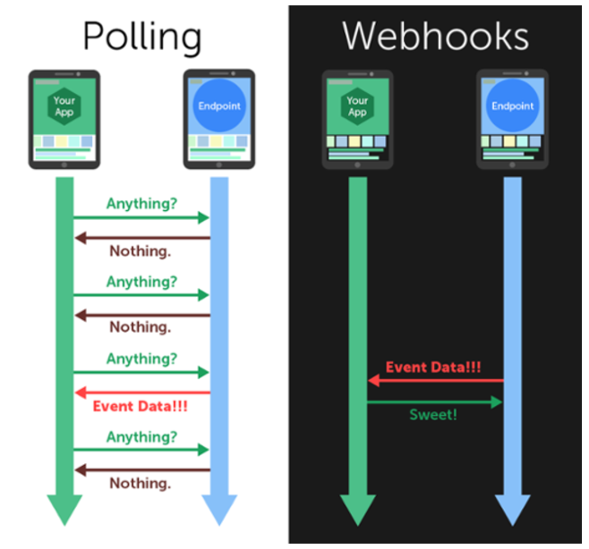

Если провести аналогию из реального мира, то представьте, что у вас есть старый почтовый ящик, и каждый день вы отправляетесь к нему, чтобы проверить, пришла ли новая почта. Вы открываете ящик и смотрите, есть ли что-то новое. Если нет, вы возвращаетесь домой и снова идёте проверять на следующий день. Это и есть polling. Теперь представьте, что у вас есть специальный почтальон, который приходит к вам домой каждый раз, когда приходит новая почта. Вместо того, чтобы самому ходить к почтовому ящику, почтальон вам сам звонит в дверь и приносит письмо прямо к вам. Это и есть webhook.

Так вот, запустить механизм polling легко и просто на локальной машине, т.к. от вас не требуется практически никаких дополнительных настроект, но вот облачные технологии стремятся к тому, что бы экономить выделенные ресурсы, поэтому они позволяют вам развернуть бота используя технологию Webhook, Google Cloud Run не является тут исключением. К тому же технология Webhook позволит вам экономить на использовании раздичных облачных систем для развёртования бота, т.к. зачастую вы там платите только за используемые ресурсы.

##### Реализация webhook в пакете telegram.bot
Изначально пакет `telegram.bot` включал в свой функционал только polling, метод обновления данных webhook в него был добавлен только в версии 3.0.0 сторонним разработчиком, но сделано это было по моей просьбе, кому интересно история добавления этого метода началась в этой [ветке](https://github.com/virtualstaticvoid/heroku-buildpack-r/issues/162) на GitHub, а [тут]9https://github.com/ebeneditos/telegram.bot/pull/27) уже был добавлен класс `Webhook` в пакет.

Класс `Webhook` очень похож на `Updater`, ниже пример работы с ним:

```{r eval=FALSE}
# Создаём метод start
start <- function(bot, update) {
 bot$sendMessage(
   chat_id = update$message$chat_id,
   text = sprintf(
     "Hello %s!",
     update$message$from$first_name
   )
 )
}

# Инициализируем экземпляр класса Webhook
webhook <- Webhook(
  webhook_url = "https://example.com/webhook", 
  token       = Sys.getenv("TOKEN"), 
  verbose     = TRUE
)

# wire up handler
webhook <- webhook + CommandHandler("start", start)

# start polling
webhook$start_server(host = "0.0.0.0", port = 8080)

# stop polling
webhook$stop_server()
```
 

Т.е. процесс такой же как и при создании `Updater`, но помимо токена бота вам ещё необходимо указать webhook url, на который telegram будет присылать для бота обновления. О том как его получить мы поговорим немного позже. Далее, так же как и с Updater, вы просто добавляете в Webhook все обработчики, и запускаете процесс обработки обновления методом `start_server()`, который является аналогом `start_polling()`.

#### Код бота запрашивающего курсы валют
В этом разделе мы продолжим развивать тему прошлого раздела о получении информации курсов валют, но теперь мы напишем полноценного бота, которого в любой момент можно спросить курс любой валюты. 

Код нашего бота:

```{r eval=FALSE}
library(telegram.bot)
library(httr)
library(jsonlite)

# Метод запроса курса валют
get_cur_rate <- function(bot, update, args) {
  
  currency_code <- toupper(args)
  api_key <- Sys.getenv('EXCHANGERATE_API_KEY')
  url     <- paste0("https://api.exchangerate-api.com/v4/latest/USD?apikey=", api_key)
  
  response <- GET(url)
  data <- fromJSON(content(response, "text"))
  
  if (!currency_code %in% names(data$rates)) {
    bot$sendMessage(chat_id = update$message$chat_id, text = paste0(args, " is Invalid currency code."))
    return(NULL)
  }
  
  rate <- data$rates[[currency_code]]
  message <- sprintf("Курс %s к USD: %f", currency_code, rate)
  bot$sendMessage(chat_id = update$message$chat_id, text = message)
  
}

# Создаём Webhook
webhook <- Webhook(
  webhook_url = Sys.getenv('WEBHOOK_URL'), 
  token       = bot_token('CURBOT'), 
  verbose     = TRUE
  )

# Добавляем обработчики
webhook <- webhook + CommandHandler("get_cur_rate", get_cur_rate, pass_args = T)

# Запускаем Webhook
webhook$start_server(
  host = "0.0.0.0",
  port = 8080
)
```

В основе метода `get_cur_rate` лежит логика, описанная в прошлом разделе. Бот получает сообщение в котором указан код валют, далее запрашивает курсы из exchangerate-api, парсит результат, и отправляет в ответе курс по указанной ранее валюте.

Далее мы инициализируем объект класса Webhook, и передаём в аргумент `webhook_url` значение переменной среды `WEBHOOK_URL`, а в аргумент `token`, значение переменной `R_TELEGRAM_BOT_CURBOT`. Значения этих переменных мы будем задавать в Dockerfile.

#### Собираем Docker образ
Для сборки нужного Docker образа мы прописываем следующий Dockerfile:

```{Dockerfile eval=FALSE}
# Use the official R base image
FROM rocker/r-ver:4.1.0

# Set the shell
SHELL ["/bin/bash", "-o", "pipefail", "-e", "-u", "-x", "-c"]

# Install necessary system dependencies
USER root
RUN apt-get update && apt-get install -y \
    libcurl4-openssl-dev \
    libssl-dev \
    && rm -rf /var/lib/apt/lists/*

# Install necessary R packages
RUN R -e "install.packages(c('httr', 'jsonlite'))"
RUN R -e "install.packages('telegram.bot', repos = 'http://cran.us.r-project.org')"

ENV EXCHANGERATE_API_KEY=[ВАШ КЛЮЧ В exchangerate-api.com]
ENV R_TELEGRAM_BOT_CURBOT=[ТОКЕН ВАШЕГО БОТА]
ENV WEBHOOK_URL=https://my-service.a.run.app/webhook

# Copy the R script to the container
COPY curbot.R /app/curbot.R

# Set the working directory
WORKDIR /app

# Run the R script
CMD ["Rscript", "/app/curbot.R"]

```

На данном этапе этапе мы ещё не знаем URL нашего сервиса, поэтому в переменную WEBHOOK_URL пока что прописываем совершенно любой URL, можно даже не работающий. На второй итерации развёртки мы будем заменять значение этой переменной.

Далее выполним локальную сборку образа, и тестовый локальный запуск контейнера.

```
docker build -t [IMAGE NAME] .
docker run --name [CONTAINER NAME] --rm [IMAGE NAME]
```

Если контейнер был успешно запущен на этом этапе в консоли вы увидите примерно такое сообщение:

```
Starting webhook server...
Listening on '0.0.0.0:8080'...
Configuring webhook 'https://currency-bot-xxxxxxxx-ew.a.run.app'...
Waiting for requests...
```

Это говорит о том, что контейнер был успешно запущен. Теперь перейдите в Docker и остановите этот контейнер, ваш бот на этом этапе отвечать на запросы не будет.

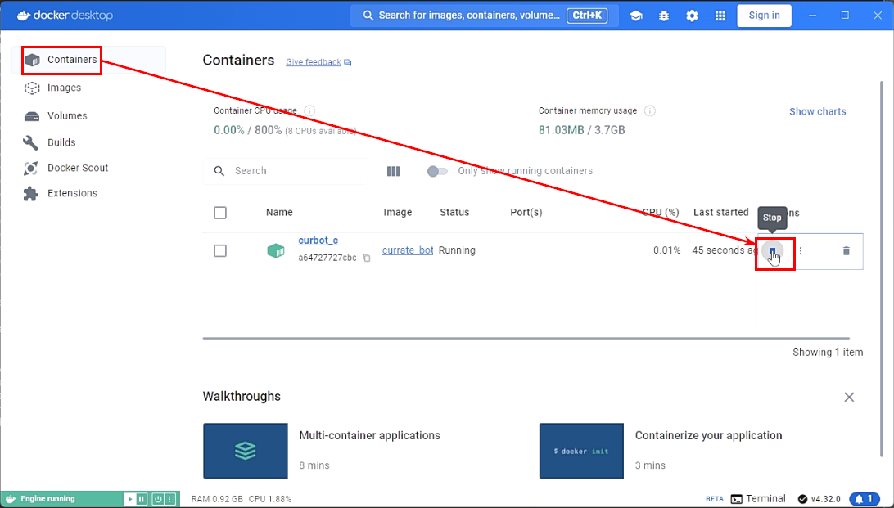

#### Создание и настройка проекта в Google Cloud
1. Переходим в [Google Cloud Console](https://console.cloud.google.com/welcome)
2. С помощью выпадающего меню в верхнем левом углу экрана создаём новый проект
3. Переходим в созданный проект
4. Включаем в проекте необходимые API сервисы, в левом меню:
    1. Cloud Run Admin API
    2. Artifact Registry API
    
Включить данные API можно будет и с помощью Google Cloud SDK на следующем шаге.


#### Инициализация Google Cloud SDK и настройка Docker
Так же как и в разделе [Как настроить запуск скрипта по рассписанию с помощью Google Cloude Run Job] перед тем как что либо публиковать в Google Cloud нам необходимо там авторизоваться, и настроить Docker на работу с Google Cloud Platform, делается это двумя командами.

```
gcloud init
```

Далее запуститься процесс инициализации, просто следуйте инструкциям, вам необходимо будет пройти авторизацию через браузер, выбрать нужный проект, и указать регион по умолчанию.

Далее необходимо настроить Docker для работы с Google Cloud.

```
gcloud auth configure-docker
```

Если а прошлом шаге вы пропустили процесс активации необходимых API в вашем Google Cloud проекте, то на даном этапе вы можете это сделать прямо из Google Cloud SDK Shell:

```
gcloud services enable run.googleapis.com
gcloud services enable artifactregistry.googleapis.com
```

#### Отправка Docker образа в Google Cloud и первый запуск бота
После успешного локального тестирования мы можем тегировать и отправить наш Docker образ в Google Artifact Registry, для этого выполним следующие команды.

```
docker tag curbot gcr.io/[PROJECT ID]/[IMAGE NAME]
docker push gcr.io/[PROJECT ID]/[IMAGE NAME]
```

Теперь пришло время первого запуска бота, выполняем следующую команду.

```
gcloud run deploy [SERVICE NAME] --image gcr.io/[PROJECT ID]/[IMAGE NAME] --platform managed --allow-unauthenticated
```

В случае успешного запуска в консоли вы увидите подобное сообщение:

```
Deploying container to Cloud Run service [SERVICE NAME] in project [PROJECT ID] region [africa-south1]
OK Deploying new service... Done.
OK Creating Revision...
OK Routing traffic...
OK Setting IAM Policy...
Done.
Service [SERVICE NAME] revision [currency-tg-bot-00001-6r2] has been deployed and is serving 100 percent of traffic.
Service URL: https://currency-tg-bot-lmgsq7kjta-bq.a.run.app
```

Наш бот по прежнему не реагирует на сообщения, поскольку у него прописан неверный webhook URL. На данном этапе нам необходим было просто получить из Google Cloud Service URL нашего бота, который вы можете найти в последней строке сообщения, которое получили после успешного запуска сервиса. Останавливаем бота и копируем это URL, он нам понадобится на следующем шаге.

```
gcloud run services delete [SERVICE NAME] --platform managed
```

#### Прописываем правильный Webhook URL и перезапускаем бота
Итак, теперь у нас есть Service URL, полученный на прошлом шагу, в моём примере это https://currency-tg-bot-lmgsq7kjta-bq.a.run.app, для того, что бы из этого URL дслеать рабоичй Webhook URL достаточно просто добавить `/webhook`. Т.е. редактируем значение переменной `WEBHOOK_URL` в нашем Dickorfie:

```{Dockerfile eval=FALSE}
# Use the official R base image
FROM rocker/r-ver:4.1.0

# Set the shell
SHELL ["/bin/bash", "-o", "pipefail", "-e", "-u", "-x", "-c"]

# Install necessary system dependencies
USER root
RUN apt-get update && apt-get install -y \
    libcurl4-openssl-dev \
    libssl-dev \
    && rm -rf /var/lib/apt/lists/*

# Install necessary R packages
RUN R -e "install.packages(c('httr', 'jsonlite', 'httpuv'))"
RUN R -e "install.packages('telegram.bot', repos = 'http://cran.us.r-project.org')"

ENV EXCHANGERATE_API_KEY=[ВАШ КЛЮЧ В exchangerate-api.com]
ENV R_TELEGRAM_BOT_CURBOT=[ТОКЕН ВАШЕГО БОТА]
ENV WEBHOOK_URL=https://currency-tg-bot-lmgsq7kjta-bq.a.run.app/webhook

# Copy the R script to the container
COPY curbot.R /app/curbot.R

# Set the working directory
WORKDIR /app

# Run the R script
CMD ["Rscript", "/app/curbot.R"]
```

Теперь необходимо локально пересобрать образ, протегировать его, отправить новую версию образа в Google Cloud и запустить на его основе сервис.

```
docker build -t [IMAGE NAME] .
docker tag curbot gcr.io/[PROJECT ID]/[IMAGE NAME]
docker push gcr.io/[PROJECT ID]/[IMAGE NAME]
gcloud run deploy [SERVICE NAME] --image gcr.io/[PROJECT ID]/[IMAGE NAME] --platform managed --allow-unauthenticated
```

Если всё прошло успешно вы вновь получите примерно следующее сообщение:

```
Deploying container to Cloud Run service [currency-tg-bot] in project [curbot-430507] region [africa-south1]
OK Deploying new service... Done.
OK Creating Revision...
OK Routing traffic...
OK Setting IAM Policy...
Done.
Service [currency-tg-bot] revision [currency-tg-bot-00001-kqg] has been deployed and is serving 100 percent of traffic.
Service URL: https://currency-tg-bot-lmgsq7kjta-bq.a.run.app
```

поздравляю, теперь ваш ботразвёрнут на Google Cloud Run Service, и готов к использованию:

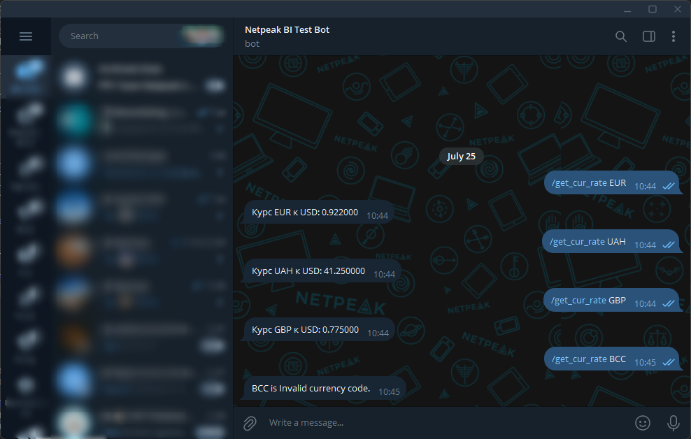

## Heroku
Heroku — это облачный сервис, который помогает разрабатывать, развертывать и управлять веб-приложениями без необходимости заниматься настройкой серверов и инфраструктуры. Вы просто пишете код вашего приложения и отправляете его в Heroku, а система автоматически обрабатывает его развертывание, масштабирование и управление.

Heroku поддерживает разные языки программирования, такие как Ruby, Node.js, Python и в том числе R Она делает процесс разработки проще за счет автоматического развертывания из систем контроля версий (например, Git), управления конфигурацией через переменные среды и возможности добавления различных сервисов, таких как базы данных, через аддоны. Это позволяет разработчикам сосредоточиться на создании функционала, не тратя время на управление серверной инфраструктурой.

Эта платформа подойдёт тем, кто не хочет заморачиваться с Docker, т.к. Heroku имеет специальные buildpacks для различных языков и сред. Для R-скриптов можно использовать buildpack для R, например heroku-buildpack-r. В этом случае вы просто загружаете ваш код и указываете необходимые зависимости в файлах, таких как init.R и Procfile.

### Разворачиваем telegram бота на Heroku
#### Видео
<iframe width="560" height="315" src="https://www.youtube.com/embed/TJRxWS0W7UY?enablejsapi=1" title="YouTube video player" frameborder="0" allow="accelerometer; autoplay; clipboard-write; encrypted-media; gyroscope; picture-in-picture; web-share" referrerpolicy="strict-origin-when-cross-origin" allowfullscreen></iframe>

#### Обзор рабочего процесса
Рабочий процесс по развёртыванию ваших ботов на платформе Heroku выглядит следующим образом.

1. Напишите код вашего бота.
2. Добавьте в проект остальные необходимые файлы такие как: `Procfile`, `init.R`, `app.json`.
3. Зарегистрируйтесь на [Heroku](https://heroku.com).
4. Скачайте и установите утилиту [Heroku CLI](https://devcenter.heroku.com/articles/heroku-cli).
5. Далее вся работа происходит в командной строке, для начала необходимо авторизоваться.
6. Перейдите в папку вашего проекта и инициализируйте новый репозиторий Git.
7. Создайте коммит со всеми изменениями.
8. Добавьте изменения в рабочем каталоге в индекс (или stage area), чтобы они были включены в следующий коммит.
9. Создайте новое приложение в Heroku.
10. Запросите информацию о вашем приложение, что бы получить его URL.
11. Создайте в приложении все необходимые перменные среды.
12. Установите нужный buildpack для вашего приложения.
13. Отправьте созданный ранее коммит на сервер Heroku и разверните приложение.
14. Запустите рабочий процесс приложения.

#### Файлы необходимые для разворачиваня бота
Для того, что бы Heroku понял, что ваш бот написан на языке R проекте должен присутствовать хотя бы один из ниже перечисленных файлов:

* `init.R`
* `packrat/init/R`
* `renv/activate.R`
* `run.R`
* `app.R`
* `plumber.R`

Файлы app.R и plumber.R характерны соответвенно для Shiny приложений, и API написанных с помощью пакета Plumber. В нашем случае нам пондобятся следующие файлы в проекте бота:

* `bot.R` - код самого бота
* `Procfile` - Описание процесса, который будет запускаться в нашем приложении.
* `init.R` - Описание зависимостей, т.е. пакетов, которые необходимо установить для работы кода нашего бота, так же вы можете использовать более продвинутые техники управления зависимостями (пакеты `pacrat` или `renv`).
* `app.json` (опционально) - Используется для автоматизации процесса развертывания и описания приложения в рамках Heroku.

Мы будем разворачивать того же бота, что и в предыдущем разделе, его код выглядит следующим образом:

```{r, eval=FALSE}
library(telegram.bot)
library(httr)
library(jsonlite)

# Метод запроса курса валют
get_cur_rate <- function(bot, update, args) {
  
  currency_code <- toupper(args)
  api_key <- Sys.getenv('EXCHANGERATE_API_KEY')
  url     <- paste0("https://api.exchangerate-api.com/v4/latest/USD?apikey=", api_key)
  
  response <- GET(url)
  data <- fromJSON(content(response, "text"))
  
  if (!currency_code %in% names(data$rates)) {
    bot$sendMessage(chat_id = update$message$chat_id, text = paste0(args, " is Invalid currency code."))
    return(NULL)
  }
  
  rate <- data$rates[[currency_code]]
  message <- sprintf("Курс %s к USD: %f", currency_code, rate)
  bot$sendMessage(chat_id = update$message$chat_id, text = message)
  
}

# Создаём Webhook
webhook <- Webhook(
  webhook_url = Sys.getenv('WEBHOOK_URL'), 
  token       = bot_token('CURBOT'), 
  verbose     = TRUE
  )

# Добавляем обработчики
webhook <- webhook + CommandHandler("get_cur_rate", get_cur_rate, pass_args = T)

# Запускаем Webhook
webhook$start_server(
  host = "0.0.0.0",
  port = as.integer(Sys.getenv("PORT", 8080))
)
```

Единственное отличае от кода бота приведённого в прошлом разделе это то, что порт мы получаем из переменной среды `Sys.getenv("PORT", 8080)`. Т.к. Heroku назначит случайный порт для вашего приложения, а Google Cloud всегда назначает вашему боту порт 8080.

`Procfile` используется Heroku для определения процесса, который будет запущен для вашего приложения. Это специальный файл, который указывает, какие команды нужно выполнять при запуске приложения.

```
web: R --file=bot.R
```

* web — это тип процесса. Для веб-приложений на Heroku это обычно web, и Heroku ожидает, что этот процесс будет слушать входящие HTTP-запросы.
* `R --file=bot.R` — это команда, которая будет запущена Heroku для старта вашего приложения. Она указывает на то, что нужно выполнить скрипт из файла bot.R.

Файл `init.R` используется для установки пакетов R по мере необходимости.

>ПРИМЕЧАНИЕ: Использование Packrat или renv — лучший способ управления зависимостями пакетов и их соответствующими версиями, поэтому этот init.Rфайл не требуется, если вы используете packratили renv.

Я использую следующий пример `init.R` файла:

```{r eval=FALSE}
helpers.installPackages("httr", "jsonlite", "telegram.bot", "stringr")
```

Вспомогательная функция `helpers.installPackages`, упрощающая установку пакетов, включена в buildpack для удобства. 

Файл `app.json` используется для автоматизации процесса развертывания и описания приложения в рамках Heroku. Это полезно для использования с Heroku Review Apps и автоматическим развертыванием.

```{json}
{
  "name": "telegram-bot",
  "description": "A Telegram bot deployed on Heroku",
  "repository": "https://github.com/your-repo/your-bot-repo",
  "logo": "https://example.com/logo.png",
  "keywords": ["telegram", "bot"],
  "env": {
    "R_TELEGRAM_BOT_CURBOT": {
      "description": "Telegram Bot Token",
      "required": true
    },
    "EXCHANGERATE_API_KEY": {
      "description": "Exchangerate api key",
      "required": true
    },
    "WEBHOOK_URL": {
      "description": "Webhook URL",
      "required": true
    }
  },
  "buildpacks": [
    {
      "url": "https://github.com/virtualstaticvoid/heroku-buildpack-r.git"
    }
  ]
}
```

Что это означает:

* "name" — имя вашего приложения на Heroku.
* "description" — краткое описание приложения.
* "repository" — ссылка на репозиторий с вашим кодом.
* "logo" — URL к логотипу вашего приложения.
* "keywords" — ключевые слова для поиска вашего приложения.
* "env" — переменные окружения, которые требуется установить для вашего приложения (например, токен для Telegram API и URL вебхука).
* "buildpacks" — список buildpacks, которые будут использоваться для развертывания. Здесь указан buildpack для R.

#### Авторизация и инициализация Git репозитория

Далее для авторизации в командной строке выполняем команду:

```
heroku login
```

После чего необходимо инициализировать новый репозиторий, добавить все изменения и создать коммит.

```
git init
git add .
git commit -m "Initial commit"
```

* `git init` - Эта команда инициализирует новый репозиторий Git в текущей директории. Она создаёт скрытую папку .git, которая содержит всю информацию о версии и конфигурации вашего репозитория. После выполнения этой команды текущая директория становится рабочим репозиторием Git, в котором вы можете отслеживать изменения файлов и выполнять другие операции управления версиями.
* `git add .` - Команда git add добавляет изменения в рабочем каталоге в индекс (или stage area), чтобы они были включены в следующий коммит. Аргумент . указывает, что нужно добавить все изменения во всех файлах текущей директории и её поддиректориях. Это делает все текущие изменения подготовленными для следующего коммита.
* `git commit -m "Initial commit"` - Эта команда создает новый коммит в репозитории, включающий все изменения, добавленные в индекс с помощью git add. Флаг -m позволяет указать сообщение коммита прямо в командной строке. Сообщение "Initial commit" — это описание того, что делает этот коммит. Обычно первое сообщение коммита описывает начальную настройку репозитория или первые изменения в проекте.

#### Создаём новое приложение и запраиваем его URL
Следующая команда создаст в вашем аккаунте Heroku новое приложение:

```
heroku create your-app-name
```

Замените `your-app-name` на название вашего приложения. 

Теперь запросим информацию о приложении, для того что бы получить его URL:

```
heroku apps:info
```

В результате вы получите следующую информацию:

```
=== your-app-name

Auto Cert Mgmt: false
Dynos:          web: 1
Git URL:        https://git.heroku.com/your-app-name.git
Owner:          your@gmail.com
Region:         us
Repo Size:      19 KB
Slug Size:      149 MB
Stack:          heroku-22
Web URL:        https://your-app-name-abcdefgh.herokuapp.com/
```

Из всей этой информации нам понадобится только Web URL, т.к. добавив к его пути webhook, мы получим тот WEBHOOK URL, который нам необходимо будет установить для нашего бота.

#### Добавляем переменные среды
В коде нашего бота мы используем 3 переменные среды:

* EXCHANGERATE_API_KEY - API Ключ, который вам необходимо получить на сайте exchangerate-api.com
* R_TELEGRAM_BOT_CURBOT - API Token вашего бота, получить его можно при создании бота через [BotFather](https://t.me/BotFather)
* WEBHOOK_URL - Webhook URL на который telegram будет присылать обновления для бота, берём значение из Web URL нашего приложения, и добавляем webhook, в нашем примере https://your-app-name-abcdefgh.herokuapp.com/webhook.

Теперь с помощью командной строки создадим эти переменные в приложении:

```
heroku config:set R_TELEGRAM_BOT_CURBOT=ТОКЕН ВАШЕГО БОТА
heroku config:set WEBHOOK_URL=https://your-app-name-abcdefgh.herokuapp.com/webhook
heroku config:set EXCHANGERATE_API_KEY=Exchangerate API Ключ
```

#### Установка buildpack
Buildpack — это инструмент, который автоматически устанавливает и настраивает необходимые зависимости для вашего приложения. Он помогает платформе как определить, как собрать и запустить ваше приложение.

Вот основные моменты, зачем и как он используется:

* **Автоматическая настройка среды**: Buildpack управляет установкой всех необходимых зависимостей и инструментов, таких как языковые среды (например, Ruby, Python, Node.js), библиотеки и фреймворки. Он автоматически настраивает среду, в которой будет работать ваше приложение, чтобы не нужно было вручную управлять этими процессами.
* **Определение процесса сборки**: Buildpack предоставляет инструкции о том, как собрать ваше приложение. Например, он может определить, какие команды нужно выполнить для установки зависимостей или как собрать исходный код.
* **Упрощение развертывания**: С помощью buildpack процесс развертывания становится проще и более автоматизированным. Вы можете просто загрузить свой код, и buildpack позаботится обо всех необходимых шагах для подготовки и запуска приложения.
* **Поддержка различных языков и фреймворков**: Разные buildpack могут поддерживать разные языки программирования и фреймворки. Например, есть отдельные buildpack для Java, Python, R и других языков.

Для использования buildpack в Heroku, вы указываете его при создании или настройке приложения. Например, если вы развертываете приложение на языке R, вам нужен соответствующий buildpack, который знает, как установить R и необходимые пакеты.

Пример использования buildpack в Heroku:

* Установка buildpack: Команда heroku buildpacks:set https://github.com/virtualstaticvoid/heroku-buildpack-r.git устанавливает buildpack для языка R.
( Автоматическая установка зависимостей: При развертывании Heroku использует buildpack для установки R, необходимых библиотек и фреймворков, а затем собирает и запускает ваше приложение.

Таким образом, buildpack упрощает процесс развертывания, автоматизируя установку и настройку среды для вашего приложения.

Для установки нужного для языка R buildpack используйте следующую команду:

```
heroku buildpacks:set https://github.com/virtualstaticvoid/heroku-buildpack-r.git
```

#### Отправка данных в Heroku и запуск бота
Последним шагом необзодимо отправить все изменения в Heroku и запустить рабочий процесс, делается жто следующими командами:

```
git push heroku master
heroku ps:scale web=1
```

* **Команда git push heroku master**: Эта команда отправляет ваши файлы проекта на сервер Heroku и разворачивает приложение.
Она обновляет код вашего приложения в Heroku и выполняет установку зависимостей, но не запускает процесс приложения.
После выполнения этой команды ваше приложение будет развернуто на Heroku, но может еще не быть активным или не обрабатывать запросы, если не настроены нужные процессы.

* **Команда heroku ps:scale web=1**: Эта команда запускает веб-процесс для вашего приложения.
Она указывает Heroku, что нужно запустить один экземпляр веб-процесса, который будет слушать входящие HTTP-запросы.
После выполнения этой команды ваш бот начнет принимать запросы и будет отвечать на них, если всё настроено правильно.

Таким образом, после `git push heroku master` ваше приложение будет развернуто, но вам нужно выполнить `heroku ps:scale web=1`, чтобы запустить его и начать обработку запросов.

Всё, ваш бот развёрнут на Heroku!

#### Переключение между разными приложениями
В heroku у вас могут быть созданы несколько приложений, если вам необходимо будет переключаться между ними, то можете воспользоваться следующими командами:

* `heroku apps` -  Эта команда покажет все ваши приложения в Heroku.
* `heroku git:remote -a <app_name>` -  Для переключения между приложениями.

В некоторых командах можно указать имя приложения, используя флаг -a:

* `heroku ps -a <app_name>`
* `heroku logs --tail -a <app_name>`
* `heroku ps:scale web=1 -a <app_name>`
* `heroku config:set VAR_NAME=value -a <app_name>`

#### Другие полезные команды Heroku cli
Вот ещё несколько полезных команд, доступных в Heroku CLI:

* `heroku ps` - отображения текущего состояния процессов (dynos) вашего приложения
* `heroku config` - просмотр переменных
* `heroku apps:info` - получить инфу о приложении, включая его url
* `heroku logs --tail` - покажет логи выполнения R скрипта

### Как настроить запуск R скрипта по расписанию в Heroku
На предыдущем шаге мы развернули в Heroku полноценного бота, но возможно вам необходимо просто настроить отправку какого либо сообщение в telegtam по расписанию. Алгоритм очень похож с развёртыванием бота, но всё таки он немного упрощён.

#### Подготовка проекта
Мы будем разворачивать тот же скрипт, отправляющий курсы валют, который рассматривали в разеделе [Как настроить запуск скрипта по рассписанию с помощью Google Cloude Run Job]:

Файл init.R:

```{r, eval=FALSE}
helpers.installPackages("httr", "jsonlite", "telegram.bot", "stringr")
```

Файл script.R:
```{r, eval=FALSE}
library(httr)
library(jsonlite)
library(telegram.bot)
library(stringr)

get_exchange_rate <- function(api_key) {
  url <- paste0("https://api.exchangerate-api.com/v4/latest/USD?apikey=", api_key)
  response <- GET(url)
  data <- fromJSON(content(response, "text"))
  return(data)
}

send_telegram_message <- function(bot_token, chat_id, message) {
  bot <- Bot(token = bot_token)
  bot$sendMessage(chat_id = chat_id, text = message)
}

# Функция для выполнения основного логики
execute_script <- function() {
  api_key   <- Sys.getenv("EXCHANGE_RATE_API_KEY")
  bot_token <- Sys.getenv("TELEGRAM_BOT_TOKEN")
  chat_id   <- Sys.getenv("TELEGRAM_CHAT_ID")
  
  exchange_rate <- get_exchange_rate(api_key)
  message <- str_glue(
    "Курс валют на {Sys.Date()}",
    '-----------------------------',
    "Курс EUR к USD: {exchange_rate$rates$EUR}", 
    "Курс GBP к USD: {exchange_rate$rates$GBP}",
    "Курс UAH к USD: {exchange_rate$rates$UAH}",
    "Курс EGP к USD: {exchange_rate$rates$EGP}", 
    .sep = '\n'
  )
  
  send_telegram_message(bot_token, chat_id, message)
}

# Выполнение скрипта
execute_script()
```

#### Обзор рабочего процесса

1. В вашем приложение достаточно двух файлов:
    1. init.R с описанием зависимосте.
    2. script.R, ну или любой файл с R кодом, который вам необходимо запускать по расписанию.
2. Залогиньтесь в Heroku, и подготовьте коммит:

```
heroku login

git init
git add .
git commit -m "Initial commit"
```

3. Создайте приложение

```
heroku create app-name
```

4. Создайте все необходимые переменные среды:

```
heroku config:set EXCHANGE_RATE_API_KEY=<ВАШ КЛЮЧ К exchange-rate-api>
heroku config:set TELEGRAM_BOT_TOKEN=<ТОКЕН ВАШЕГО БОТА>
heroku config:set TELEGRAM_CHAT_ID=<ID чата в который будете отправлять курсы валют>
```

5. Устновите нужный buildpack:

```
heroku buildpacks:set https://github.com/virtualstaticvoid/heroku-buildpack-r.git
```

6. Запушьте приложение

```
git push heroku master
```

7. Перейдите в web версию [Heroku](https://heroku.com), зайдите в созданное приложение, перейдите на вкладку Resources? и добавьте Add-on "Heroku Scheduler", есть и другие дополнения, которые позволяют настраивать расписание запуска ваших скриптов, но они платные:


8. Перейдите в дополннеие "Heroku Scheduler" и нажмите "Create job"

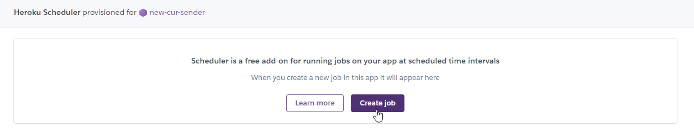

9. Настройте расписание запуска, и укажите команду `Rscript script.R`:

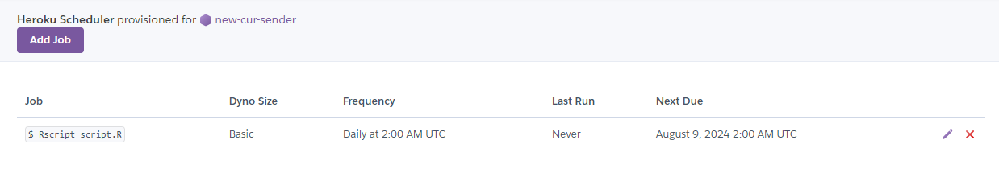

Возможности настройки расписания в дополнении "Heroku Scheduler" довольно примитывные, но можно настроить запуск каждый 10 минут, каждый час в определённую минуту, или каждый день в определённое время.

## Какую из описанных облачных платформ выбрать
Развёртывание бота на Heroku и Google Cloud Run имеет свои особенности и преимущества, в зависимости от ваших требований и предпочтений. Вот некоторые ключевые моменты, которые могут помочь вам определиться:

### Преимущества Heroku

1. **Простота и удобство использования:**
    * Интуитивный интерфейс: Heroku предлагает простой в использовании интерфейс и инструменты командной строки, которые облегчают развертывание и управление приложениями.
    * Автоматическое масштабирование: Heroku автоматически масштабирует ваше приложение в зависимости от нагрузки, и вам не нужно заботиться о настройке серверов.
2. **Широкий выбор buildpack и добавок:**
    * Buildpacks: Heroku поддерживает различные языковые среды через buildpacks, что упрощает настройку среды для вашего приложения.
    * Дополнения: В магазине расширений Heroku можно найти множество сервисов для мониторинга, баз данных, очередей и других нужд.
3. **Автоматическое управление зависимостями:**
    * Легкость в управлении: Heroku автоматически управляет зависимостями и настройками окружения, что упрощает развертывание.
4. **Встроенные инструменты для мониторинга и логирования:**
    * Логи и мониторинг: Heroku предоставляет встроенные инструменты для мониторинга и сбора логов, что помогает отслеживать состояние вашего приложения.
5. **Интеграция с Git:**
    * Git-процесс: Простая интеграция с Git позволяет использовать стандартные git-команды для развертывания и обновления приложений.

### Преимущества Google Cloud Run

1. **Масштабируемость и гибкость:**
    * Масштабируемость: Google Cloud Run автоматически масштабирует ваше приложение в зависимости от входящих запросов и может обрабатывать трафик от нуля до тысяч запросов в секунду.
    * Гибкость: Поддержка контейнеров позволяет вам использовать любой язык программирования и фреймворк, который вы хотите.
2. **Полный контроль над окружением:**
    * Контейнеры: Вы можете использовать Docker-контейнеры, что дает вам полный контроль над средой выполнения вашего приложения, включая версии зависимостей и настройки.
3. **Интеграция с другими сервисами Google Cloud:**
    * Богатая экосистема: Cloud Run легко интегрируется с другими сервисами Google Cloud, такими как Cloud SQL, Pub/Sub и Cloud Storage.
4. **Биллинг по запросам:**
    * Оплата за использование: Вы оплачиваете только фактическое время работы вашего приложения и количество обработанных запросов, что может быть более экономичным при низкой активности.
5. **Быстрое развертывание и обновление:**
    * Контейнеры: С использованием контейнеров вы можете быстро развернуть и обновить приложение, что упрощает управление версиями и деплой.

### Итог

* Heroku лучше подходит для разработчиков, которые ищут простоту и удобство в развертывании, особенно если вы используете стандартные языки программирования и фреймворки, поддерживаемые Heroku. Он хорош для быстрого старта и имеет много встроенных функций и добавок.
* Google Cloud Run предоставит больше гибкости и масштабируемости, особенно если вам нужен полный контроль над средой выполнения или если ваше приложение должно работать в контейнерах. Это хороший выбор для масштабируемых приложений с высокой нагрузкой.

Выбор между Heroku и Google Cloud Run зависит от ваших требований к проекту и предпочтений в управлении приложением.

## Заключение
Поздравляю с завершением последней главы! Вы успешно развернули своего бота на Google Cloud Run и готовы к его масштабированию и поддержке в облаке. Надеюсь, вы получили все необходимые знания и навыки для успешного управления и развития вашего бота. Спасибо за участие в этом путешествии, и я надеюсь, что вы продолжите развиваться в мире разработки и анализа данных.
